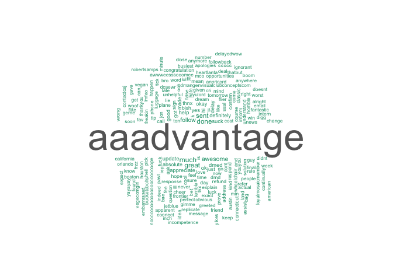
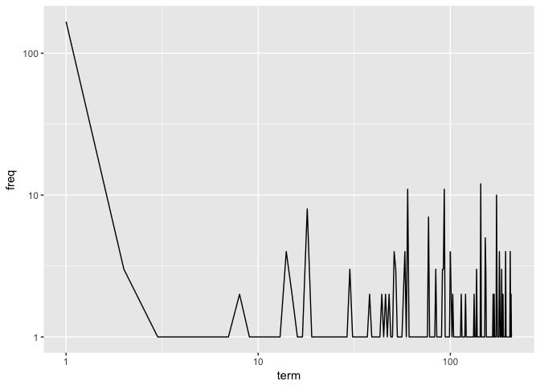
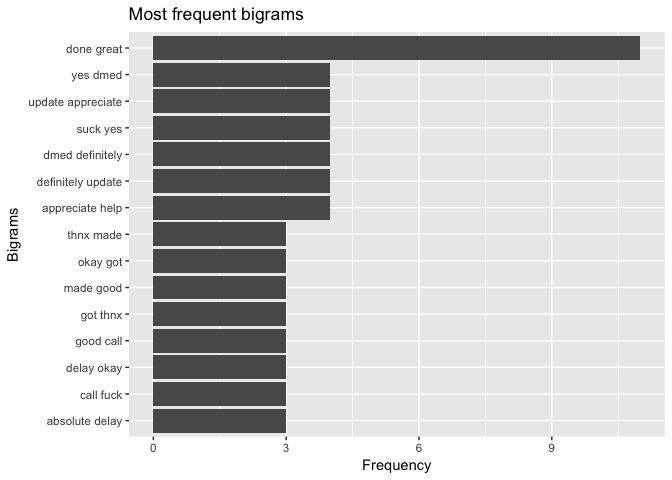
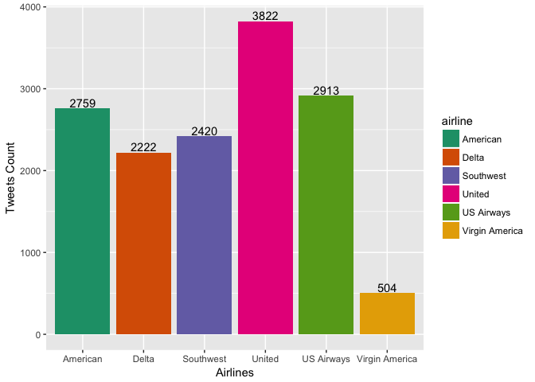
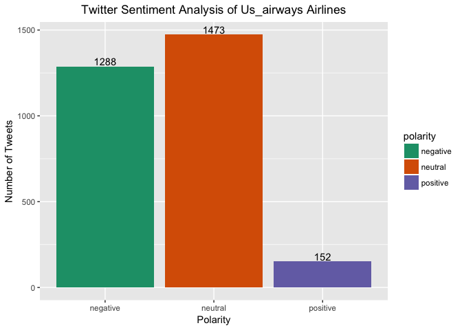
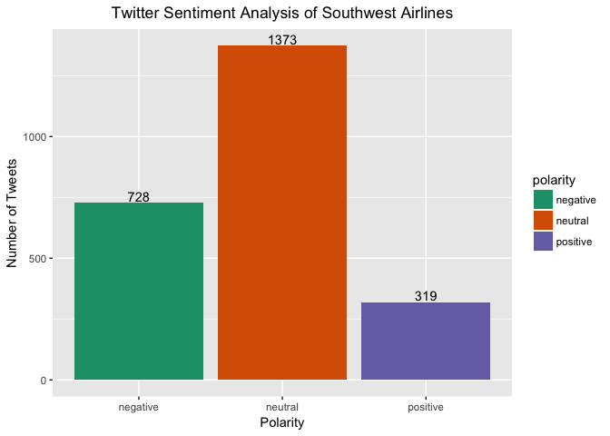
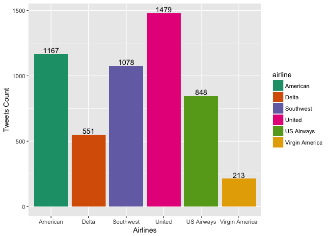

# Airline Sentiment

### Load the dataset

```r
data_dir <- "/Users/jeevarehakrishnaraj/Desktop/Springboard/Capstone Project/Capstone" 
twitter_airline <- read.csv(file.path(data_dir,"tweets.csv"),header = TRUE)
knitr::opts_chunk$set(echo = TRUE)
```

### Load the libraries

```r
library(tm)
```

```
## Loading required package: NLP
```

```r
library(dplyr)
```

```
## Warning: package 'dplyr' was built under R version 3.4.2
```

```
## 
## Attaching package: 'dplyr'
```

```
## The following objects are masked from 'package:stats':
## 
##     filter, lag
```

```
## The following objects are masked from 'package:base':
## 
##     intersect, setdiff, setequal, union
```

```r
library(plyr)
```

```
## -------------------------------------------------------------------------
```

```
## You have loaded plyr after dplyr - this is likely to cause problems.
## If you need functions from both plyr and dplyr, please load plyr first, then dplyr:
## library(plyr); library(dplyr)
```

```
## -------------------------------------------------------------------------
```

```
## 
## Attaching package: 'plyr'
```

```
## The following objects are masked from 'package:dplyr':
## 
##     arrange, count, desc, failwith, id, mutate, rename, summarise,
##     summarize
```

```r
library(sentiment)
```

```
## Loading required package: RCurl
```

```
## Loading required package: bitops
```

```
## Loading required package: rjson
```

```r
library(twitteR)
```

```
## 
## Attaching package: 'twitteR'
```

```
## The following object is masked from 'package:plyr':
## 
##     id
```

```
## The following objects are masked from 'package:dplyr':
## 
##     id, location
```

```r
library(wordcloud)
```

```
## Loading required package: RColorBrewer
```

```r
library(ggplot2)
```

```
## 
## Attaching package: 'ggplot2'
```

```
## The following object is masked from 'package:NLP':
## 
##     annotate
```
### Replace twitter handle with blank 

```r
twitter_airline$text <- gsub("@VirginAmerica","",gsub("@AmericanAir","",gsub("@JetBlue ","",gsub("@SouthwestAir","",gsub("@united","",gsub("@USAirways","",twitter_airline$text))))))
```

### Build a corpus, and specify the source to be character vectors

```r
tweets_corpus <- Corpus(VectorSource(twitter_airline$text))
```

### Inspect Corpus

```r
inspect(tweets_corpus[1:2])
```

```
## <<SimpleCorpus>>
## Metadata:  corpus specific: 1, document level (indexed): 0
## Content:  documents: 2
## 
## [1]  What @dhepburn said.                                     
## [2]  plus you've added commercials to the experience... tacky.
```

### Remove punctuations from corpus

```r
tweets_corpus <- tm_map(tweets_corpus,removePunctuation)
```

### Remove URLs

```r
removeURL <- function(x) {
  gsub("http[^[:space:]]*", "", x)
}
tweets_corpus <- tm_map(tweets_corpus,content_transformer(removeURL))
```

### Remove anything expect English and Space

```r
remove_others <- function(x) {
  gsub("[^[:alpha:][:space:]]*","",x)
}
tweets_corpus <- tm_map(tweets_corpus,content_transformer(remove_others))
```

### Remove Stopwords

```r
tweets_stopwords <- c(setdiff(stopwords('english'), c("r", "big")),"use", "see", "used", "via", "amp")
tweets_corpus <- tm_map(tweets_corpus,removeWords,tweets_stopwords)
```

### Remove extra whitespace

```r
tweets_corpus <- tm_map(tweets_corpus,stripWhitespace)
```

### Convert the corpus to lowercase 

```r
tweets_corpus <- tm_map(tweets_corpus,content_transformer(tolower))
```

### Make a copy of the corpus

```r
tweets_corpus_copy <- tweets_corpus
```

### Stemming 

```r
tweets_corpus <- tm_map(tweets_corpus,stemDocument)
```

### Stem Completion

```r
tweets_corpus <- tm_map(tweets_corpus,content_transformer(stemCompletion), dictionary = tweets_corpus_copy)
```


### Create Term Document Martix

```r
tweet_tdm <- TermDocumentMatrix(tweets_corpus, control = list(wordLengths = c(1,Inf)))
tweet_tdm
```

```
## <<TermDocumentMatrix (terms: 140, documents: 14640)>>
## Non-/sparse entries: 318/2049282
## Sparsity           : 100%
## Maximal term length: 28
## Weighting          : term frequency (tf)
```


### Word Frequencies

```r
m  <- as.matrix(tweet_tdm)
v <- sort(rowSums(m),decreasing = TRUE)
d <- data.frame(word = names(v),freq=v)
head(d, 5)
```

```
##          word freq
## thank   thank  124
## done     done   10
## sent     sent   10
## flight flight    9
## a           a    7
```

```r
# Word Cloud

wordcloud(words = d$word, freq = d$freq, min.freq = 1,
          max.words=200, random.order=FALSE, rot.per=0.35, 
          colors=brewer.pal(8, "Dark2"))
```

<!-- -->

```r
# Frequent Terms
freq.terms <- findFreqTerms(tweet_tdm, lowfreq = 1)
term.freq <- rowSums(as.matrix(tweet_tdm))
df <- data.frame(term = names(term.freq), freq = term.freq)
```
### Tweets by Airlines

We will analyze the total number of tweets for each airlines


```r
ggplot(twitter_airline, aes(x= airline)) + geom_bar(aes(y=..count.., fill = airline))+geom_text(stat='count',aes(label=..count..),vjust=-0.2)+
  scale_fill_brewer(palette="Dark2") + xlab("Airlines") + ylab("Tweets Count")
```

<!-- -->

United Airlines has the most tweets  and Virgin America has the least tweets. Having higher number of tweets can either be because of their popularty or  they might have lot of issues which needs to be investigated further. 


### Sentiments

Let us know look at the sentiments of the tweets for each airlines.

### Retrieve Data for Delta airline

```r
delta <- subset(twitter_airline,airline == "Delta")
delta.txt  <- delta$text
delta_sentiment <- sentiment(delta.txt)
delta_sentiment$score <- 0
delta_sentiment$score[delta_sentiment$polarity == "positive"] <- 1
delta_sentiment$score[delta_sentiment$polarity == "negative"] <- -1
delta_table <- table(delta_sentiment$polarity)
ggplot(delta_sentiment, aes(x=polarity)) +
  geom_bar(aes(y=..count.., fill=polarity)) +geom_text(stat='count',aes(label=..count..),vjust=-0.2)+
  scale_fill_brewer(palette="Dark2") +
  labs(x="Polarity", y="Number of Tweets") +
  ggtitle("Twitter Sentiment Analysis of Delta Airlines")+
  theme(plot.title = element_text(hjust = 0.5))
```

<!-- -->

```r
delta_sentiment$airline = 'Delta'
delta_sentiment$code = 'DL'
colnames(delta_sentiment)
```

```
## [1] "text"     "polarity" "language" "score"    "airline"  "code"
```
 
Delta has most of the tweets that are nuetral. But the negative tweets are more than the positive tweets and requires inspection.
### Retrieve Data for American airline

```r
american <- subset(twitter_airline,airline == "American")
american.txt  <- american$text
american_sentiment <- sentiment(american.txt)
american_sentiment$score <- 0
american_sentiment$score[american_sentiment$polarity == "positive"] <- 1
american_sentiment$score[american_sentiment$polarity == "negative"] <- -1
american_table <- table(american_sentiment$polarity)
ggplot(american_sentiment, aes(x=polarity)) +
  geom_bar(aes(y=..count.., fill=polarity)) +geom_text(stat='count',aes(label=..count..),vjust=-0.2)+
  scale_fill_brewer(palette="Dark2") +
  labs(x="Polarity", y="Number of Tweets") +
  ggtitle("Twitter Sentiment Analysis of American Airlines")+
  theme(plot.title = element_text(hjust = 0.5))
```

<!-- -->

```r
american_sentiment$airline = 'American'
american_sentiment$code = 'AA'
colnames(american_sentiment)
```

```
## [1] "text"     "polarity" "language" "score"    "airline"  "code"
```

AA tweets indicate that their negative tweets are almost equal to the neutral tweets. The reason behind the negative tweets must be explored. 

### Retrieve Data for United airline

```r
united <- subset(twitter_airline,airline == "United")
united.txt  <- united$text
united_sentiment <- sentiment(united.txt)
united_sentiment$score <- 0
united_sentiment$score[united_sentiment$polarity == "positive"] <- 1
united_sentiment$score[united_sentiment$polarity == "negative"] <- -1
united_table <- table(united_sentiment$polarity)
ggplot(united_sentiment, aes(x=polarity)) +
  geom_bar(aes(y=..count.., fill=polarity)) +geom_text(stat='count',aes(label=..count..),vjust=-0.2)+
  scale_fill_brewer(palette="Dark2") +
  labs(x="Polarity", y="Number of Tweets") +
  ggtitle("Twitter Sentiment Analysis of United Airlines")+
  theme(plot.title = element_text(hjust = 0.5))
```

<!-- -->

```r
united_sentiment$airline = 'United'
united_sentiment$code = 'UA'
colnames(united_sentiment)
```

```
## [1] "text"     "polarity" "language" "score"    "airline"  "code"
```
United airlines tweets indicate that their negative tweets are almost equal to the neutral tweets. The reason behind the negative tweets must be explored. 


### Retrieve Data for Southwest airline

```r
southwest <- subset(twitter_airline,airline == "Southwest")
southwest.txt  <- southwest$text
southwest_sentiment <- sentiment(southwest.txt)
southwest_sentiment$score <- 0
southwest_sentiment$score[southwest_sentiment$polarity == "positive"] <- 1
southwest_sentiment$score[southwest_sentiment$polarity == "negative"] <- -1
southwest_table <- table(southwest_sentiment$polarity)
ggplot(southwest_sentiment, aes(x=polarity)) +
  geom_bar(aes(y=..count.., fill=polarity)) +geom_text(stat='count',aes(label=..count..),vjust=-0.2)+
  scale_fill_brewer(palette="Dark2") +
  labs(x="Polarity", y="Number of Tweets") +
  ggtitle("Twitter Sentiment Analysis of Southwest Airlines")+
  theme(plot.title = element_text(hjust = 0.5))
```

<!-- -->

```r
southwest_sentiment$airline = 'Southwest'
southwest_sentiment$code = 'SW'
colnames(southwest_sentiment)
```

```
## [1] "text"     "polarity" "language" "score"    "airline"  "code"
```
United airlines tweets indicate that they have almost double the amount of neutral tweets as compared to the negative tweets. 

### Retrieve Data for US Airways

```r
us_airways <- subset(twitter_airline,airline == "US Airways")
us_airways.txt  <- us_airways$text
us_airways_sentiment <- sentiment(us_airways.txt)
us_airways_sentiment$score <- 0
us_airways_sentiment$score[us_airways_sentiment$polarity == "positive"] <- 1
us_airways_sentiment$score[us_airways_sentiment$polarity == "negative"] <- -1
us_airways_table <- table(us_airways_sentiment$polarity)
ggplot(us_airways_sentiment, aes(x=polarity)) +
  geom_bar(aes(y=..count.., fill=polarity)) +geom_text(stat='count',aes(label=..count..),vjust=-0.2)+
  scale_fill_brewer(palette="Dark2") +
  labs(x="Polarity", y="Number of Tweets") +
  ggtitle("Twitter Sentiment Analysis of Us_airways Airlines")+
  theme(plot.title = element_text(hjust = 0.5))
```

<!-- -->

```r
us_airways_sentiment$airline = 'US Airways'
us_airways_sentiment$code = 'UW'
colnames(us_airways_sentiment)
```

```
## [1] "text"     "polarity" "language" "score"    "airline"  "code"
```

US Airways tweets indicate that they have almost equal amount of neutral and negative tweets. The reason behind the negative tweets must be investigated further.


### Retrieve Data for Virgin America

```r
virgin_america <- subset(twitter_airline,airline == "Virgin America")
virgin_america.txt  <- virgin_america$text
virgin_america_sentiment <- sentiment(virgin_america.txt)
virgin_america_sentiment$score <- 0
virgin_america_sentiment$score[virgin_america_sentiment$polarity == "positive"] <- 1
virgin_america_sentiment$score[virgin_america_sentiment$polarity == "negative"] <- -1
virgin_america_table <- table(virgin_america_sentiment$polarity)
ggplot(virgin_america_sentiment, aes(x=polarity)) +
  geom_bar(aes(y=..count.., fill=polarity)) +geom_text(stat='count',aes(label=..count..),vjust=-0.2)+
  scale_fill_brewer(palette="Dark2") +
  labs(x="Polarity", y="Number of Tweets") +
  ggtitle("Twitter Sentiment Analysis of Virgin America ")+
  theme(plot.title = element_text(hjust = 0.5))
```

<!-- -->

```r
virgin_america_sentiment$airline = 'Virgin America'
virgin_america_sentiment$code = 'VA'
colnames(virgin_america_sentiment)
```

```
## [1] "text"     "polarity" "language" "score"    "airline"  "code"
```

Virgin America tweets indicate that they have more neutral tweets

### Combining data from all airlines

```r
all.sentiment <- rbind(delta_sentiment,american_sentiment,united_sentiment,southwest_sentiment,virgin_america_sentiment,us_airways_sentiment)
all.sentiment$score <- 0
 all.sentiment$score[all.sentiment$polarity == "Very Positive"] <- 1
 all.sentiment$score[all.sentiment$polarity == "Positive"] <- 0.5
 all.sentiment$score[all.sentiment$polarity == "Negative"] <- -0.5
 all.sentiment$score[all.sentiment$polarity == " Very Negative"] <- -1

 #Plot by sentiment for all airlines
 
ggplot(all.sentiment, aes(x=airline,position = 'fill')) + geom_bar(aes(y=..count.., fill=polarity), position = "fill")  + scale_fill_brewer(palette="Dark2") +
 labs(x="Polarity", y="Number of Tweets") +
 ggtitle("Twitter Sentiment Analysis of US based airlines ")+
  theme(plot.title = element_text(hjust = 0.5)) 
```

<!-- -->

```r
 all.airlines <- rbind(delta,american,united,us_airways,virgin_america,southwest)
all.airlines$updatedsentiment <- all.sentiment$polarity
library(reshape2)
airlines= all.airlines %>% group_by(airline) %>% dplyr::summarise(count=n())
posNegByAirline <- dcast(all.airlines, airline ~ updatedsentiment)
```

```
## Using updatedsentiment as value column: use value.var to override.
```

```
## Aggregation function missing: defaulting to length
```

```r
posNegByAirline
```

```
##          airline negative neutral positive
## 1       American     1167    1361      231
## 2          Delta      551    1353      318
## 3      Southwest     1079    1219      122
## 4         United     1480    2045      297
## 5     US Airways      848    1678      387
## 6 Virgin America      214     260       30
```

The 100% stacked bar indicate that American, United and US Airways have the most negative tweets as compared to other airlines. It is important now to understand the reason behind the negative tweets

## Negative tweets by Airlines

The total number of negative tweets by airlines 


```r
negativeTweets <- all.airlines %>% filter(updatedsentiment =="negative")


ggplot(negativeTweets, aes(x= airline)) + geom_bar(aes(y=..count.., fill = airline))+geom_text(stat='count',aes(label=..count..),vjust=-0.2)+
  scale_fill_brewer(palette="Dark2") + xlab("Airlines") + ylab("Tweets Count")
```

<!-- -->
