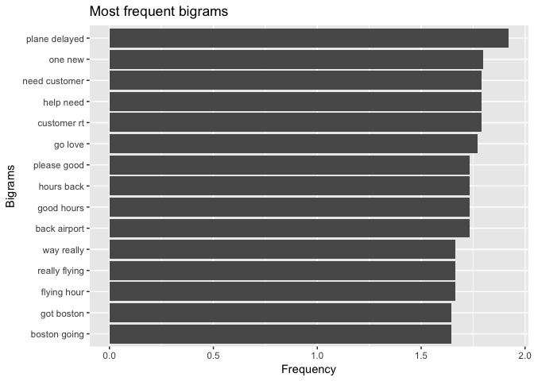
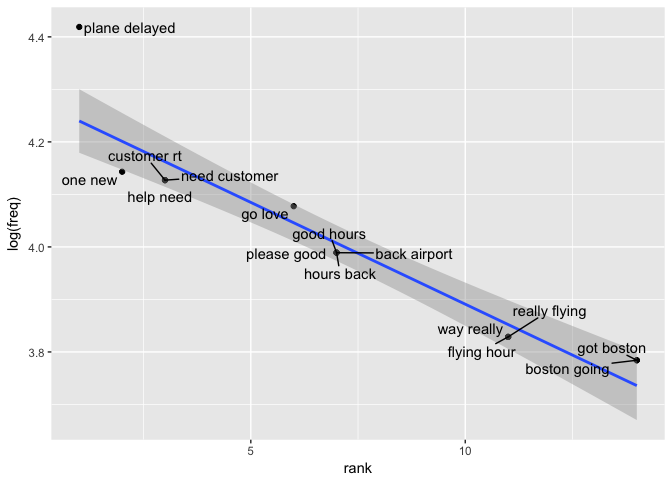
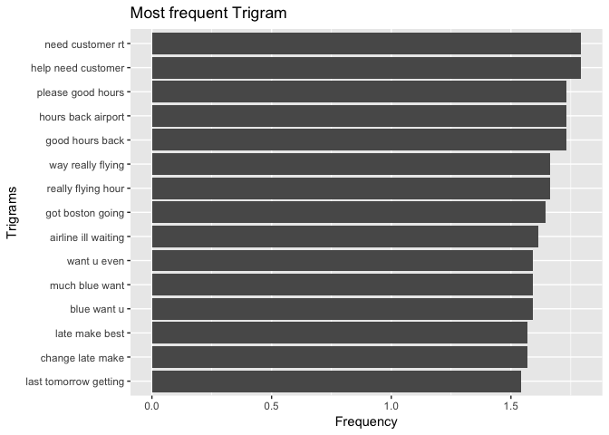
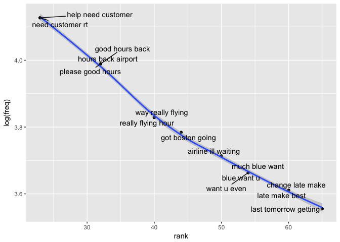

Airline Sentiment
================
2017-12-30

### Introduction

Analyzing the US based airlines performances by analyzing the the tweets of the airlines.Identifying the sentiments of tweets and classifying them as nuetral, negative and positive sentiment for each airlines. Identify the issues behind negative sentiments and checking the significance of bigrams, trigrams and airlines on the sentiment.

### Description of Data Set

The dataset contains important fields like tweet\_id,airline\_sentiment, airline, name, text, tweet\_created, tweet\_location which will be widely used in the sentiment analysis.

``` r
data_dir <- "~/Desktop/Springboard/Capstone Project/Capstone" 
twitter_airline <- read.csv(file.path(data_dir,"tweets.csv"),header = TRUE)
dim(twitter_airline)
```

    ## [1] 14640    15

``` r
colnames(twitter_airline)
```

    ##  [1] "tweet_id"                     "airline_sentiment"           
    ##  [3] "airline_sentiment_confidence" "negativereason"              
    ##  [5] "negativereason_confidence"    "airline"                     
    ##  [7] "airline_sentiment_gold"       "name"                        
    ##  [9] "negativereason_gold"          "retweet_count"               
    ## [11] "text"                         "tweet_coord"                 
    ## [13] "tweet_created"                "tweet_location"              
    ## [15] "user_timezone"

``` r
knitr::opts_chunk$set(echo = TRUE)
```

### Load the libraries

Loading the libraries required for sentiment analysis.

``` r
library(tm)
library(dplyr)
library(plyr)
library(sentiment)
library(twitteR)
library(wordcloud)
library(ggplot2)
library(magrittr)
library(tidytext)
library(ggrepel)
library(stringr)
dyn.load('/Library/Java/JavaVirtualMachines/jdk1.8.0_66.jdk/Contents/Home/jre/lib/server/libjvm.dylib')
require(rJava)
```

### Structure of the dataset

``` r
str(twitter_airline)
```

    ## 'data.frame':    14640 obs. of  15 variables:
    ##  $ tweet_id                    : num  5.7e+17 5.7e+17 5.7e+17 5.7e+17 5.7e+17 ...
    ##  $ airline_sentiment           : Factor w/ 3 levels "negative","neutral",..: 2 3 2 1 1 1 3 2 3 3 ...
    ##  $ airline_sentiment_confidence: num  1 0.349 0.684 1 1 ...
    ##  $ negativereason              : Factor w/ 11 levels "","Bad Flight",..: 1 1 1 2 3 3 1 1 1 1 ...
    ##  $ negativereason_confidence   : num  NA 0 NA 0.703 1 ...
    ##  $ airline                     : Factor w/ 6 levels "American","Delta",..: 6 6 6 6 6 6 6 6 6 6 ...
    ##  $ airline_sentiment_gold      : Factor w/ 4 levels "","negative",..: 1 1 1 1 1 1 1 1 1 1 ...
    ##  $ name                        : Factor w/ 7701 levels "___the___","__betrayal",..: 1073 3477 7666 3477 3477 3477 1392 5658 1874 7665 ...
    ##  $ negativereason_gold         : Factor w/ 14 levels "","Bad Flight",..: 1 1 1 1 1 1 1 1 1 1 ...
    ##  $ retweet_count               : int  0 0 0 0 0 0 0 0 0 0 ...
    ##  $ text                        : Factor w/ 14427 levels "_\xf4ִ RT @JetBlue: Our fleet's on fleek. http://t.co/4KH92mKoTZ",..: 14016 13923 13794 13857 13659 13937 14049 13928 14015 13855 ...
    ##  $ tweet_coord                 : Factor w/ 833 levels "","[-33.87144962, 151.20821275]",..: 1 1 1 1 1 1 1 1 1 1 ...
    ##  $ tweet_created               : Factor w/ 6804 levels "2/16/15 23:36",..: 6414 6397 6397 6397 6396 6396 6395 6394 6393 6376 ...
    ##  $ tweet_location              : Factor w/ 3082 levels "","  || san antonio, texas||",..: 1 1 1465 1 1 1 2407 1529 2389 1529 ...
    ##  $ user_timezone               : Factor w/ 86 levels "","Abu Dhabi",..: 32 64 29 64 64 64 64 64 64 32 ...

### Summary of the dataset

``` r
summary(twitter_airline)
```

    ##     tweet_id         airline_sentiment airline_sentiment_confidence
    ##  Min.   :5.676e+17   negative:9178     Min.   :0.3350              
    ##  1st Qu.:5.686e+17   neutral :3099     1st Qu.:0.6923              
    ##  Median :5.695e+17   positive:2363     Median :1.0000              
    ##  Mean   :5.692e+17                     Mean   :0.9002              
    ##  3rd Qu.:5.699e+17                     3rd Qu.:1.0000              
    ##  Max.   :5.703e+17                     Max.   :1.0000              
    ##                                                                    
    ##                 negativereason negativereason_confidence
    ##                        :5462   Min.   :0.000            
    ##  Customer Service Issue:2910   1st Qu.:0.361            
    ##  Late Flight           :1665   Median :0.671            
    ##  Can't Tell            :1190   Mean   :0.638            
    ##  Cancelled Flight      : 847   3rd Qu.:1.000            
    ##  Lost Luggage          : 724   Max.   :1.000            
    ##  (Other)               :1842   NA's   :4118             
    ##            airline     airline_sentiment_gold          name      
    ##  American      :2759           :14600         JetBlueNews:   63  
    ##  Delta         :2222   negative:   32         kbosspotter:   32  
    ##  Southwest     :2420   neutral :    3         _mhertz    :   29  
    ##  United        :3822   positive:    5         otisday    :   28  
    ##  US Airways    :2913                          throthra   :   27  
    ##  Virgin America: 504                          rossj987   :   23  
    ##                                               (Other)    :14438  
    ##                                negativereason_gold retweet_count     
    ##                                          :14608    Min.   : 0.00000  
    ##  Customer Service Issue                  :   12    1st Qu.: 0.00000  
    ##  Late Flight                             :    4    Median : 0.00000  
    ##  Can't Tell                              :    3    Mean   : 0.08265  
    ##  Cancelled Flight                        :    3    3rd Qu.: 0.00000  
    ##  Cancelled Flight\nCustomer Service Issue:    2    Max.   :44.00000  
    ##  (Other)                                 :    8                      
    ##                       text                            tweet_coord   
    ##  @united thanks         :    6                              :13621  
    ##  @AmericanAir thanks    :    5   [0.0, 0.0]                 :  164  
    ##  @JetBlue thanks!       :    5   [40.64656067, -73.78334045]:    6  
    ##  @SouthwestAir sent     :    5   [32.91792297, -97.00367737]:    3  
    ##  @AmericanAir thank you!:    4   [40.64646912, -73.79133606]:    3  
    ##  @united thank you!     :    4   [18.22245647, -63.00369733]:    2  
    ##  (Other)                :14611   (Other)                    :  841  
    ##        tweet_created          tweet_location
    ##  2/22/15 14:22:   11                 :4733  
    ##  2/22/15 17:15:   11   Boston, MA    : 157  
    ##  2/23/15 11:50:   11   New York, NY  : 156  
    ##  2/22/15 13:06:   10   Washington, DC: 150  
    ##  2/22/15 14:11:   10   New York      : 127  
    ##  2/22/15 17:14:   10   USA           : 126  
    ##  (Other)      :14577   (Other)       :9191  
    ##                     user_timezone 
    ##                            :4820  
    ##  Eastern Time (US & Canada):3744  
    ##  Central Time (US & Canada):1931  
    ##  Pacific Time (US & Canada):1208  
    ##  Quito                     : 738  
    ##  Atlantic Time (Canada)    : 497  
    ##  (Other)                   :1702

Dataset contains 14640 observations and 15 variables. There are some new variables that will be added to the dataset.

### Replace twitter handle with blank

The tweets contained the airlines twitter handle. We must first remove the twitter handle as they should not be used in the text analysis.

``` r
twitter_airline$text <- gsub("@VirginAmerica","",gsub("@AmericanAir","",
 gsub("@JetBlue ","",gsub("@SouthwestAir","",gsub("@united","",
 gsub("@USAirways","", twitter_airline$text))))))
```

### Subsetting delta tweets from the dataset

``` r
twitter_delta <- filter(twitter_airline, airline =="Delta")
```

### Build and cleaning the corpus

Here we convert the text into a word corpus using the function VectorSource. A word corpus enables us to eliminate common words using the text mining package tm. Removing the corpus specific stopwords lets us focus on the important words.

``` r
tweets_corpus <- Corpus(VectorSource(twitter_delta$text))


# Inspect Corpus
inspect(tweets_corpus[1:5])
```

    ## <<SimpleCorpus>>
    ## Metadata:  corpus specific: 1, document level (indexed): 0
    ## Content:  documents: 5
    ## 
    ## [1] Yesterday on my way from EWR to FLL just after take-off. :)\n#wheelsup #JetBlueSoFly http://t.co/9xkiy0Kq2j                            
    ## [2] I hope so because I fly very often and would hate to change airlines.                                                                  
    ## [3] flight 1041 to Savannah, GA                                                                                                            
    ## [4] They weren't on any flight, they just came Late Flight. Your JetBlue employee just informed us!                                        
    ## [5] everyone is here but our pilots are no where to be found and my last flight the plane was dirty that I had to clean my area &amp; seat!

### Clean the corpus

``` r
# Remove Punctuations
tweets_corpus <- tm_map(tweets_corpus,removePunctuation)


#Remove URLs
removeURL <- function(x) {
  gsub("http[^[:space:]]*", "", x)
}
tweets_corpus <- tm_map(tweets_corpus,content_transformer(removeURL))

# Remove anything expect English and Space
remove_others <- function(x) {
  gsub("[^[:alpha:][:space:]]*","",x)
}
tweets_corpus <- tm_map(tweets_corpus,content_transformer(remove_others))
inspect(tweets_corpus[1:5])
```

    ## <<SimpleCorpus>>
    ## Metadata:  corpus specific: 1, document level (indexed): 0
    ## Content:  documents: 5
    ## 
    ## [1] Yesterday on my way from EWR to FLL just after takeoff \nwheelsup JetBlueSoFly                                                      
    ## [2] I hope so because I fly very often and would hate to change airlines                                                                
    ## [3] flight  to Savannah GA                                                                                                              
    ## [4] They werent on any flight they just came Late Flight Your JetBlue employee just informed us                                         
    ## [5] everyone is here but our pilots are no where to be found and my last flight the plane was dirty that I had to clean my area amp seat

### Convert the corpus to lowercase

``` r
tweets_corpus <- tm_map(tweets_corpus,content_transformer(tolower))

# Remove Stopwords. 
tweets_stopwords <- c(setdiff(stopwords('english'), c("r", "big","delta","united","american","airways","airlines","flight","pilot",
 "virgin","US airways","southwest","a","the","is","and")),"use", "see", 
 "used", "via", "amp","the","a","aa","aaaand","i","a","the",
 "flight","airlines","flights","airway","will", "cant","and","is","can","im")
tweets_corpus <- tm_map(tweets_corpus,removeWords,tweets_stopwords)
inspect(tweets_corpus[1:5])
```

    ## <<SimpleCorpus>>
    ## Metadata:  corpus specific: 1, document level (indexed): 0
    ## Content:  documents: 5
    ## 
    ## [1] yesterday   way  ewr  fll just  takeoff \nwheelsup jetbluesofly           
    ## [2]  hope    fly  often   hate  change                                        
    ## [3]    savannah ga                                                            
    ## [4]  werent     just came late   jetblue employee just informed us            
    ## [5] everyone     pilots      found   last   plane  dirty     clean  area  seat

### Remove extra whitespace

``` r
tweets_corpus <- tm_map(tweets_corpus,stripWhitespace)
inspect(tweets_corpus[1:5])
```

    ## <<SimpleCorpus>>
    ## Metadata:  corpus specific: 1, document level (indexed): 0
    ## Content:  documents: 5
    ## 
    ## [1] yesterday way ewr fll just takeoff wheelsup jetbluesofly 
    ## [2]  hope fly often hate change                              
    ## [3]  savannah ga                                             
    ## [4]  werent just came late jetblue employee just informed us 
    ## [5] everyone pilots found last plane dirty clean area seat

### Make a copy of the corpus

``` r
tweets_corpus_copy <- tweets_corpus
tweets_corpus_jp <- tweets_corpus
```

### converting corpus to dataframe

``` r
attributes(tweets_corpus_jp)
```

    ## $names
    ## [1] "content" "meta"    "dmeta"  
    ## 
    ## $class
    ## [1] "SimpleCorpus" "Corpus"

``` r
delta_df <-data.frame(text=unlist(sapply(tweets_corpus, `[`)), stringsAsFactors=F)


delta_df$tweet_id <- twitter_delta$tweet_id
head(delta_df)
```

    ##                                                        text    tweet_id
    ## 1 yesterday way ewr fll just takeoff wheelsup jetbluesofly  5.70309e+17
    ## 2                               hope fly often hate change  5.70309e+17
    ## 3                                               savannah ga 5.70309e+17
    ## 4   werent just came late jetblue employee just informed us 5.70308e+17
    ## 5    everyone pilots found last plane dirty clean area seat 5.70305e+17
    ## 6                            update appreciated time thanks 5.70305e+17

### Create Term Document Martix

We convert the word corpus into a document matrix. The Document matrix can be analyzed to examine most frequently occurring words.

``` r
tweet_tdm <- TermDocumentMatrix(tweets_corpus,
                                control = list(wordLengths = c(1,Inf)))
tweet_tdm
```

    ## <<TermDocumentMatrix (terms: 4248, documents: 2222)>>
    ## Non-/sparse entries: 16822/9422234
    ## Sparsity           : 100%
    ## Maximal term length: 29
    ## Weighting          : term frequency (tf)

### Word Frequencies

We find the most frequent words and we create a Word Cloud of tweets using We are limiting the maximum words to 100 and plotting the top 10 frequent words using the ggplot package.

``` r
# Frequent Terms
freq_terms <- findFreqTerms(tweet_tdm)
term_freq <- sort(rowSums(as.matrix(tweet_tdm)),decreasing = TRUE)
freqterms_df <- data.frame(term = names(term_freq), freq = term_freq)

head(freqterms_df)
```

    ##            term freq
    ## jetblue jetblue  376
    ## thanks   thanks  182
    ## just       just  158
    ## fleek     fleek  152
    ## fleets   fleets  145
    ## now         now  135

``` r
# Creating a word cloud of frequent term
wordcloud(words = freqterms_df$term, freq = freqterms_df$freq, min.freq = 1,
          max.words=100, random.order=FALSE, rot.per=0.35, 
          colors=brewer.pal(8, "Dark2"))
```


``` r
# Plotting the top 10 frequent words


freqterms_df$rank <- rank(-freqterms_df$freq,ties.method="min")
freqterms_df <- freqterms_df[order(freqterms_df$rank,decreasing = F),]
head(freqterms_df,10)
```

    ##            term freq rank
    ## jetblue jetblue  376    1
    ## thanks   thanks  182    2
    ## just       just  158    3
    ## fleek     fleek  152    4
    ## fleets   fleets  145    5
    ## now         now  135    6
    ## get         get  130    7
    ## time       time  105    8
    ## jfk         jfk  104    9
    ## thank     thank   95   10

``` r
ggplot(head(freqterms_df,10), aes(x=term, y=rank)) + geom_bar(stat="identity") +
xlab("Terms") + ylab("Count") 
```


#### Plot the frequency of the words on log scale .

Plotting the frequency of top 50 words in the logarithmic scale.

``` r
# Word frequency on log scale

freq_terms20 <- head(freqterms_df,20)
ggplot(freq_terms20, aes(rank, log(freq))) + geom_point()+  geom_smooth(method="lm") +
geom_text_repel(label = rownames(freq_terms20)) 
```


#### Plotting Bigrams for word frequency

The initial exploration of the word analysis was helpful and we will construct bigrams and trigrams and plot the top 15 bigram and trigram on a logarithmic scale.Bigrams are two word phrases and trigrams are three word phrases. Recall that stop words had been removed so the phrases may look choppy.

``` r
#Bigram 
bigram_df <- freqterms_df %>%
  unnest_tokens(bigram, term , token = "ngrams", n = 2)

bigram_df$rank <- rank(-bigram_df$freq,ties.method="min")
bigram_df <- bigram_df[order(bigram_df$rank,decreasing = F),]

bigram_df15 <- head(bigram_df,15)
head(bigram_df15,15)
```

    ## # A tibble: 15 x 3
    ##     freq  rank        bigram
    ##    <dbl> <int>         <chr>
    ##  1    83     1 plane delayed
    ##  2    63     2       one new
    ##  3    62     3     help need
    ##  4    62     3 need customer
    ##  5    62     3   customer rt
    ##  6    59     6       go love
    ##  7    54     7   please good
    ##  8    54     7    good hours
    ##  9    54     7    hours back
    ## 10    54     7  back airport
    ## 11    46    11    way really
    ## 12    46    11 really flying
    ## 13    46    11   flying hour
    ## 14    44    14    got boston
    ## 15    44    14  boston going

``` r
bigram_df15 <- bigram_df15[c("bigram","freq","rank")]
#Bigram Plot
ggplot(bigram_df15,  aes(reorder(bigram,freq), log(freq))) +
 geom_bar(stat = "identity") + coord_flip() +
 xlab("Bigrams") + ylab("Frequency") + ggtitle("Most frequent bigrams")
```



``` r
#Bigram Plot ranking vs frequency on log scale

ggplot(bigram_df15, aes(rank, log(freq))) + geom_point()+ geom_smooth(method="lm") +
geom_text_repel(label = (bigram_df15$bigram)) 
```



#### Plotting Bigrams / Trigrams for word frequency

``` r
#Trigram
trigram_df <- freqterms_df %>%  unnest_tokens(trigram, term , token = "ngrams", n = 3)
trigram_df <- trigram_df %>% arrange(desc(freq))

trigram_df15 <- head(trigram_df,15)
head(trigram_df15,15)
```

    ## # A tibble: 15 x 3
    ##     freq  rank               trigram
    ##    <dbl> <int>                 <chr>
    ##  1    62    23    help need customer
    ##  2    62    23      need customer rt
    ##  3    54    32     please good hours
    ##  4    54    32       good hours back
    ##  5    54    32    hours back airport
    ##  6    46    40     way really flying
    ##  7    46    40    really flying hour
    ##  8    44    44      got boston going
    ##  9    41    50   airline ill waiting
    ## 10    39    54        much blue want
    ## 11    39    54           blue want u
    ## 12    39    54           want u even
    ## 13    37    60      change late make
    ## 14    37    60        late make best
    ## 15    35    65 last tomorrow getting

``` r
# Trigram Plot 
ggplot(trigram_df15, aes(reorder(trigram,freq), log(freq))) +
  geom_bar(stat = "identity") + coord_flip() +
  xlab("Trigrams") + ylab("Frequency") +
  ggtitle("Most frequent Trigram")
```



``` r
#Trigram Plot ranking vs frequency on log scale

ggplot(trigram_df15, aes(rank, log(freq))) + geom_point() +
  geom_smooth(method="lm") +geom_text_repel(label = (trigram_df15$trigram))
```



### Sentiments

Let us know look at the sentiments of the tweets for delta airlines. It helps in identifying the positive, negative and nuetral sentiment of the tweets.

### Retrieve Data for Delta airline

``` r
delta <- delta_df
delta <- droplevels(delta)


delta_txt  <- delta$text

delta_sentiment <- sentiment(delta_txt)

# map values 
delta_sentiment$score <- NA
delta_sentiment$score[delta_sentiment$polarity == "positive"] <- 1
delta_sentiment$score[delta_sentiment$polarity == "negative"] <- -1
#delta_table <- table(delta_sentiment$polarity)
ggplot(delta_sentiment, aes(x=polarity)) +
  geom_bar(aes(y=..count.., fill=polarity)) +geom_text(stat='count',
  aes(label=..count..),vjust=-0.2)+
  scale_fill_brewer(palette="Dark2") +
 labs(x="Polarity", y="Number of Tweets") +
  ggtitle("Twitter Sentiment Analysis of Delta Airlines")+
  theme(plot.title = element_text(hjust = 0.5))
```


``` r
delta_sentiment$tweet_id <- delta$tweet_id

delta_sentiment$freq <- str_count(delta_sentiment$text, '\\s+')+1
colnames(delta_sentiment) <- paste("sentiment", colnames(delta_sentiment), sep = "_")
delta_sentiment$tweet_id <- delta$tweet_id
delta_sentiment$text <- delta$text

delta_sentiment$airline <- 'Delta'
delta_sentiment$code <- 'DL'
colnames(delta_sentiment)
```

    ##  [1] "sentiment_text"     "sentiment_polarity" "sentiment_language"
    ##  [4] "sentiment_score"    "sentiment_tweet_id" "sentiment_freq"    
    ##  [7] "tweet_id"           "text"               "airline"           
    ## [10] "code"

Delta has most of the tweets that are nuetral. The negative tweets are more than the positive tweets \#\#\# Create Vcorpus

Creating and cleaning VCorpus to use unigrams, bigrams and trigrams for Document Term Matrix.

``` r
dtm_corpus <- VCorpus(VectorSource(twitter_delta$text))

# Remove Punctuations
dtm_corpus<- tm_map(dtm_corpus,removePunctuation)

#Remove URLs
removeURL <- function(x) {
  gsub("http[^[:space:]]*", "", x)
}
dtm_corpus<- tm_map(dtm_corpus,content_transformer(removeURL))

# Remove anything expect English and Space
remove_others <- function(x) {
  gsub("[^[:alpha:][:space:]]*","",x)
}
dtm_corpus<- tm_map(dtm_corpus,content_transformer(remove_others))

# Transform to lower case

dtm_corpus<- tm_map(dtm_corpus,content_transformer(tolower))

# Remove Stopwords. 
tweets_stopwords <- c(setdiff(stopwords('english'), c("r", "big","Delta","Delta","Delta","airways","airlines","flight","pilot",
 "virgin","US airways","southwest","a","the","is","and")),"use", "see", 
 "used", "via", "amp","the","a","aa","aaaand","i","a","the",
 "flight","airlines","flights","airway","will", "cant","and","is","can","im")
dtm_corpus<- tm_map(dtm_corpus,removeWords,tweets_stopwords)

# Remove WhiteSpace
dtm_corpus<- tm_map(dtm_corpus,stripWhitespace)
```

### Create Document Term Matrix

The unigrams, bigrams and trigram of document matrix can be analyzed to examine most frequently occurring words.

#### Unigram of DTM

The unigram are single word phase from the document term matrix is created and the sparse terms are removed. The tweet ID and the tweets are added to the dataframe created . The term are placed across the columns and their occurence across each tweet are indicated either 0 or 1.

``` r
# Creating DTM
unigram_dtm <- DocumentTermMatrix(dtm_corpus)

# Inspecting the unigram DTM
inspect(unigram_dtm[1:5,5:10])
```

    ## <<DocumentTermMatrix (documents: 5, terms: 6)>>
    ## Non-/sparse entries: 0/30
    ## Sparsity           : 100%
    ## Maximal term length: 10
    ## Weighting          : term frequency (tf)
    ## Sample             :
    ##     Terms
    ## Docs abducted able aboard abq absolute absolutely
    ##    1        0    0      0   0        0          0
    ##    2        0    0      0   0        0          0
    ##    3        0    0      0   0        0          0
    ##    4        0    0      0   0        0          0
    ##    5        0    0      0   0        0          0

``` r
# Removing Sparseterms from the DTM 
unigram_sparse <- removeSparseTerms(unigram_dtm,0.995)
unigram_sparse
```

    ## <<DocumentTermMatrix (documents: 2222, terms: 274)>>
    ## Non-/sparse entries: 8158/600670
    ## Sparsity           : 99%
    ## Maximal term length: 15
    ## Weighting          : term frequency (tf)

``` r
unigram_df <- as.data.frame(as.matrix(unigram_sparse))
colnames(unigram_df) <- paste("unigram_df.", colnames(unigram_df), sep = "_")
colnames(unigram_df) <- make.names(colnames(unigram_df))

unigram_df$tweet_id <- delta_df$tweet_id
unigram_df$text <- delta_df$text
dim(unigram_df)
```

    ## [1] 2222  276

#### Bigram of DTM

The bigrams are two word phase from the document term matrix is created and the sparse terms are removed.

``` r
#Tokenizing
BigramTokenizer <- function(x) {RWeka::NGramTokenizer(x, RWeka::Weka_control(min = 2, max = 2))}
#BigramTokenizer <- function(x) NGramTokenizer(x, Weka_control(min=2, max=2))

bigram_dtm <- DocumentTermMatrix(dtm_corpus, 
                                 control=list(tokenize=BigramTokenizer))

# Inspecting the bigram DTM
inspect(bigram_dtm[1:5,5:10])
```

    ## <<DocumentTermMatrix (documents: 5, terms: 6)>>
    ## Non-/sparse entries: 0/30
    ## Sparsity           : 100%
    ## Maximal term length: 20
    ## Weighting          : term frequency (tf)
    ## Sample             :
    ##     Terms
    ## Docs abc oh abc thats abcnetwork kgonzales abcnetwork please
    ##    1      0         0                    0                 0
    ##    2      0         0                    0                 0
    ##    3      0         0                    0                 0
    ##    4      0         0                    0                 0
    ##    5      0         0                    0                 0
    ##     Terms
    ## Docs abducted children able access
    ##    1                 0           0
    ##    2                 0           0
    ##    3                 0           0
    ##    4                 0           0
    ##    5                 0           0

``` r
# Removing Sparseterms from the DTM 
bigram_sparse <- removeSparseTerms(bigram_dtm,0.995)
bigram_sparse
```

    ## <<DocumentTermMatrix (documents: 2222, terms: 16)>>
    ## Non-/sparse entries: 586/34966
    ## Sparsity           : 98%
    ## Maximal term length: 19
    ## Weighting          : term frequency (tf)

``` r
bigram_df <- as.data.frame(as.matrix(bigram_sparse))
colnames(bigram_df) <- paste("bigram_df.", colnames(bigram_df), sep = "_")
colnames(bigram_df) <- make.names(colnames(bigram_df))
bigram_df$tweet_id <- delta_df$tweet_id
bigram_df$text <- delta_df$text
dim(bigram_df)
```

    ## [1] 2222   18

#### Trigram of DTM

The trigrams are three word phase from the document term matrix is created and the sparse terms are removed.

``` r
#Tokenizing
#TrigramTokenizer <- function(x) NGramTokenizer(x, Weka_control(min=3, max=3))
TrigramTokenizer <- function(x)  {RWeka::NGramTokenizer(x, RWeka::Weka_control(min = 3, max = 3))}

trigram_dtm <- DocumentTermMatrix(dtm_corpus, 
                                  control=list(tokenize=TrigramTokenizer))

# Inspecting the trigram DTM
inspect(trigram_dtm[1:5,5:10])
```

    ## <<DocumentTermMatrix (documents: 5, terms: 6)>>
    ## Non-/sparse entries: 0/30
    ## Sparsity           : 100%
    ## Maximal term length: 29
    ## Weighting          : term frequency (tf)
    ## Sample             :
    ##     Terms
    ## Docs abc thats silly abcnetwork kgonzales supposed abcnetwork please give
    ##    1               0                             0                      0
    ##    2               0                             0                      0
    ##    3               0                             0                      0
    ##    4               0                             0                      0
    ##    5               0                             0                      0
    ##     Terms
    ## Docs abducted children returning able access using able anything improve
    ##    1                           0                 0                     0
    ##    2                           0                 0                     0
    ##    3                           0                 0                     0
    ##    4                           0                 0                     0
    ##    5                           0                 0                     0

``` r
# Removing Sparseterms from the DTM 
trigram_sparse <- removeSparseTerms(trigram_dtm,0.995)
trigram_sparse
```

    ## <<DocumentTermMatrix (documents: 2222, terms: 7)>>
    ## Non-/sparse entries: 259/15295
    ## Sparsity           : 98%
    ## Maximal term length: 26
    ## Weighting          : term frequency (tf)

``` r
trigram_df <- as.data.frame(as.matrix(trigram_sparse))
colnames(trigram_df) <- paste("trigram_df.", colnames(trigram_df), sep = "_")
colnames(trigram_df) <- make.names(colnames(trigram_df))
trigram_df$tweet_id <- delta_df$tweet_id
trigram_df$text <- delta_df$text
dim(trigram_df)
```

    ## [1] 2222    9

``` r
#head(trigram_df,5)
#write.csv(trigram_df, file.path(data_dir,"Delta_Trigram.csv"))
```

### Preparing for the model

Combining the unigram, bigrams, trigrams and sentiment into one dataframe for modelling

``` r
tweets_unibigram <- full_join(unigram_df, 
                              bigram_df, by = c("tweet_id", "text"))
 
tweets_unibitrigram <- full_join(tweets_unibigram,trigram_df,
                                 by = c("tweet_id","text"))

tweets_model <- full_join(tweets_unibitrigram,delta_sentiment, 
                          by = c("tweet_id","text")) 

#write.csv(tweets_model, file.path(data_dir,"Delete.csv"))
```
