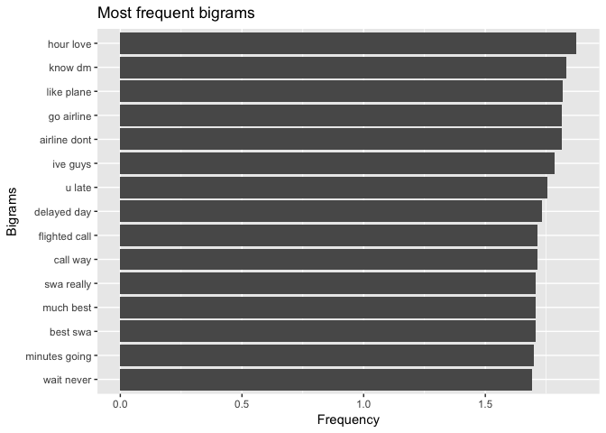
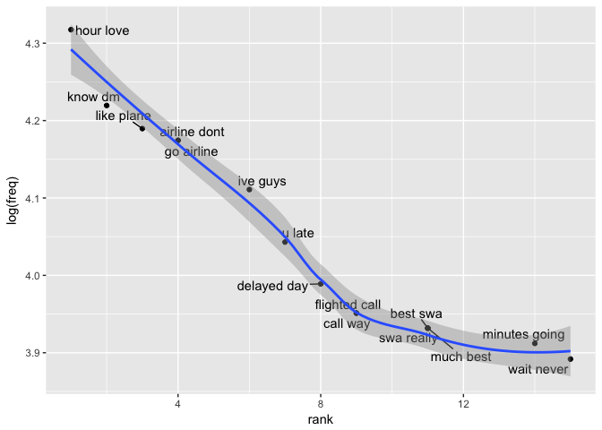
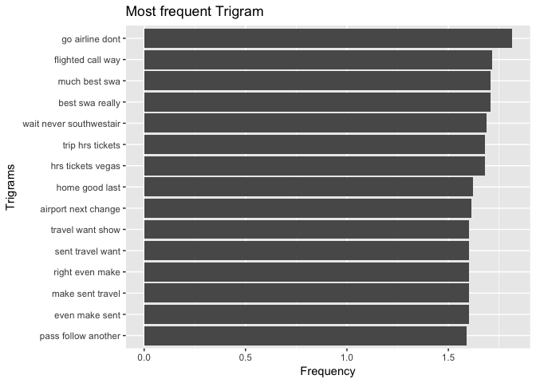
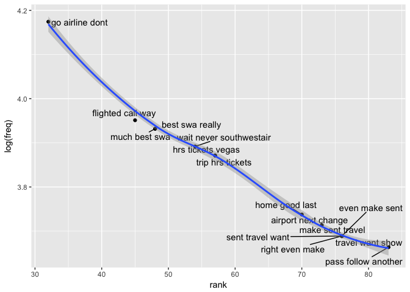

Airline Sentiment
================
2017-11-24

### Introduction

Analyzing the US based airlines performances by analyzing the the tweets of the airlines.Identifying the sentiments of tweets and classifying them as nuetral, negative and positive sentiment for each airlines. Identify the issues behind negative sentiments and checking the significance of bigrams, trigrams and airlines on the sentiment.

### Description of Data Set

The dataset contains important fields like tweet\_id,airline\_sentiment, airline, name, text, tweet\_created, tweet\_location which will be widely used in the sentiment analysis.

``` r
data_dir <- "~/Desktop/Springboard/Capstone Project/Capstone" 
twitter_airline <- read.csv(file.path(data_dir,"tweets.csv"),header = TRUE)
dim(twitter_airline)
```

    ## [1] 14640    15

``` r
colnames(twitter_airline)
```

    ##  [1] "tweet_id"                     "airline_sentiment"           
    ##  [3] "airline_sentiment_confidence" "negativereason"              
    ##  [5] "negativereason_confidence"    "airline"                     
    ##  [7] "airline_sentiment_gold"       "name"                        
    ##  [9] "negativereason_gold"          "retweet_count"               
    ## [11] "text"                         "tweet_coord"                 
    ## [13] "tweet_created"                "tweet_location"              
    ## [15] "user_timezone"

``` r
knitr::opts_chunk$set(echo = TRUE)
```

### Load the libraries

Loading the libraries required for sentiment analysis.

``` r
library(tm)
library(dplyr)
library(plyr)
library(sentiment)
library(twitteR)
library(wordcloud)
library(ggplot2)
library(magrittr)
library(tidytext)
library(ggrepel)
```

### Structure of the dataset

``` r
str(twitter_airline)
```

    ## 'data.frame':    14640 obs. of  15 variables:
    ##  $ tweet_id                    : num  5.7e+17 5.7e+17 5.7e+17 5.7e+17 5.7e+17 ...
    ##  $ airline_sentiment           : Factor w/ 3 levels "negative","neutral",..: 2 3 2 1 1 1 3 2 3 3 ...
    ##  $ airline_sentiment_confidence: num  1 0.349 0.684 1 1 ...
    ##  $ negativereason              : Factor w/ 11 levels "","Bad Flight",..: 1 1 1 2 3 3 1 1 1 1 ...
    ##  $ negativereason_confidence   : num  NA 0 NA 0.703 1 ...
    ##  $ airline                     : Factor w/ 6 levels "American","Delta",..: 6 6 6 6 6 6 6 6 6 6 ...
    ##  $ airline_sentiment_gold      : Factor w/ 4 levels "","negative",..: 1 1 1 1 1 1 1 1 1 1 ...
    ##  $ name                        : Factor w/ 7701 levels "___the___","__betrayal",..: 1073 3477 7666 3477 3477 3477 1392 5658 1874 7665 ...
    ##  $ negativereason_gold         : Factor w/ 14 levels "","Bad Flight",..: 1 1 1 1 1 1 1 1 1 1 ...
    ##  $ retweet_count               : int  0 0 0 0 0 0 0 0 0 0 ...
    ##  $ text                        : Factor w/ 14427 levels "_\xf4ִ RT @JetBlue: Our fleet's on fleek. http://t.co/4KH92mKoTZ",..: 14016 13923 13794 13857 13659 13937 14049 13928 14015 13855 ...
    ##  $ tweet_coord                 : Factor w/ 833 levels "","[-33.87144962, 151.20821275]",..: 1 1 1 1 1 1 1 1 1 1 ...
    ##  $ tweet_created               : Factor w/ 6804 levels "2/16/15 23:36",..: 6414 6397 6397 6397 6396 6396 6395 6394 6393 6376 ...
    ##  $ tweet_location              : Factor w/ 3082 levels "","  || san antonio, texas||",..: 1 1 1465 1 1 1 2407 1529 2389 1529 ...
    ##  $ user_timezone               : Factor w/ 86 levels "","Abu Dhabi",..: 32 64 29 64 64 64 64 64 64 32 ...

### Summary of the dataset

``` r
summary(twitter_airline)
```

    ##     tweet_id         airline_sentiment airline_sentiment_confidence
    ##  Min.   :5.676e+17   negative:9178     Min.   :0.3350              
    ##  1st Qu.:5.686e+17   neutral :3099     1st Qu.:0.6923              
    ##  Median :5.695e+17   positive:2363     Median :1.0000              
    ##  Mean   :5.692e+17                     Mean   :0.9002              
    ##  3rd Qu.:5.699e+17                     3rd Qu.:1.0000              
    ##  Max.   :5.703e+17                     Max.   :1.0000              
    ##                                                                    
    ##                 negativereason negativereason_confidence
    ##                        :5462   Min.   :0.000            
    ##  Customer Service Issue:2910   1st Qu.:0.361            
    ##  Late Flight           :1665   Median :0.671            
    ##  Can't Tell            :1190   Mean   :0.638            
    ##  Cancelled Flight      : 847   3rd Qu.:1.000            
    ##  Lost Luggage          : 724   Max.   :1.000            
    ##  (Other)               :1842   NA's   :4118             
    ##            airline     airline_sentiment_gold          name      
    ##  American      :2759           :14600         JetBlueNews:   63  
    ##  Delta         :2222   negative:   32         kbosspotter:   32  
    ##  Southwest     :2420   neutral :    3         _mhertz    :   29  
    ##  United        :3822   positive:    5         otisday    :   28  
    ##  US Airways    :2913                          throthra   :   27  
    ##  Virgin America: 504                          rossj987   :   23  
    ##                                               (Other)    :14438  
    ##                                negativereason_gold retweet_count     
    ##                                          :14608    Min.   : 0.00000  
    ##  Customer Service Issue                  :   12    1st Qu.: 0.00000  
    ##  Late Flight                             :    4    Median : 0.00000  
    ##  Can't Tell                              :    3    Mean   : 0.08265  
    ##  Cancelled Flight                        :    3    3rd Qu.: 0.00000  
    ##  Cancelled Flight\nCustomer Service Issue:    2    Max.   :44.00000  
    ##  (Other)                                 :    8                      
    ##                       text                            tweet_coord   
    ##  @united thanks         :    6                              :13621  
    ##  @AmericanAir thanks    :    5   [0.0, 0.0]                 :  164  
    ##  @JetBlue thanks!       :    5   [40.64656067, -73.78334045]:    6  
    ##  @SouthwestAir sent     :    5   [32.91792297, -97.00367737]:    3  
    ##  @AmericanAir thank you!:    4   [40.64646912, -73.79133606]:    3  
    ##  @united thank you!     :    4   [18.22245647, -63.00369733]:    2  
    ##  (Other)                :14611   (Other)                    :  841  
    ##        tweet_created          tweet_location
    ##  2/22/15 14:22:   11                 :4733  
    ##  2/22/15 17:15:   11   Boston, MA    : 157  
    ##  2/23/15 11:50:   11   New York, NY  : 156  
    ##  2/22/15 13:06:   10   Washington, DC: 150  
    ##  2/22/15 14:11:   10   New York      : 127  
    ##  2/22/15 17:14:   10   USA           : 126  
    ##  (Other)      :14577   (Other)       :9191  
    ##                     user_timezone 
    ##                            :4820  
    ##  Eastern Time (US & Canada):3744  
    ##  Central Time (US & Canada):1931  
    ##  Pacific Time (US & Canada):1208  
    ##  Quito                     : 738  
    ##  Atlantic Time (Canada)    : 497  
    ##  (Other)                   :1702

Dataset contains 14640 observations and 15 variables. There are some new variables that will be added to the dataset.

### Replace twitter handle with blank

The tweets contained the airlines twitter handle. We must first remove the twitter handle as they should not be used in the text analysis.

``` r
twitter_airline$text <- gsub("@VirginAmerica","",gsub("@AmericanAir","",
 gsub("@JetBlue ","",gsub("@SouthwestAir","",gsub("@united","",
 gsub("@USAirways","", twitter_airline$text))))))
```

### Subsetting southwest tweets from the dataset

``` r
twitter_southwest <- filter(twitter_airline, airline =="Southwest")
```

### Build and cleaning the corpus

Here we convert the text into a word corpus using the function VectorSource. A word corpus enables us to eliminate common words using the text mining package tm. Removing the corpus specific stopwords lets us focus on the important words.

``` r
tweets_corpus <- Corpus(VectorSource(twitter_southwest$text))


# Inspect Corpus
inspect(tweets_corpus[1:5])
```

    ## <<SimpleCorpus>>
    ## Metadata:  corpus specific: 1, document level (indexed): 0
    ## Content:  documents: 5
    ## 
    ## [1]  still waiting. Just hit one hour.                                                                                                  
    ## [2]  although I'm not happy you Cancelled Flighted my flight home tomorrow (phx to atl then dca) I am happy on how easy it was to rebook
    ## [3]  Hello - been on hold for extremely long time. Have confirmation # &amp; can't get boarding pass. Have tried numerous times!!       
    ## [4]  I'm teaching new #travelers how to research, #budget &amp; #save for a trip today! http://t.co/Qll48r57ep                          
    ## [5]  Very frustrated for the loooooong wait time to speak to a live person!!! Cannot get boarding pass for flight tomorrow!!

### Clean the corpus

``` r
# Remove Punctuations
tweets_corpus <- tm_map(tweets_corpus,removePunctuation)


#Remove URLs
removeURL <- function(x) {
  gsub("http[^[:space:]]*", "", x)
}
tweets_corpus <- tm_map(tweets_corpus,content_transformer(removeURL))

# Remove anything expect English and Space
remove_others <- function(x) {
  gsub("[^[:alpha:][:space:]]*","",x)
}
tweets_corpus <- tm_map(tweets_corpus,content_transformer(remove_others))
inspect(tweets_corpus[1:5])
```

    ## <<SimpleCorpus>>
    ## Metadata:  corpus specific: 1, document level (indexed): 0
    ## Content:  documents: 5
    ## 
    ## [1]  still waiting Just hit one hour                                                                                                 
    ## [2]  although Im not happy you Cancelled Flighted my flight home tomorrow phx to atl then dca I am happy on how easy it was to rebook
    ## [3]  Hello  been on hold for extremely long time Have confirmation  amp cant get boarding pass Have tried numerous times             
    ## [4]  Im teaching new travelers how to research budget amp save for a trip today                                                      
    ## [5]  Very frustrated for the loooooong wait time to speak to a live person Cannot get boarding pass for flight tomorrow

### Convert the corpus to lowercase

``` r
tweets_corpus <- tm_map(tweets_corpus,content_transformer(tolower))

# Remove Stopwords. 
tweets_stopwords <- c(setdiff(stopwords('english'), c("r", "big","southwest","southwest","southwest","airways","airlines","flight","pilot",
 "virgin","US airways","southwest","a","the","is","and")),"use", "see", 
 "used", "via", "amp","the","a","aa","aaaand","i","a","the",
 "flight","airlines","flights","airway","will", "cant","and","is","can","im","southwest","SW")
tweets_corpus <- tm_map(tweets_corpus,removeWords,tweets_stopwords)
inspect(tweets_corpus[1:5])
```

    ## <<SimpleCorpus>>
    ## Metadata:  corpus specific: 1, document level (indexed): 0
    ## Content:  documents: 5
    ## 
    ## [1]  still waiting just hit one hour                                                            
    ## [2]  although   happy  cancelled flighted   home tomorrow phx  atl  dca   happy   easy    rebook
    ## [3]  hello    hold  extremely long time  confirmation    get boarding pass  tried numerous times
    ## [4]   teaching new travelers   research budget  save   trip today                               
    ## [5]   frustrated   loooooong wait time  speak   live person  get boarding pass   tomorrow

### Remove extra whitespace

``` r
tweets_corpus <- tm_map(tweets_corpus,stripWhitespace)
inspect(tweets_corpus[1:5])
```

    ## <<SimpleCorpus>>
    ## Metadata:  corpus specific: 1, document level (indexed): 0
    ## Content:  documents: 5
    ## 
    ## [1]  still waiting just hit one hour                                                   
    ## [2]  although happy cancelled flighted home tomorrow phx atl dca happy easy rebook     
    ## [3]  hello hold extremely long time confirmation get boarding pass tried numerous times
    ## [4]  teaching new travelers research budget save trip today                            
    ## [5]  frustrated loooooong wait time speak live person get boarding pass tomorrow

### Make a copy of the corpus

``` r
tweets_corpus_copy <- tweets_corpus
tweets_corpus_jp <- tweets_corpus
```

### converting corpus to dataframe

``` r
attributes(tweets_corpus_jp)
```

    ## $names
    ## [1] "content" "meta"    "dmeta"  
    ## 
    ## $class
    ## [1] "SimpleCorpus" "Corpus"

``` r
southwest_df <-data.frame(text=unlist(sapply(tweets_corpus, `[`)), stringsAsFactors=F)


southwest_df$tweet_id <- twitter_southwest$tweet_id
head(southwest_df)
```

    ##                                                                                     text
    ## 1                                                        still waiting just hit one hour
    ## 2          although happy cancelled flighted home tomorrow phx atl dca happy easy rebook
    ## 3     hello hold extremely long time confirmation get boarding pass tried numerous times
    ## 4                                teaching new travelers research budget save trip today 
    ## 5            frustrated loooooong wait time speak live person get boarding pass tomorrow
    ## 6  still update text still response email fr sr feel like yr losing customer servicecare
    ##      tweet_id
    ## 1 5.70309e+17
    ## 2 5.70309e+17
    ## 3 5.70308e+17
    ## 4 5.70306e+17
    ## 5 5.70306e+17
    ## 6 5.70305e+17

### Create Term Document Martix

We convert the word corpus into a document matrix. The Document matrix can be analyzed to examine most frequently occurring words.

``` r
tweet_tdm <- TermDocumentMatrix(tweets_corpus,
                                control = list(wordLengths = c(1,Inf)))
tweet_tdm
```

    ## <<TermDocumentMatrix (terms: 4437, documents: 2420)>>
    ## Non-/sparse entries: 19440/10718100
    ## Sparsity           : 100%
    ## Maximal term length: 46
    ## Weighting          : term frequency (tf)

### Word Frequencies

We find the most frequent words and we create a Word Cloud of tweets using We are limiting the maximum words to 100 and plotting the top 10 frequent words using the ggplot package.

``` r
# Frequent Terms
freq_terms <- findFreqTerms(tweet_tdm)
term_freq <- sort(rowSums(as.matrix(tweet_tdm)),decreasing = TRUE)
freqterms_df <- data.frame(term = names(term_freq), freq = term_freq)


# Creating a word cloud of frequent term
wordcloud(words = freqterms_df$term, freq = freqterms_df$freq, min.freq = 1,
          max.words=100, random.order=FALSE, rot.per=0.35, 
          colors=brewer.pal(8, "Dark2"))
```


``` r
# Plotting the top 10 frequent words


freqterms_df$rank <- rank(-freqterms_df$freq,ties.method="min")
freqterms_df <- freqterms_df[order(freqterms_df$rank,decreasing = F),]
head(freqterms_df,10)
```

    ##                term freq rank
    ## cancelled cancelled  242    1
    ## get             get  230    2
    ## thanks       thanks  194    3
    ## now             now  167    4
    ## just           just  163    5
    ## hold           hold  157    6
    ## help           help  153    7
    ## thank         thank  143    8
    ## service     service  137    9
    ## time           time  125   10

``` r
ggplot(head(freqterms_df,10), aes(x=term, y=rank)) + geom_bar(stat="identity") +
xlab("Terms") + ylab("Count") 
```


#### Plot the frequency of the words on log scale .

Plotting the frequency of top 50 words in the logarithmic scale.

``` r
# Word frequency on log scale

freq_terms20 <- head(freqterms_df,20)
ggplot(freq_terms20, aes(rank, log(freq))) + geom_point() +
geom_text_repel(label = rownames(freq_terms20)) +  geom_smooth()
```

    ## `geom_smooth()` using method = 'loess'


``` r
  #theme(axis.text.x=element_text(angle=45,hjust=1)) 
```

#### Plotting Bigrams for word frequency

The initial exploration of the word analysis was helpful and we will construct bigrams and trigrams and plot the top 15 bigram and trigram on a logarithmic scale.Bigrams are two word phrases and trigrams are three word phrases. Recall that stop words had been removed so the phrases may look choppy.

``` r
#Bigram 
bigram_df <- freqterms_df %>%
  unnest_tokens(bigram, term , token = "ngrams", n = 2)

bigram_df$rank <- rank(-bigram_df$freq,ties.method="min")
bigram_df <- bigram_df[order(bigram_df$rank,decreasing = F),]

bigram_df15 <- head(bigram_df,15)
head(bigram_df15,15)
```

    ## # A tibble: 15 x 3
    ##     freq  rank        bigram
    ##    <dbl> <int>         <chr>
    ##  1    75     1     hour love
    ##  2    68     2       know dm
    ##  3    66     3    like plane
    ##  4    65     4    go airline
    ##  5    65     4  airline dont
    ##  6    61     6      ive guys
    ##  7    57     7        u late
    ##  8    54     8   delayed day
    ##  9    52     9 flighted call
    ## 10    52     9      call way
    ## 11    51    11     much best
    ## 12    51    11      best swa
    ## 13    51    11    swa really
    ## 14    50    14 minutes going
    ## 15    49    15    wait never

``` r
bigram_df15 <- bigram_df15[c("bigram","freq","rank")]
#Bigram Plot
ggplot(bigram_df15,  aes(reorder(bigram,freq), log10(freq))) +
 geom_bar(stat = "identity") + coord_flip() +
 xlab("Bigrams") + ylab("Frequency") + ggtitle("Most frequent bigrams")
```



``` r
#Bigram Plot ranking vs frequency on log scale

ggplot(bigram_df15, aes(rank, log(freq))) + geom_point() +
geom_text_repel(label = (bigram_df15$bigram)) + geom_smooth()
```

    ## `geom_smooth()` using method = 'loess'



#### Plotting Bigrams / Trigrams for word frequency

``` r
#Trigram
trigram_df <- freqterms_df %>%  unnest_tokens(trigram, term , token = "ngrams", n = 3)
trigram_df <- trigram_df %>% arrange(desc(freq))

trigram_df15 <- head(trigram_df,15)
head(trigram_df15,15)
```

    ## # A tibble: 15 x 3
    ##     freq  rank                 trigram
    ##    <dbl> <int>                   <chr>
    ##  1    65    32         go airline dont
    ##  2    52    45       flighted call way
    ##  3    51    48           much best swa
    ##  4    51    48         best swa really
    ##  5    49    54 wait never southwestair
    ##  6    48    57        trip hrs tickets
    ##  7    48    57       hrs tickets vegas
    ##  8    42    70          home good last
    ##  9    41    73     airport next change
    ## 10    40    76         right even make
    ## 11    40    76          even make sent
    ## 12    40    76        make sent travel
    ## 13    40    76        sent travel want
    ## 14    40    76        travel want show
    ## 15    39    83     pass follow another

``` r
# Trigram Plot 
ggplot(trigram_df15, aes(reorder(trigram,freq), log10(freq))) +
  geom_bar(stat = "identity") + coord_flip() +
  xlab("Trigrams") + ylab("Frequency") +
  ggtitle("Most frequent Trigram")
```



``` r
#Trigram Plot ranking vs frequency on log scale

ggplot(trigram_df15, aes(rank, log(freq))) + geom_point() +
geom_text_repel(label = (trigram_df15$trigram)) + geom_smooth()
```

    ## `geom_smooth()` using method = 'loess'



### Sentiments

Let us know look at the sentiments of the tweets for southwest airlines. It helps in identifying the positive, negative and nuetral sentiment of the tweets.

### Retrieve Data for southwest airline

``` r
southwest <- southwest_df
southwest <- droplevels(southwest)


southwest_txt  <- southwest$text

southwest_sentiment <- sentiment(southwest_txt)

# map values 
southwest_sentiment$score <- NA
southwest_sentiment$score[southwest_sentiment$polarity == "positive"] <- 1
southwest_sentiment$score[southwest_sentiment$polarity == "negative"] <- -1
#southwest_table <- table(southwest_sentiment$polarity)
ggplot(southwest_sentiment, aes(x=polarity)) +
  geom_bar(aes(y=..count.., fill=polarity)) +geom_text(stat='count',
  aes(label=..count..),vjust=-0.2)+
  scale_fill_brewer(palette="Dark2") +
 labs(x="Polarity", y="Number of Tweets") +
  ggtitle("Twitter Sentiment Analysis of southwest Airlines")+
  theme(plot.title = element_text(hjust = 0.5))
```


``` r
southwest_sentiment$tweet_id <- southwest$tweet_id

southwest_sentiment$airline <- 'southwest'
southwest_sentiment$code <- 'SW'
colnames(southwest_sentiment)
```

    ## [1] "text"     "polarity" "language" "score"    "tweet_id" "airline" 
    ## [7] "code"

southwest has most of the tweets that are nuetral. The negative tweets are more than the positive tweets
