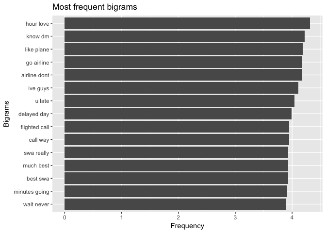
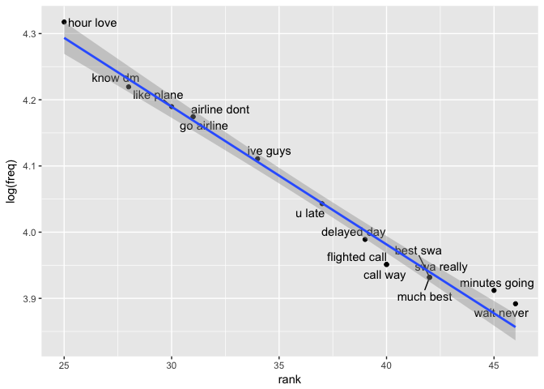
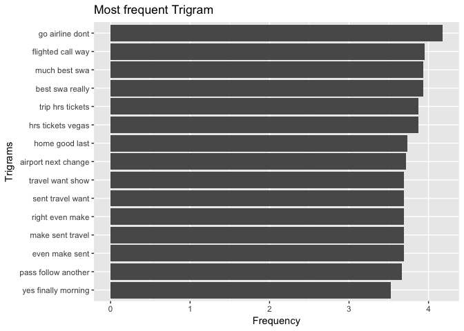
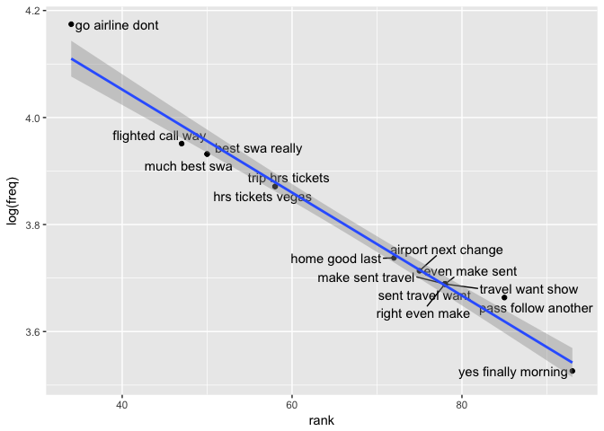

Southwest Airlines Sentiment
================
2018-07-14

### Introduction

Analyzing the Southwest Airlines performances by analyzing the the tweets. Identifying the sentiments of tweets and classifying them as nuetral, negative and positive sentiment for each airlines. Identify the issues behind negative sentiments and checking the significance of bigrams, trigrams and airlines on the sentiment.

### Description of Data Set

The dataset contains important fields like tweet\_id,airline\_sentiment, airline, name, text, tweet\_created, tweet\_location which will be widely used in the sentiment analysis.

``` r
data_dir <- "~/Desktop/Springboard/Capstone Project/Capstone" 
twitter_airline <- read.csv(file.path(data_dir,"Tweets.csv"),header = TRUE)
dim(twitter_airline)
```

    ## [1] 14640    15

``` r
colnames(twitter_airline)
```

    ##  [1] "tweet_id"                     "airline_sentiment"           
    ##  [3] "airline_sentiment_confidence" "negativereason"              
    ##  [5] "negativereason_confidence"    "airline"                     
    ##  [7] "airline_sentiment_gold"       "name"                        
    ##  [9] "negativereason_gold"          "retweet_count"               
    ## [11] "text"                         "tweet_coord"                 
    ## [13] "tweet_created"                "tweet_location"              
    ## [15] "user_timezone"

### Load the libraries

Loading the libraries required for sentiment analysis.

``` r
library(tm)
library(dplyr)
library(plyr)
library(sentiment)
library(twitteR)
library(wordcloud)
library(ggplot2)
library(magrittr)
library(tidytext)
library(ggrepel)
library(stringr)
library(slam)
library(caret)
library(e1071)
library(ROCR)
library(pROC)
library(ROSE)
library(DMwR)
```

### Structure of the dataset

``` r
str(twitter_airline)
```

    ## 'data.frame':    14640 obs. of  15 variables:
    ##  $ tweet_id                    : num  5.7e+17 5.7e+17 5.7e+17 5.7e+17 5.7e+17 ...
    ##  $ airline_sentiment           : Factor w/ 3 levels "negative","neutral",..: 2 3 2 1 1 1 3 2 3 3 ...
    ##  $ airline_sentiment_confidence: num  1 0.349 0.684 1 1 ...
    ##  $ negativereason              : Factor w/ 11 levels "","Bad Flight",..: 1 1 1 2 3 3 1 1 1 1 ...
    ##  $ negativereason_confidence   : num  NA 0 NA 0.703 1 ...
    ##  $ airline                     : Factor w/ 6 levels "American","Delta",..: 6 6 6 6 6 6 6 6 6 6 ...
    ##  $ airline_sentiment_gold      : Factor w/ 4 levels "","negative",..: 1 1 1 1 1 1 1 1 1 1 ...
    ##  $ name                        : Factor w/ 7701 levels "___the___","__betrayal",..: 1073 3477 7666 3477 3477 3477 1392 5658 1874 7665 ...
    ##  $ negativereason_gold         : Factor w/ 14 levels "","Bad Flight",..: 1 1 1 1 1 1 1 1 1 1 ...
    ##  $ retweet_count               : int  0 0 0 0 0 0 0 0 0 0 ...
    ##  $ text                        : Factor w/ 14427 levels "_\xf4ִ RT @JetBlue: Our fleet's on fleek. http://t.co/4KH92mKoTZ",..: 14016 13923 13794 13857 13659 13937 14049 13928 14015 13855 ...
    ##  $ tweet_coord                 : Factor w/ 833 levels "","[-33.87144962, 151.20821275]",..: 1 1 1 1 1 1 1 1 1 1 ...
    ##  $ tweet_created               : Factor w/ 6804 levels "2/16/15 23:36",..: 6414 6397 6397 6397 6396 6396 6395 6394 6393 6376 ...
    ##  $ tweet_location              : Factor w/ 3082 levels "","  || san antonio, texas||",..: 1 1 1465 1 1 1 2407 1529 2389 1529 ...
    ##  $ user_timezone               : Factor w/ 86 levels "","Abu Dhabi",..: 32 64 29 64 64 64 64 64 64 32 ...

### Summary of the dataset

``` r
summary(twitter_airline)
```

    ##     tweet_id         airline_sentiment airline_sentiment_confidence
    ##  Min.   :5.676e+17   negative:9178     Min.   :0.3350              
    ##  1st Qu.:5.686e+17   neutral :3099     1st Qu.:0.6923              
    ##  Median :5.695e+17   positive:2363     Median :1.0000              
    ##  Mean   :5.692e+17                     Mean   :0.9002              
    ##  3rd Qu.:5.699e+17                     3rd Qu.:1.0000              
    ##  Max.   :5.703e+17                     Max.   :1.0000              
    ##                                                                    
    ##                 negativereason negativereason_confidence
    ##                        :5462   Min.   :0.000            
    ##  Customer Service Issue:2910   1st Qu.:0.361            
    ##  Late Flight           :1665   Median :0.671            
    ##  Can't Tell            :1190   Mean   :0.638            
    ##  Cancelled Flight      : 847   3rd Qu.:1.000            
    ##  Lost Luggage          : 724   Max.   :1.000            
    ##  (Other)               :1842   NA's   :4118             
    ##            airline     airline_sentiment_gold          name      
    ##  American      :2759           :14600         JetBlueNews:   63  
    ##  Delta         :2222   negative:   32         kbosspotter:   32  
    ##  Southwest     :2420   neutral :    3         _mhertz    :   29  
    ##  United        :3822   positive:    5         otisday    :   28  
    ##  US Airways    :2913                          throthra   :   27  
    ##  Virgin America: 504                          rossj987   :   23  
    ##                                               (Other)    :14438  
    ##                                negativereason_gold retweet_count     
    ##                                          :14608    Min.   : 0.00000  
    ##  Customer Service Issue                  :   12    1st Qu.: 0.00000  
    ##  Late Flight                             :    4    Median : 0.00000  
    ##  Can't Tell                              :    3    Mean   : 0.08265  
    ##  Cancelled Flight                        :    3    3rd Qu.: 0.00000  
    ##  Cancelled Flight\nCustomer Service Issue:    2    Max.   :44.00000  
    ##  (Other)                                 :    8                      
    ##                       text                            tweet_coord   
    ##  @united thanks         :    6                              :13621  
    ##  @AmericanAir thanks    :    5   [0.0, 0.0]                 :  164  
    ##  @JetBlue thanks!       :    5   [40.64656067, -73.78334045]:    6  
    ##  @SouthwestAir sent     :    5   [32.91792297, -97.00367737]:    3  
    ##  @AmericanAir thank you!:    4   [40.64646912, -73.79133606]:    3  
    ##  @united thank you!     :    4   [18.22245647, -63.00369733]:    2  
    ##  (Other)                :14611   (Other)                    :  841  
    ##        tweet_created          tweet_location
    ##  2/22/15 14:22:   11                 :4733  
    ##  2/22/15 17:15:   11   Boston, MA    : 157  
    ##  2/23/15 11:50:   11   New York, NY  : 156  
    ##  2/22/15 13:06:   10   Washington, DC: 150  
    ##  2/22/15 14:11:   10   New York      : 127  
    ##  2/22/15 17:14:   10   USA           : 126  
    ##  (Other)      :14577   (Other)       :9191  
    ##                     user_timezone 
    ##                            :4820  
    ##  Eastern Time (US & Canada):3744  
    ##  Central Time (US & Canada):1931  
    ##  Pacific Time (US & Canada):1208  
    ##  Quito                     : 738  
    ##  Atlantic Time (Canada)    : 497  
    ##  (Other)                   :1702

Dataset contains 14640 observations and 15 variables. There are some new variables that will be added to the dataset.

### Replace twitter handle with blank

The tweets contained the airlines twitter handle. We must first remove the twitter handle as they should not be used in the text analysis.

``` r
twitter_airline$text <- gsub("@VirginAmerica","",gsub("@SouthwestAir","",
 gsub("@JetBlue ","",gsub("@SouthwestAir","",gsub("@Southwest","",
 gsub("@USAirways","", twitter_airline$text))))))
```

### Subsetting Southwest\_Airways tweets from the dataset

``` r
twitter_Southwest_airlines <- filter(twitter_airline, airline =="Southwest")
```

### Build and cleaning the corpus

Here we convert the text into a word corpus using the function VectorSource. A word corpus enables us to eliminate common words using the text mining package tm. Removing the corpus specific stopwords lets us focus on the important words.

``` r
tweets_corpus <- Corpus(VectorSource(twitter_Southwest_airlines$text))


# Inspect Corpus
inspect(tweets_corpus[1:5])
```

    ## <<SimpleCorpus>>
    ## Metadata:  corpus specific: 1, document level (indexed): 0
    ## Content:  documents: 5
    ## 
    ## [1] Air still waiting. Just hit one hour.                                                                                                  
    ## [2] Air although I'm not happy you Cancelled Flighted my flight home tomorrow (phx to atl then dca) I am happy on how easy it was to rebook
    ## [3] Air Hello - been on hold for extremely long time. Have confirmation # &amp; can't get boarding pass. Have tried numerous times!!       
    ## [4] Air I'm teaching new #travelers how to research, #budget &amp; #save for a trip today! http://t.co/Qll48r57ep                          
    ## [5] Air Very frustrated for the loooooong wait time to speak to a live person!!! Cannot get boarding pass for flight tomorrow!!

### Clean the corpus

``` r
# Remove Punctuations
tweets_corpus <- tm_map(tweets_corpus,removePunctuation)


#Remove URLs
removeURL <- function(x) {
  gsub("http[^[:space:]]*", "", x)
}
tweets_corpus <- tm_map(tweets_corpus,content_transformer(removeURL))

# Remove anything expect English and Space
remove_others <- function(x) {
  gsub("[^[:alpha:][:space:]]*","",x)
}
tweets_corpus <- tm_map(tweets_corpus,content_transformer(remove_others))
inspect(tweets_corpus[1:5])
```

    ## <<SimpleCorpus>>
    ## Metadata:  corpus specific: 1, document level (indexed): 0
    ## Content:  documents: 5
    ## 
    ## [1] Air still waiting Just hit one hour                                                                                                 
    ## [2] Air although Im not happy you Cancelled Flighted my flight home tomorrow phx to atl then dca I am happy on how easy it was to rebook
    ## [3] Air Hello  been on hold for extremely long time Have confirmation  amp cant get boarding pass Have tried numerous times             
    ## [4] Air Im teaching new travelers how to research budget amp save for a trip today                                                      
    ## [5] Air Very frustrated for the loooooong wait time to speak to a live person Cannot get boarding pass for flight tomorrow

### Convert the corpus to lowercase

``` r
tweets_corpus <- tm_map(tweets_corpus,content_transformer(tolower))

# Remove Stopwords. 
tweets_stopwords <- c(setdiff(stopwords('english'), c("r", "big","Virgin America","Virgin America","Southwest","airways","airlines","flight","pilot",
 "virgin","US airways","southwest","a","the","is","and")),"use", "see", 
 "used", "via", "amp","the","a","aa","aaaand","i","a","the",
 "flight","airlines","flights","airway","will", "cant","and","is","can","im",
 "jetblue")
tweets_corpus <- tm_map(tweets_corpus,removeWords,tweets_stopwords)
inspect(tweets_corpus[1:5])
```

    ## <<SimpleCorpus>>
    ## Metadata:  corpus specific: 1, document level (indexed): 0
    ## Content:  documents: 5
    ## 
    ## [1] air still waiting just hit one hour                                                            
    ## [2] air although   happy  cancelled flighted   home tomorrow phx  atl  dca   happy   easy    rebook
    ## [3] air hello    hold  extremely long time  confirmation    get boarding pass  tried numerous times
    ## [4] air  teaching new travelers   research budget  save   trip today                               
    ## [5] air  frustrated   loooooong wait time  speak   live person  get boarding pass   tomorrow

### Remove extra whitespace

``` r
tweets_corpus <- tm_map(tweets_corpus,stripWhitespace)
inspect(tweets_corpus[1:5])
```

    ## <<SimpleCorpus>>
    ## Metadata:  corpus specific: 1, document level (indexed): 0
    ## Content:  documents: 5
    ## 
    ## [1] air still waiting just hit one hour                                                   
    ## [2] air although happy cancelled flighted home tomorrow phx atl dca happy easy rebook     
    ## [3] air hello hold extremely long time confirmation get boarding pass tried numerous times
    ## [4] air teaching new travelers research budget save trip today                            
    ## [5] air frustrated loooooong wait time speak live person get boarding pass tomorrow

### Make a copy of the corpus

``` r
tweets_corpus_copy <- tweets_corpus
tweets_corpus_jp <- tweets_corpus
```

### converting corpus to dataframe

``` r
attributes(tweets_corpus_jp)
```

    ## $names
    ## [1] "content" "meta"    "dmeta"  
    ## 
    ## $class
    ## [1] "SimpleCorpus" "Corpus"

``` r
Southwest_Airways_df <-data.frame(text=unlist(sapply(tweets_corpus, `[`)), stringsAsFactors=F)


Southwest_Airways_df$tweet_id <- twitter_Southwest_airlines$tweet_id
head(Southwest_Airways_df)
```

    ##                                                                                        text
    ## 1                                                       air still waiting just hit one hour
    ## 2         air although happy cancelled flighted home tomorrow phx atl dca happy easy rebook
    ## 3    air hello hold extremely long time confirmation get boarding pass tried numerous times
    ## 4                               air teaching new travelers research budget save trip today 
    ## 5           air frustrated loooooong wait time speak live person get boarding pass tomorrow
    ## 6 air still update text still response email fr sr feel like yr losing customer servicecare
    ##      tweet_id
    ## 1 5.70309e+17
    ## 2 5.70309e+17
    ## 3 5.70308e+17
    ## 4 5.70306e+17
    ## 5 5.70306e+17
    ## 6 5.70305e+17

### Create Term Document Martix

We convert the word corpus into a document matrix. The Document matrix can be analyzed to examine most frequently occurring words.

``` r
tweet_tdm <- TermDocumentMatrix(tweets_corpus,
                                control = list(wordLengths = c(1,Inf)))
tweet_tdm
```

    ## <<TermDocumentMatrix (terms: 4443, documents: 2420)>>
    ## Non-/sparse entries: 21879/10730181
    ## Sparsity           : 100%
    ## Maximal term length: 46
    ## Weighting          : term frequency (tf)

### Word Frequencies

We find the most frequent words and we create a Word Cloud of tweets using We are limiting the maximum words to 100 and plotting the top 10 frequent words using the ggplot package.

``` r
# Frequent Terms
freq_terms <- findFreqTerms(tweet_tdm)
term_freq <- sort(rowSums(as.matrix(tweet_tdm)),decreasing = TRUE)
freqterms_df <- data.frame(term = names(term_freq), freq = term_freq)

head(freqterms_df)
```

    ##                term freq
    ## air             air 2391
    ## cancelled cancelled  242
    ## get             get  230
    ## thanks       thanks  194
    ## now             now  167
    ## just           just  163

``` r
# Creating a word cloud of frequent term
wordcloud(words = freqterms_df$term, freq = freqterms_df$freq, min.freq = 1,
          max.words=75, random.order=FALSE, rot.per=0.35, 
          colors=brewer.pal(8, "Dark2"))
```


``` r
# Plotting the top 10 frequent words


freqterms_df$rank <- rank(-freqterms_df$freq,ties.method="min")
#dplyr sort 
freqterms_df <- freqterms_df[order(freqterms_df$rank,decreasing = F),]
head(freqterms_df,10)
```

    ##                term freq rank
    ## air             air 2391    1
    ## cancelled cancelled  242    2
    ## get             get  230    3
    ## thanks       thanks  194    4
    ## now             now  167    5
    ## just           just  163    6
    ## hold           hold  157    7
    ## help           help  153    8
    ## thank         thank  143    9
    ## service     service  137   10

``` r
ggplot(head(freqterms_df,10), aes(x=term, y=rank)) + geom_bar(stat="identity") +
xlab("Terms") + ylab("Count") 
```


#### Plot the frequency of the words on log scale .

Plotting the frequency of top 50 words in the logarithmic scale.

``` r
# Word frequency on log scale


freq_terms20 <- head(freqterms_df,20)
ggplot(freq_terms20, aes(rank, log(freq))) + geom_point() +
geom_text_repel(label = rownames(freq_terms20)) +  geom_smooth(method="lm")
```


#### Plotting Bigrams for word frequency

The initial exploration of the word analysis was helpful and we will construct bigrams and plot the top 15 bigrams on a logarithmic scale.Bigrams are two word phrases.Recall that stop words had been removed so the phrases may look choppy

``` r
#Bigram 
bigram_df <- freqterms_df %>%
  unnest_tokens(bigram, term , token = "ngrams", n = 2)

bigram_df$rank <- rank(-bigram_df$freq,ties.method="min")
bigram_df <- bigram_df[order(bigram_df$rank,decreasing = F),]

bigram_df <- na.omit(bigram_df)

bigram_df15 <- head(bigram_df,15)
head(bigram_df15,15)
```

    ##      freq rank        bigram
    ## 4362   75   25     hour love
    ## 4359   68   28       know dm
    ## 4357   66   30    like plane
    ## 4355   65   31    go airline
    ## 4356   65   31  airline dont
    ## 4353   61   34      ive guys
    ## 4350   57   37        u late
    ## 4348   54   39   delayed day
    ## 4346   52   40 flighted call
    ## 4347   52   40      call way
    ## 4343   51   42     much best
    ## 4344   51   42      best swa
    ## 4345   51   42    swa really
    ## 4342   50   45 minutes going
    ## 4341   49   46    wait never

``` r
bigram_df15 <- bigram_df15[c("bigram","freq","rank")]
#Bigram Plot
ggplot(bigram_df15,  aes(reorder(bigram,freq), log(freq))) +
 geom_bar(stat = "identity") + coord_flip() +
 xlab("Bigrams") + ylab("Frequency") + ggtitle("Most frequent bigrams")
```



``` r
#Bigram Plot ranking vs frequency on log scale

ggplot(bigram_df15, aes(rank, log(freq))) + geom_point() +
geom_text_repel(label = (bigram_df15$bigram)) + geom_smooth(method="lm")
```



#### Plotting Trigrams for word frequency

We will construct trigrams and plot the top 15 trigrams on a logarithmic scale. Trigrams are three word phrases

``` r
#Trigram
trigram_df <- freqterms_df %>%  unnest_tokens(trigram, term , token = "ngrams", n = 3)
trigram_df <- trigram_df %>% arrange(desc(freq))

trigram_df <- na.omit(trigram_df)

trigram_df15 <- head(trigram_df,15)
head(trigram_df15,15)
```

    ##    freq rank             trigram
    ## 31   65   34     go airline dont
    ## 39   52   47   flighted call way
    ## 40   51   50       much best swa
    ## 41   51   50     best swa really
    ## 44   48   58    trip hrs tickets
    ## 45   48   58   hrs tickets vegas
    ## 51   42   72      home good last
    ## 52   41   75 airport next change
    ## 53   40   78     right even make
    ## 54   40   78      even make sent
    ## 55   40   78    make sent travel
    ## 56   40   78    sent travel want
    ## 57   40   78    travel want show
    ## 58   39   85 pass follow another
    ## 62   34   93 yes finally morning

``` r
# Trigram Plot 
ggplot(trigram_df15, aes(reorder(trigram,freq), log(freq))) +
  geom_bar(stat = "identity") + coord_flip() +
  xlab("Trigrams") + ylab("Frequency") +
  ggtitle("Most frequent Trigram")
```



``` r
#Trigram Plot ranking vs frequency on log scale

ggplot(trigram_df15, aes(rank, log(freq))) + geom_point() +
geom_text_repel(label = (trigram_df15$trigram)) + geom_smooth(method="lm")
```



### Sentiments

Let us know look at the sentiments of the tweets for all\_airlines. It helps in identifying the positive, negative and nuetral sentiment of the tweets.

### Retrieve Data for Southwest Airlines

``` r
Southwest_Airways <- Southwest_Airways_df
Southwest_Airways <- droplevels(Southwest_Airways)


Southwest_Airways_txt  <- Southwest_Airways$text

Southwest_Airways_sentiment <- sentiment(Southwest_Airways_txt)

# map values 
Southwest_Airways_sentiment$score <- NA
Southwest_Airways_sentiment$score[Southwest_Airways_sentiment$polarity == "positive"] <- 1
Southwest_Airways_sentiment$score[Southwest_Airways_sentiment$polarity == "negative"] <- -1
#Southwest_Airways_table <- table(Southwest_Airways_sentiment$polarity)
ggplot(Southwest_Airways_sentiment, aes(x=polarity)) +
  geom_bar(aes(y=..count.., fill=polarity)) +geom_text(stat='count',
  aes(label=..count..),vjust=-0.2)+
  scale_fill_brewer(palette="Dark2") +
 labs(x="Polarity", y="Number of Tweets") +
  ggtitle("Twitter Sentiment Analysis of Southwest_Airways Airlines")+
  theme(plot.title = element_text(hjust = 0.5))
```


``` r
Southwest_Airways_sentiment$tweet_id <- Southwest_Airways$tweet_id

Southwest_Airways_sentiment$freq <- str_count(Southwest_Airways_sentiment$text, '\\s+')+1
colnames(Southwest_Airways_sentiment) <- paste("sentiment", colnames(Southwest_Airways_sentiment), sep = "_")
Southwest_Airways_sentiment$tweet_id <- twitter_Southwest_airlines$tweet_id
Southwest_Airways_sentiment$text <- twitter_Southwest_airlines$text

Southwest_Airways_sentiment$airline <- 'Southwest_Airlines'
Southwest_Airways_sentiment$code <- 'AA'
Southwest_Airways_sentiment$negativereason <- twitter_Southwest_airlines$negativereason
Southwest_Airways_sentiment$location <- twitter_Southwest_airlines$tweet_location
Southwest_Airways_sentiment$timezone <- twitter_Southwest_airlines$user_timezone

Southwest_Airways_sentiment <- Southwest_Airways_sentiment[,c(6:8,1:5,11:13)]


colnames(Southwest_Airways_sentiment)
```

    ##  [1] "sentiment_freq"     "tweet_id"           "text"              
    ##  [4] "sentiment_text"     "sentiment_polarity" "sentiment_language"
    ##  [7] "sentiment_score"    "sentiment_tweet_id" "negativereason"    
    ## [10] "location"           "timezone"

Southwest Airlines sentiments has been analyzed and plotted. Most of the tweets are nuetral. The negative tweets are more than the positive tweets and we will go ahead and look at the significance of sentiments on unigrams,bigrams and trigrams.

### Create Vcorpus

Creating and cleaning VCorpus to use unigrams, bigrams and trigrams for Document Term Matrix.

``` r
dtm_corpus <- VCorpus(VectorSource(twitter_Southwest_airlines$text))

# Remove Punctuations
dtm_corpus<- tm_map(dtm_corpus,removePunctuation)

#Remove URLs
removeURL <- function(x) {
  gsub("http[^[:space:]]*", "", x)
}
dtm_corpus<- tm_map(dtm_corpus,content_transformer(removeURL))

# Remove anything expect English and Space
remove_others <- function(x) {
  gsub("[^[:alpha:][:space:]]*","",x)
}
dtm_corpus<- tm_map(dtm_corpus,content_transformer(remove_others))

# Transform to lower case

dtm_corpus<- tm_map(dtm_corpus,content_transformer(tolower))

# Remove Stopwords. 
tweets_stopwords <- c(setdiff(stopwords('english'), c("r", "big","Virgin America",
 "jetblue","Virgin America","airways","airlines","flight","pilot",
 "virgin","US airways","southwest","a","the","is","and")),"use", "see", 
 "used", "via", "amp","the","a","aa","aaaand","i","a","the",
 "flight","airlines","flights","airway","will", "cant","and","is","can","im")
dtm_corpus<- tm_map(dtm_corpus,removeWords,tweets_stopwords)

# Remove WhiteSpace
dtm_corpus<- tm_map(dtm_corpus,stripWhitespace)
```

### Create Document Term Matrix

The unigrams, bigrams and trigram of document matrix can be analyzed to examine most frequently occurring words.

#### Unigram of DTM

The unigram are single word phase from the document term matrix is created and the sparse terms are removed. The tweet ID and the tweets are added to the dataframe created . The term are placed across the columns and their occurence across each tweet are indicated either 0 or 1.

``` r
# Creating DTM
unigram_dtm <- DocumentTermMatrix(dtm_corpus)

# Inspecting the unigram DTM
inspect(unigram_dtm[1:5,5:10])
```

    ## <<DocumentTermMatrix (documents: 5, terms: 6)>>
    ## Non-/sparse entries: 0/30
    ## Sparsity           : 100%
    ## Maximal term length: 11
    ## Weighting          : term frequency (tf)
    ## Sample             :
    ##     Terms
    ## Docs abq absolute absolutely absoulutely abt abused
    ##    1   0        0          0           0   0      0
    ##    2   0        0          0           0   0      0
    ##    3   0        0          0           0   0      0
    ##    4   0        0          0           0   0      0
    ##    5   0        0          0           0   0      0

``` r
# Removing Sparseterms from the DTM 
unigram_sparse <- removeSparseTerms(unigram_dtm,0.995)
unigram_sparse
```

    ## <<DocumentTermMatrix (documents: 2420, terms: 288)>>
    ## Non-/sparse entries: 12327/684633
    ## Sparsity           : 98%
    ## Maximal term length: 18
    ## Weighting          : term frequency (tf)

``` r
unigram_df <- as.data.frame(as.matrix(unigram_sparse))
colnames(unigram_df) <- paste("unigram", colnames(unigram_df), sep = "_")
colnames(unigram_df) <- make.names(colnames(unigram_df))

unigram_df$tweet_id <- twitter_Southwest_airlines$tweet_id
unigram_df$text <- twitter_Southwest_airlines$text
dim(unigram_df)
```

    ## [1] 2420  290

#### Bigram of DTM

The bigrams are two word phase from the document term matrix is created and the sparse terms are removed.

``` r
#Tokenizing
#BigramTokenizer <- function(x) 
 # {RWeka::NGramTokenizer(x, RWeka::Weka_control(min = 2, max = 2))}
#BigramTokenizer <- function(x) NGramTokenizer(x, Weka_control(min=2, max=2))
BigramTokenizer <-function(x) unlist(lapply(ngrams(words(x), 2), paste, collapse = " "), use.names = FALSE)
bigram_dtm <- DocumentTermMatrix(dtm_corpus, 
                                 control=list(tokenize=BigramTokenizer))

# Inspecting the bigram DTM
inspect(bigram_dtm[1:5,5:10])
```

    ## <<DocumentTermMatrix (documents: 5, terms: 6)>>
    ## Non-/sparse entries: 0/30
    ## Sparsity           : 100%
    ## Maximal term length: 11
    ## Weighting          : term frequency (tf)
    ## Sample             :
    ##     Terms
    ## Docs able change able check able figure able fly able get able give
    ##    1           0          0           0        0        0         0
    ##    2           0          0           0        0        0         0
    ##    3           0          0           0        0        0         0
    ##    4           0          0           0        0        0         0
    ##    5           0          0           0        0        0         0

``` r
# Removing Sparseterms from the DTM 
bigram_sparse <- removeSparseTerms(bigram_dtm,0.995)
bigram_sparse
```

    ## <<DocumentTermMatrix (documents: 2420, terms: 38)>>
    ## Non-/sparse entries: 1054/90906
    ## Sparsity           : 99%
    ## Maximal term length: 19
    ## Weighting          : term frequency (tf)

``` r
bigram_df <- as.data.frame(as.matrix(bigram_sparse))
colnames(bigram_df) <- paste("bigram", colnames(bigram_df), sep = "_")
colnames(bigram_df) <- make.names(colnames(bigram_df))
bigram_df$tweet_id <- twitter_Southwest_airlines$tweet_id
bigram_df$text <- twitter_Southwest_airlines$text
dim(bigram_df)
```

    ## [1] 2420   40

#### Trigram of DTM

The trigrams are three word phase from the document term matrix is created and the sparse terms are removed.

``` r
#Tokenizing
#TrigramTokenizer <- function(x) NGramTokenizer(x, Weka_control(min=3, max=3))
#TrigramTokenizer <- function(x)  {RWeka::NGramTokenizer(x, RWeka::Weka_control(min = 3, max = 3))}
TrigramTokenizer <-function(x) unlist(lapply(ngrams(words(x), 3), paste, collapse = " "), use.names = FALSE)
trigram_dtm <- DocumentTermMatrix(dtm_corpus, 
                                  control=list(tokenize=TrigramTokenizer))

# Inspecting the trigram DTM
inspect(trigram_dtm[1:5,5:10])
```

    ## <<DocumentTermMatrix (documents: 5, terms: 6)>>
    ## Non-/sparse entries: 0/30
    ## Sparsity           : 100%
    ## Maximal term length: 22
    ## Weighting          : term frequency (tf)
    ## Sample             :
    ##     Terms
    ## Docs able change cancelled able change without able check online
    ##    1                     0                   0                 0
    ##    2                     0                   0                 0
    ##    3                     0                   0                 0
    ##    4                     0                   0                 0
    ##    5                     0                   0                 0
    ##     Terms
    ## Docs able figure workaround able fly airport able get anyone
    ##    1                      0                0               0
    ##    2                      0                0               0
    ##    3                      0                0               0
    ##    4                      0                0               0
    ##    5                      0                0               0

``` r
# Removing Sparseterms from the DTM 
trigram_sparse <- removeSparseTerms(trigram_dtm,0.999)
trigram_sparse
```

    ## <<DocumentTermMatrix (documents: 2420, terms: 100)>>
    ## Non-/sparse entries: 399/241601
    ## Sparsity           : 100%
    ## Maximal term length: 38
    ## Weighting          : term frequency (tf)

``` r
trigram_df <- as.data.frame(as.matrix(trigram_sparse))
colnames(trigram_df) <- paste("trigram", colnames(trigram_df), sep = "_")
colnames(trigram_df) <- make.names(colnames(trigram_df))
trigram_df$tweet_id <- twitter_Southwest_airlines$tweet_id
trigram_df$text <- twitter_Southwest_airlines$text
dim(trigram_df)
```

    ## [1] 2420  102

``` r
#head(trigram_df,5)
#write.csv(trigram_df, file.path(data_dir,"Southwest_Airways_Trigram.csv"))
```

### Preparing for the model

Combining the unigram, bigrams, trigrams and sentiment into one dataframe for modelling

``` r
test_df  <- inner_join(unigram_df, bigram_df, by = c("tweet_id", "text"))

test_df1  <- inner_join(test_df, trigram_df, by = c("tweet_id", "text"))

test_df2 <- inner_join(Southwest_Airways_sentiment, test_df1, by = c("tweet_id", "text"))


dim(test_df )
```

    ## [1] 2420  328

``` r
dim(test_df1)
```

    ## [1] 2420  428

``` r
dim(test_df2)
```

    ## [1] 2420  437

``` r
# Adding Variables for modeling
test_df2 <- test_df2 %>% 
  mutate(Is_Negative = ifelse(sentiment_polarity ==  "negative",
                              1,0)) 

test_df2 <- test_df2 %>% 
  mutate(Is_Neutral = ifelse(sentiment_polarity ==  "neutral",
                             1,0)) 

test_df2 <- test_df2 %>% 
  mutate(Is_Positive = ifelse(sentiment_polarity ==  "positive",
                             1,0 )) 
```

### Mapping the tweets reason

Creating new feature tweetreason to categorize the negative reason into more meaningful variables

``` r
test_df2$negativereason <- as.character(test_df2$negativereason)
test_df2 <- test_df2 %>% 
  mutate(tweetreason = ifelse(negativereason == "","Can't Tell",negativereason))  

#Mapping Flight Issues
test_df2$tweetreason <- mapvalues(test_df2$tweetreason,
                      c("Bad Flight","Cancelled Flight","Late Flight"), 
                      c("Flight Issue","Flight Issue","Flight Issue"))
#Mapping Luggage Issues
test_df2$tweetreason <- mapvalues(test_df2$tweetreason,
                      c("Damaged Luggage","Lost Luggage"), 
                      c("Luggage Issue","Luggage Issue"))
#Mapping Customer Service Issue
test_df2$tweetreason <- mapvalues(test_df2$tweetreason,
                      c("Flight Booking Problems", "Flight Attendant Complaints",
                        "longlines"), 
                      c("Customer Service Issue","Customer Service Issue",
                        "Customer Service Issue"))
dim(test_df2)
```

    ## [1] 2420  441

``` r
# Plotting the count of negative reason 

ggplot(test_df2, aes(x=tweetreason)) +
  geom_bar(aes(y=..count..)) +geom_text(stat='count',
  aes(label=..count..),vjust=-0.5)+
  scale_fill_brewer(palette="Dark2") +
 labs(x="Negative Reason", y="Number of Tweets") +
  ggtitle("Tweets by Negative Reason")+
  theme(plot.title = element_text(hjust = 0.5), 
        axis.text.x = element_text(angle = 35, hjust = 1))
```


``` r
test_df2$tweetreason <- as.factor(test_df2$tweetreason)
```

### User TimeZone

Creating new features timezone to categorize the various timezone into more meaningful variables

``` r
test_df2$timezone <- as.character(test_df2$timezone)

test_df2 <- test_df2 %>% 
  mutate(timezone = ifelse(timezone == "","NA",timezone))  


dim(test_df2)
```

    ## [1] 2420  441

``` r
#Mapping US Timezones
test_df2$timezone <- mapvalues(test_df2$timezone,
                      c("Atlantic Time (Canada)", "Central Time (US & Canada)",
                        "Eastern Time (US & Canada)","Mountain Time (US & Canada)",
                        "Pacific Time (US & Canada)"), 
                      c("AST","CST", "EST","MST","PST"))
 


# Plotting the count of negative reason 

ggplot(test_df2, aes(x=timezone)) +
  geom_bar(aes(y=..count..)) +geom_text(stat='count',
  aes(label=..count..),vjust=-0.5)+
  scale_fill_brewer(palette="Dark2") +
 labs(x="Negative Reason", y="Number of Tweets") +
  ggtitle("Tweets by Timezone")+
  theme(plot.title = element_text(hjust = 0.5), 
        axis.text.x = element_text(angle = 35, hjust = 1))
```


``` r
test_df2$timezone<- as.factor(test_df2$timezone)
```

### Unigram Modeling

Creating a dataframe test\_unigram which includes tweetreason, timezone, sentiment\_freq,Is\_Positive,Is\_Negative,Is\_Neutral and all unigram varialbles. Losgistic regression is applied for all positive/neutral/negative sentiments based on the tweetreason.

``` r
test_unigram <- select(test_df2,tweetreason, timezone,
                           sentiment_freq,Is_Positive,Is_Negative,Is_Neutral,
                          starts_with("unigram"))


positive_model_unigram <- glm(Is_Positive ~ tweetreason, 
                              family = binomial("logit") , data = test_unigram)

negative_model_unigram <- glm(Is_Negative ~ tweetreason, 
                          family = binomial("logit") , data = test_unigram)

neutral_model_unigram <- glm(Is_Neutral ~ tweetreason, 
                             family = binomial("logit") , data = test_unigram)
```

### Bigram modeling

Creating a dataframe test\_bigram which includes tweetreason, timezone, sentiment\_freq,Is\_Positive,Is\_Negative,Is\_Neutral and all bigram varialbles. Losgistic regression is applied for all positive/neutral/negative sentiments based on the tweetreason.

``` r
test_bigram <- select(test_df2,tweetreason, timezone,
                           sentiment_freq,Is_Positive,Is_Negative,Is_Neutral,
                          starts_with("bigram"))


positive_model_bigram <- glm(Is_Positive ~ tweetreason, 
                              family = binomial("logit") , data = test_bigram)

negative_model_bigram <- glm(Is_Negative ~ tweetreason, 
                          family = binomial("logit") , data = test_bigram)

neutral_model_bigram <- glm(Is_Neutral ~ tweetreason, 
                             family = binomial("logit") , data = test_bigram)
```

### Trigram Modeling

Creating a dataframe test\_trigram which includes tweetreason, timezone, sentiment\_freq,Is\_Positive,Is\_Negative,Is\_Neutral and all trigram varialbles. Losgistic regression is applied for all positive/neutral/negative sentiments based on the tweetreason.

``` r
test_trigram <- select(test_df2,tweetreason, timezone,
                           sentiment_freq,Is_Positive,Is_Negative,Is_Neutral,
                          starts_with("trigram"))

positive_model_trigram <- glm(Is_Positive ~ tweetreason , 
                              family = binomial("logit") , data = test_trigram)

negative_model_trigram <- glm(Is_Negative ~ tweetreason, 
                          family = binomial("logit") , data = test_trigram)

neutral_model_trigram <- glm(Is_Neutral ~ tweetreason , 
                             family = binomial("logit") , data = test_trigram)
```

### Data Split

Dataset is split using createDataPartition from the caret package. The dataset is split into 70:30 ratio.

``` r
## split training data into train batch and test batch
set.seed(23)


training_rows <- createDataPartition(test_df2$sentiment_polarity, 
                                     p = 0.7, list = FALSE)

train_batch <- test_df2[training_rows, ]
test_batch <- test_df2[-training_rows, ]
train_control <- trainControl(method = "repeatedcv", repeats = 5,
                        summaryFunction = twoClassSummary,
                        classProbs = TRUE)
```

### Mapping Values for training dataset

Mapping the values for training dataset and creating dataframe for all the unigrams/bigrams/trigrams for positive/neutral/negative sentiment. SMOTE function is used to balance the dataset.

``` r
train_batch$Is_Positive <- as.factor(train_batch$Is_Positive)
train_batch$Is_Negative <- as.factor(train_batch$Is_Negative)
train_batch$Is_Neutral <- as.factor(train_batch$Is_Neutral)

#train_batch[sapply(train_batch, is.numeric)] <-
 #lapply(train_batch[sapply(train_batch, is.numeric)], as.factor)


train_unigram <- select(train_batch,tweetreason, timezone,
                           sentiment_freq,Is_Positive,Is_Negative,Is_Neutral,
                          starts_with("unigram"))


train_unigram_pos <- SMOTE(Is_Positive ~ . -Is_Negative-Is_Neutral, 
                           data =  train_unigram,perc.over=100,perc.under=200)
train_unigram_neg <- SMOTE(Is_Negative ~ .-Is_Positive-Is_Neutral, 
                           data = train_unigram, perc.over=100,perc.under=200)
train_unigram_neu <- SMOTE(Is_Neutral ~ . -Is_Positive-Is_Negative,
                           data = train_unigram,perc.over=100,perc.under=200)


train_bigram <- select(train_batch,tweetreason, timezone,
                           sentiment_freq,Is_Positive,Is_Negative,Is_Neutral,
                          starts_with("bigram"))
train_bigram_pos <- SMOTE(Is_Positive ~ . -Is_Negative-Is_Neutral,
                          data =  train_bigram,perc.over=100,perc.under=200)
train_bigram_neg <- SMOTE(Is_Negative ~ .-Is_Positive-Is_Neutral, 
                         data =  train_bigram,perc.over=100,perc.under=200)
train_bigram_neu <- SMOTE(Is_Neutral ~  . -Is_Positive-Is_Negative, 
                         data =  train_bigram,perc.over=100,perc.under=200)


train_trigram <-select(train_batch,tweetreason, timezone,
                           sentiment_freq,Is_Positive,Is_Negative,Is_Neutral,
                           starts_with("trigram"))

train_trigram_pos <- SMOTE(Is_Positive ~ . -Is_Negative-Is_Neutral,
                          data =  train_trigram,perc.over=100,perc.under=200)
train_trigram_neg <- SMOTE(Is_Negative ~ .-Is_Positive-Is_Neutral, 
                         data =  train_trigram,perc.over=100,perc.under=200)
train_trigram_neu <- SMOTE(Is_Neutral ~  . -Is_Positive-Is_Negative, 
                         data =  train_trigram,perc.over=100,perc.under=200)


#Mapping unigrams
train_unigram_pos <- train_unigram_pos %>% mutate(Is_Positive  = 
                    ifelse(Is_Positive == "1", "Positive","NotPostitive"))

train_unigram_neg <- train_unigram_neg %>% mutate(Is_Negative  = 
                    ifelse(Is_Negative == "1", "Negative","NotNegative"))

train_unigram_neu <- train_unigram_neu %>% mutate(Is_Neutral  = 
                    ifelse(Is_Neutral == "1", "Neutral","NotNeutral"))

#Mapping bigrams
train_bigram_pos <- train_bigram_pos %>% mutate(Is_Positive  = 
                    ifelse(Is_Positive == "1", "Positive","NotPostitive"))

train_bigram_neg <- train_bigram_neg %>% mutate(Is_Negative  = 
                    ifelse(Is_Negative == "1", "Negative","NotNegative"))

train_bigram_neu <- train_bigram_neu %>% mutate(Is_Neutral  = 
                    ifelse(Is_Neutral == "1", "Neutral","NotNeutral"))

#Mapping trigrams
train_trigram_pos <- train_trigram_pos %>% mutate(Is_Positive  = 
                    ifelse(Is_Positive == "1", "Positive","NotPostitive"))

train_trigram_neg <- train_trigram_neg %>% mutate(Is_Negative  = 
                    ifelse(Is_Negative == "1", "Negative","NotNegative"))

train_trigram_neu <- train_trigram_neu %>% mutate(Is_Neutral  = 
                    ifelse(Is_Neutral == "1", "Neutral","NotNeutral"))
```

### Mapping Values for test dataset

Mapping the values for test dataset and creating dataframe for all the unigrams/bigrams/trigrams for positive/neutral/negative sentiment.

``` r
test_batch$Is_Positive <- as.factor(test_batch$Is_Positive)
test_batch$Is_Negative <- as.factor(test_batch$Is_Negative)
test_batch$Is_Neutral <- as.factor(test_batch$Is_Neutral)

#test_batch[sapply(test_batch, is.numeric)] <-
 # lapply(test_batch[sapply(test_batch, is.numeric)], as.factor)


pred_unigram <- select(test_batch,tweetreason, timezone,
                           sentiment_freq,Is_Positive,Is_Negative,Is_Neutral,
                          starts_with("unigram"))
pred_unigram_pos <- pred_unigram[-c(5,6)]
pred_unigram_neg <- pred_unigram[-c(4,6)]
pred_unigram_neu <- pred_unigram[-c(4,5)]

pred_bigram <- select(test_batch,tweetreason, timezone,
                           sentiment_freq,Is_Positive,Is_Negative,Is_Neutral,
                          starts_with("bigram"))

pred_bigram_pos <- pred_bigram[-c(5,6)]
pred_bigram_neg <- pred_bigram[-c(4,6)]
pred_bigram_neu <- pred_bigram[-c(4,5)]

  
pred_trigram <-select(test_batch,tweetreason, timezone,
                           sentiment_freq,Is_Positive,Is_Negative,Is_Neutral,
                           starts_with("trigram"))

pred_trigram_pos <- pred_trigram[-c(5,6)]
pred_trigram_neg <- pred_trigram[-c(4,6)]
pred_trigram_neu <- pred_trigram[-c(4,5)]


#Mapping unigrams
pred_unigram_pos <- pred_unigram_pos %>% mutate(Is_Positive  = 
                    ifelse(Is_Positive == "1", "Positive","NotPostitive"))

pred_unigram_neg <- pred_unigram_neg %>% mutate(Is_Negative  = 
                    ifelse(Is_Negative == "1", "Negative","NotNegative"))

pred_unigram_neu <- pred_unigram_neu %>% mutate(Is_Neutral  = 
                    ifelse(Is_Neutral == "1", "Neutral","NotNeutral"))

#Mapping bigrams
pred_bigram_pos <- pred_bigram_pos %>% mutate(Is_Positive  = 
                    ifelse(Is_Positive == "1", "Positive","NotPostitive"))

pred_bigram_neg <- pred_bigram_neg %>% mutate(Is_Negative  = 
                    ifelse(Is_Negative == "1", "Negative","NotNegative"))

pred_bigram_neu <- pred_bigram_neu %>% mutate(Is_Neutral  = 
                    ifelse(Is_Neutral == "1", "Neutral","NotNeutral"))

#Mapping trigrams
pred_trigram_pos <- pred_trigram_pos %>% mutate(Is_Positive  = 
                    ifelse(Is_Positive == "1", "Positive","NotPostitive"))

pred_trigram_neg <- pred_trigram_neg %>% mutate(Is_Negative  = 
                    ifelse(Is_Negative == "1", "Negative","NotNegative"))

pred_trigram_neu <- pred_trigram_neu %>% mutate(Is_Neutral  = 
                    ifelse(Is_Neutral == "1", "Neutral","NotNeutral"))
```

### Cross Validation for Logistics Regression for tweet reason

Sentiment variables are converted into factors for all the dataframe and cross validation is performed using logistics regression with tweetreason on all the sentiment for unigram/bigram/trigram.

``` r
train_unigram_pos$Is_Positive <- as.factor(train_unigram_pos$Is_Positive)
train_unigram_neg$Is_Negative<- as.factor(train_unigram_neg$Is_Negative)
train_unigram_neu$Is_Neutral <- as.factor(train_unigram_neu$Is_Neutral)

train_bigram_pos$Is_Positive <- as.factor(train_bigram_pos$Is_Positive)
train_bigram_neg$Is_Negative<- as.factor(train_bigram_neg$Is_Negative)
train_bigram_neu$Is_Neutral <- as.factor(train_bigram_neu$Is_Neutral)

train_trigram_pos$Is_Positive <- as.factor(train_trigram_pos$Is_Positive)
train_trigram_neg$Is_Negative<- as.factor(train_trigram_neg$Is_Negative)
train_trigram_neu$Is_Neutral <- as.factor(train_trigram_neu$Is_Neutral)

#Unigram Cross Validation 
system.time(uni_model_pos <- train(Is_Positive ~ tweetreason,
                          data=train_unigram_pos, trControl=train_control,
                          method = "glm", metric = "ROC",
                          family = binomial("logit")))
```

    ##    user  system elapsed 
    ##   1.494   0.038   1.579

``` r
system.time(uni_model_neg <- train(Is_Negative ~ tweetreason,
                          data=train_unigram_neg, trControl=train_control,
                          method = "glm", metric = "ROC",
                          family = binomial("logit")))
```

    ##    user  system elapsed 
    ##   1.580   0.029   1.620

``` r
system.time(uni_model_neu <- train(Is_Neutral ~ tweetreason,
                          data=train_unigram_neu, trControl=train_control,
                          method = "glm", metric = "ROC",
                          family = binomial("logit")))
```

    ##    user  system elapsed 
    ##   1.730   0.025   1.769

``` r
#Bigram Cross Validation 
system.time(bi_model_pos <- train(Is_Positive ~ tweetreason,
                          data=train_bigram_pos, trControl=train_control,
                          method = "glm", metric = "ROC",
                          family = binomial("logit")))
```

    ##    user  system elapsed 
    ##   1.465   0.024   1.498

``` r
system.time(bi_model_neg <- train(Is_Negative ~ tweetreason,
                          data=train_bigram_neg, trControl=train_control,
                          method = "glm", metric = "ROC",
                          family = binomial("logit")))
```

    ##    user  system elapsed 
    ##   1.620   0.022   1.661

``` r
system.time(bi_model_neu <- train(Is_Neutral ~ tweetreason,
                          data=train_bigram_neu, trControl=train_control,
                          method = "glm", metric = "ROC",
                          family = binomial("logit")))
```

    ##    user  system elapsed 
    ##   1.757   0.027   1.796

``` r
#Trigram Cross Validation 
system.time(tri_model_pos <- train(Is_Positive ~ tweetreason,
                          data=train_trigram_pos, trControl=train_control,
                          method = "glm", metric = "ROC",
                          family = binomial("logit")))
```

    ##    user  system elapsed 
    ##   1.466   0.018   1.496

``` r
system.time(tri_model_neg <- train(Is_Negative ~ tweetreason,
                          data=train_trigram_neg, trControl=train_control,
                          method = "glm", metric = "ROC",
                          family = binomial("logit")))
```

    ##    user  system elapsed 
    ##   1.593   0.024   1.628

``` r
system.time(tri_model_neu <- train(Is_Neutral ~ tweetreason,
                          data=train_trigram_neu, trControl=train_control,
                          method = "glm", metric = "ROC",
                          family = binomial("logit")))
```

    ##    user  system elapsed 
    ##   1.703   0.021   1.734

### Bootstrapping

Bootstrapping is performed using logistics regression with tweetreason on all the sentiment for unigram/bigram/trigram.

``` r
# define training control
train_bootcontrol <- trainControl(method="boot", number=20, 
                                  summaryFunction = twoClassSummary,
                        classProbs = TRUE)


#Unigram Cross Validation 
system.time(uni_boost_pos <- train(Is_Positive ~ tweetreason,
                          data=train_unigram_pos, trControl=train_bootcontrol,
                          method = "glm", metric = "ROC",
                          family = binomial("logit")))
```

    ##    user  system elapsed 
    ##   1.044   0.014   1.068

``` r
system.time(uni_boost_neg <- train(Is_Negative ~ tweetreason,
                          data=train_unigram_neg, trControl=train_bootcontrol,
                          method = "glm", metric = "ROC",
                          family = binomial("logit")))
```

    ##    user  system elapsed 
    ##   1.314   0.030   1.385

``` r
system.time(uni_boost_neu <- train(Is_Neutral ~ tweetreason,
                          data=train_unigram_neu, trControl=train_bootcontrol,
                          method = "glm", metric = "ROC",
                          family = binomial("logit")))
```

    ##    user  system elapsed 
    ##   1.223   0.014   1.246

``` r
#Bigram Cross Validation 
system.time(bi_boost_pos <- train(Is_Positive ~ tweetreason,
                          data=train_bigram_pos, trControl=train_bootcontrol,
                          method = "glm", metric = "ROC",
                          family = binomial("logit")))
```

    ##    user  system elapsed 
    ##   1.048   0.014   1.071

``` r
system.time(bi_boost_neg <- train(Is_Negative ~ tweetreason,
                          data=train_bigram_neg, trControl=train_bootcontrol,
                          method = "glm", metric = "ROC",
                          family = binomial("logit")))
```

    ##    user  system elapsed 
    ##   1.162   0.012   1.181

``` r
system.time(bi_boost_neu <- train(Is_Neutral ~ tweetreason,
                          data=train_bigram_neu, trControl=train_bootcontrol,
                          method = "glm", metric = "ROC",
                          family = binomial("logit")))
```

    ##    user  system elapsed 
    ##   1.235   0.011   1.255

``` r
#Trigram Cross Validation 
system.time(tri_boost_pos <- train(Is_Positive ~ tweetreason,
                          data=train_trigram_pos, trControl=train_bootcontrol,
                          method = "glm", metric = "ROC",
                          family = binomial("logit")))
```

    ##    user  system elapsed 
    ##   1.045   0.016   1.066

``` r
system.time(tri_boost_neg <- train(Is_Negative ~ tweetreason,
                          data=train_trigram_neg, trControl=train_bootcontrol,
                          method = "glm", metric = "ROC",
                          family = binomial("logit")))
```

    ##    user  system elapsed 
    ##   1.156   0.017   1.180

``` r
system.time(tri_boost_neu <- train(Is_Neutral ~ tweetreason,
                          data=train_trigram_neu, trControl=train_bootcontrol,
                          method = "glm", metric = "ROC",
                          family = binomial("logit")))
```

    ##    user  system elapsed 
    ##   1.230   0.016   1.252

### ROC curve for Logistic Regression

ROC curves are plotted for the all the cross validated models to check the significance of tweetreason on sentiments for all the dataframe. P & N values describe the number of positives and negative in the model

``` r
library(precrec)

#Unigram Positive
glm_train_uni_pos <- predict(uni_model_pos, train_unigram_pos, type = "prob")

sscurves <- evalmod(scores =  glm_train_uni_pos$Positive, 
                    labels = train_unigram_pos$Is_Positive)
aucs <- auc(sscurves)
# AUC of Unigram Positive
aucs <- aucs[aucs[,3] == "ROC",4]
print("AUC of Unigram Positive")
```

    ## [1] "AUC of Unigram Positive"

``` r
aucs
```

    ## [1] 0.7133002

``` r
plot(sscurves, "ROC")
```


``` r
#Unigram Negative
glm_train_uni_neg <- predict(uni_model_neg, train_unigram_neg, type = "prob")


sscurves <- evalmod(scores =  glm_train_uni_neg$Negative, 
                    labels = train_unigram_neg$Is_Negative)
aucs <- auc(sscurves)

# AUC of Unigram Negative
aucs <- aucs[aucs[,3] == "ROC",4]
print("AUC of Unigram Negative")
```

    ## [1] "AUC of Unigram Negative"

``` r
aucs
```

    ## [1] 0.2063742

``` r
plot(sscurves, "ROC")
```


``` r
#Unigram Neutral
glm_train_uni_neu <- predict(uni_model_neu, train_unigram_neu, type = "prob")
sscurves <- evalmod(scores =  glm_train_uni_neu$Neutral, 
                    labels = train_unigram_neu$Is_Neutral)

aucs <- auc(sscurves)

# AUC of Unigram Neutral
aucs <- aucs[aucs[,3] == "ROC",4]
print("AUC of Unigram Neutral")
```

    ## [1] "AUC of Unigram Neutral"

``` r
aucs
```

    ## [1] 0.2801908

``` r
plot(sscurves, "ROC")
```


``` r
#Bigram Positive
glm_train_bi_pos <- predict(bi_model_pos, train_bigram_pos, type = "prob")
sscurves <- evalmod(scores =  glm_train_bi_pos$Positive, 
                    labels = train_bigram_pos$Is_Positive)

aucs <- auc(sscurves)

# AUC of Bigram Positive
aucs <- aucs[aucs[,3] == "ROC",4]
print("AUC of Bigram Positive")
```

    ## [1] "AUC of Bigram Positive"

``` r
aucs
```

    ## [1] 0.6865503

``` r
plot(sscurves, "ROC")
```


``` r
#Bigram Negative
glm_train_bi_neg <- predict(bi_model_neg, train_bigram_neg, type = "prob")
sscurves <- evalmod(scores =  glm_train_bi_neg$Negative, 
                    labels =train_bigram_neg$Is_Negative)
aucs <- auc(sscurves)

# AUC of Bigram Negative
aucs <- aucs[aucs[,3] == "ROC",4]
print("AUC of Bigram Negative")
```

    ## [1] "AUC of Bigram Negative"

``` r
aucs
```

    ## [1] 0.2010929

``` r
plot(sscurves, "ROC")
```


``` r
#Bigram Neutral
glm_train_bi_neu <- predict(bi_model_neu, train_bigram_neu, type = "prob")
sscurves <- evalmod(scores =  glm_train_bi_neu$Neutral, 
                    labels =train_bigram_neu$Is_Neutral)
aucs <- auc(sscurves)

# AUC of Bigram Neutral
aucs <- aucs[aucs[,3] == "ROC",4]
print("AUC of Bigram Neutral")
```

    ## [1] "AUC of Bigram Neutral"

``` r
aucs
```

    ## [1] 0.2950069

``` r
plot(sscurves, "ROC")
```


``` r
#Trigram Positive
glm_train_tri_pos <- predict(tri_model_pos, train_trigram_pos, type = "prob")
sscurves <- evalmod(scores =  glm_train_tri_pos$Positive, 
                    labels =train_trigram_pos$Is_Positive)
aucs <- auc(sscurves)

# AUC of Trigram Positive
aucs <- aucs[aucs[,3] == "ROC",4]
print("AUC of Trigram Positive")
```

    ## [1] "AUC of Trigram Positive"

``` r
aucs
```

    ## [1] 0.715224

``` r
plot(sscurves, "ROC")
```


``` r
#Trigram Negative
glm_train_tri_neg <- predict(tri_model_neg, train_trigram_neg, type = "prob")
sscurves <- evalmod(scores =  glm_train_tri_neg$Negative,
                    labels =train_trigram_neg$Is_Negative)
aucs <- auc(sscurves)

# AUC of Trigram Negative
aucs <- aucs[aucs[,3] == "ROC",4]
print("AUC of Trigram Negative")
```

    ## [1] "AUC of Trigram Negative"

``` r
aucs
```

    ## [1] 0.1883812

``` r
plot(sscurves, "ROC")
```


``` r
#Trigram Neutral
glm_train_tri_neu <- predict(tri_model_neu, train_trigram_neu, type = "prob")
sscurves <- evalmod(scores =  glm_train_tri_neu$Neutral, 
                    labels =train_trigram_neu$Is_Neutral)
aucs <- auc(sscurves)

# AUC of Trigram Neutral
aucs <- aucs[aucs[,3] == "ROC",4]
print("AUC of Trigram Neutral")
```

    ## [1] "AUC of Trigram Neutral"

``` r
aucs
```

    ## [1] 0.2799954

``` r
plot(sscurves, "ROC")
```


### Cross Validation for Naive Bayes for tweetreason

cross validation is performed using Naive Bayes with tweetreason on all the sentiment for unigram/bigram/trigram.

``` r
#Unigram Cross Validation 
system.time(uni_model_pos_nb <- train(Is_Positive ~ tweetreason,
                          data=train_unigram_pos, trControl=train_control,
                          method = "nb", metric = "ROC"
                        ))
```

    ##    user  system elapsed 
    ##   4.552   0.060   4.718

``` r
#system.time(uni_model_neg_nb <- train(Is_Negative ~ tweetreason,
 #                         data=train_unigram_neg, trControl=train_control,
  #                        method = "nb", metric = "ROC"
   #                       ))

system.time(uni_model_neu_nb <- train(Is_Neutral ~ tweetreason,
                          data=train_unigram_neu, trControl=train_control,
                          method = "nb", metric = "ROC" ))
```

    ##    user  system elapsed 
    ##  16.673   0.283  17.165

``` r
#Bigram Cross Validation 
system.time(bi_model_pos_nb <- train(Is_Positive ~ tweetreason,
                          data=train_bigram_pos, trControl=train_control,
                          method = "nb", metric = "ROC"))
```

    ##    user  system elapsed 
    ##   3.874   0.030   3.948

``` r
#system.time(bi_model_neg_nb <- train(Is_Negative ~ tweetreason,
 #                         data=train_bigram_neg, trControl=train_control,
  #                        method = "nb", metric = "ROC"))

system.time(bi_model_neu_nb <- train(Is_Neutral ~ tweetreason,
                          data=train_bigram_neu, trControl=train_control,
                          method = "nb", metric = "ROC"))
```

    ##    user  system elapsed 
    ##  16.416   0.090  16.613

``` r
#Trigram Cross Validation 
system.time(tri_model_pos_nb <- train(Is_Positive ~ tweetreason,
                          data=train_trigram_pos, trControl=train_control,
                          method = "nb", metric = "ROC"))
```

    ##    user  system elapsed 
    ##   3.894   0.025   3.942

``` r
#system.time(tri_model_neg_nb <- train(Is_Negative ~ tweetreason,
 #                         data=train_trigram_neg, trControl=train_control,
  #                        method = "nb", metric = "ROC"))

system.time(tri_model_neu_nb <- train(Is_Neutral ~ tweetreason,
                          data=train_trigram_neu, trControl=train_control,
                          method = "nb", metric = "ROC"))
```

    ##    user  system elapsed 
    ##  16.780   0.091  16.975

### Cross Validation for Naive Bayes for sentiment\_freq and tweetreason

cross validation is performed using Naive Bayes with tweetreason and sentiment\_freq on all the sentiment for unigram/bigram/trigram.P & N values describe the number of positives and negative in the model

``` r
#Unigram Cross Validation 


system.time(uni_model_pos_nb <- train(Is_Positive ~ sentiment_freq + tweetreason,
                          data=train_unigram_pos, trControl=train_control,
                          method = "nb", metric = "ROC"
                        ))
```

    ##    user  system elapsed 
    ##   4.380   0.033   4.439

``` r
#system.time(uni_model_neg_nb <- train(Is_Negative ~ sentiment_freq + tweetreason,
 #                        data=train_unigram_neg, trControl=train_control,
  #                        method = "nb", metric = "ROC"
   #                       ))

system.time(uni_model_neu_nb <- train(Is_Neutral ~ sentiment_freq + tweetreason,
                          data=train_unigram_neu, trControl=train_control,
                          method = "nb", metric = "ROC" ))
```

    ##    user  system elapsed 
    ##  19.130   0.136  19.445

``` r
#Bigram Cross Validation 
system.time(bi_model_pos_nb <- train(Is_Positive ~ sentiment_freq + tweetreason,
                          data=train_bigram_pos, trControl=train_control,
                          method = "nb", metric = "ROC"))
```

    ##    user  system elapsed 
    ##   4.443   0.038   4.534

``` r
#system.time(bi_model_neg_nb <- train(Is_Negative ~ sentiment_freq + tweetreason,
 #                         data=train_bigram_neg, trControl=train_control,
  #                        method = "nb", metric = "ROC"))

system.time(bi_model_neu_nb <- train(Is_Neutral ~ sentiment_freq + tweetreason,
                          data=train_bigram_neu, trControl=train_control,
                          method = "nb", metric = "ROC"))
```

    ##    user  system elapsed 
    ##  18.942   0.114  19.179

``` r
#Trigram Cross Validation 
system.time(tri_model_pos_nb <- train(Is_Positive ~ sentiment_freq + tweetreason,
                          data=train_trigram_pos, trControl=train_control,
                          method = "nb", metric = "ROC"))
```

    ##    user  system elapsed 
    ##   4.363   0.026   4.414

``` r
#system.time(tri_model_neg_nb <- train(Is_Negative ~ sentiment_freq + tweetreason,
 #                         data=train_trigram_neg, trControl=train_control,
  #                        method = "nb", metric = "ROC"))

system.time(tri_model_neu_nb <- train(Is_Neutral ~ sentiment_freq + tweetreason,
                          data=train_trigram_neu, trControl=train_control,
                          method = "nb", metric = "ROC"))
```

    ##    user  system elapsed 
    ##  19.134   0.110  19.364

### ROC Curve for Naive Bayes

ROC curves are plotted for the all the cross validated models to check the significance of tweetreason and sentiment\_freq on sentiments for unigram,bigram and trigram

``` r
#unigram Positive ROC Curve
nb_train_uni_pos <- predict(uni_model_pos_nb, train_unigram_pos, type= "prob")
sscurves <- evalmod(scores =  nb_train_uni_pos$Positive, 
                    labels =train_unigram_pos$Is_Positive)

aucs <- auc(sscurves)


# AUC of Unigram Positive
aucs <- aucs[aucs[,3] == "ROC",4]
print("AUC of Unigram Positive")
```

    ## [1] "AUC of Unigram Positive"

``` r
aucs
```

    ## [1] 0.8158881

``` r
plot(sscurves, "ROC")
```


``` r
#Unigram Negative ROC Curve
#nb_train_uni_neg <- predict(uni_model_neg_nb, train_unigram_neg, type = "prob")

#sscurves <- evalmod(scores =  nb_train_uni_neg$Negative, 
#                     labels =train_unigram_neg$Is_Negative)

#aucs <- auc(sscurves)

#aucs_pr <- auc(sscurves1)
# AUC of Trigram Negative
#aucs <- aucs[aucs[,3] == "ROC",4]
#print("AUC of Trigram Negative")
#aucs
#plot(sscurves, "ROC")

#Unigram Neutral ROC Curve
nb_train_uni_neu <- predict(uni_model_neu_nb, train_unigram_neu, type = "prob")
sscurves <- evalmod(scores =  nb_train_uni_neu$Neutral, 
                    labels =train_unigram_neu$Is_Neutral)
aucs <- auc(sscurves)

# AUC of Unigram Neutral
aucs <- aucs[aucs[,3] == "ROC",4]
print("AUC of Unigram Neutral")
```

    ## [1] "AUC of Unigram Neutral"

``` r
aucs
```

    ## [1] 0.2012267

``` r
plot(sscurves, "ROC")
```


``` r
#bigram Positive ROC Curve
nb_train_bi_pos <- predict(bi_model_pos_nb, train_bigram_pos, type= "prob")
sscurves <- evalmod(scores =  nb_train_bi_pos$Positive,
                    labels =train_bigram_pos$Is_Positive)
aucs <- auc(sscurves)

# AUC of Bigram Positive
aucs <- aucs[aucs[,3] == "ROC",4]
print("AUC of Bigram Positive")
```

    ## [1] "AUC of Bigram Positive"

``` r
aucs
```

    ## [1] 0.7567763

``` r
plot(sscurves, "ROC")
```


``` r
#bigram Negative ROC Curve
#nb_train_bi_neg <- predict(bi_model_neg_nb, train_bigram_neg, type = "prob")

#sscurves <- evalmod(scores =  nb_train_bi_neg$Negative, 
#                     labels =train_bigram_neg$Is_Negative)
#aucs <- auc(sscurves)

# AUC of Bigram Negative
#aucs <- aucs[aucs[,3] == "ROC",4]
#print("AUC of Bigram negative")
#aucs
#plot(sscurves, "ROC")

#Bigram Neutral ROC Curve
nb_train_bi_neu <- predict(bi_model_neu_nb, train_bigram_neu, type = "prob")
sscurves <- evalmod(scores =  nb_train_bi_neu$Neutral,
                    labels =train_bigram_neu$Is_Neutral)
aucs <- auc(sscurves)

# AUC of Bigram Neutral
aucs <- aucs[aucs[,3] == "ROC",4]
print("AUC of Bigram Neutral")
```

    ## [1] "AUC of Bigram Neutral"

``` r
aucs
```

    ## [1] 0.2059596

``` r
plot(sscurves, "ROC")
```


``` r
#Trigram Positive ROC Curve
nb_train_tri_pos <- predict(tri_model_pos_nb, train_trigram_pos, type= "prob")
sscurves <- evalmod(scores =  nb_train_tri_pos$Positive, 
                    labels =train_trigram_pos$Is_Positive)
aucs <- auc(sscurves)

# AUC of Trigram Positive
aucs <- aucs[aucs[,3] == "ROC",4]
print("AUC of Trigram Positive")
```

    ## [1] "AUC of Trigram Positive"

``` r
aucs
```

    ## [1] 0.8001544

``` r
plot(sscurves, "ROC")
```


``` r
#trigram Negative ROC Curve
#nb_train_tri_neg <- predict(tri_model_neg_nb, train_trigram_neg, type = "prob")

#sscurves <- evalmod(scores =  nb_train_tri_neg$Negative, 
  #labels =train_trigram_neg$Is_Negative)
#aucs <- auc(sscurves)

# AUC of Trigram Negative
#aucs <- aucs[aucs[,3] == "ROC",4]
#print("AUC of Trigram Negative")
#aucs
#plot(sscurves, "ROC")

#Trigram Neutral ROC Curve
nb_train_tri_neu <- predict(tri_model_neu_nb, train_trigram_neu, type = "prob")
sscurves <- evalmod(scores =  nb_train_tri_neu$Neutral, 
                    labels =train_trigram_neu$Is_Neutral)
aucs <- auc(sscurves)

# AUC of Trigram Neutral
aucs <- aucs[aucs[,3] == "ROC",4]
print("AUC of Trigram Neutral")
```

    ## [1] "AUC of Trigram Neutral"

``` r
aucs
```

    ## [1] 0.2047532

``` r
plot(sscurves, "ROC")
```


### Cross Validation for Naive Bayes for entire training dataset

cross validation is performed using Naive Bayes with entire training dataset on all the sentiment for unigram/bigram/trigram. timezone is excluded as it had zero variances.

``` r
#Unigram Cross Validation 


system.time(uni_model_pos_nb1 <- train(Is_Positive ~ .-Is_Negative-Is_Neutral-timezone,
                          data=train_unigram_pos, trControl=train_control,
                          method = "nb", metric = "ROC"
                        ))
```

    ##    user  system elapsed 
    ## 151.675   1.122 154.018

``` r
#system.time(uni_model_neg_nb1 <- train(Is_Negative ~. -Is_Neutral-Is_Positive-timezone,
 #                       data=train_unigram_neg, trControl=train_control,
  #                       method = "nb", metric = "ROC"
   #                      ))

system.time(uni_model_neu_nb1 <- train(Is_Neutral ~ .-Is_Negative-Is_Positive-timezone,
                          data=train_unigram_neu, trControl=train_control,
                          method = "nb", metric = "ROC" ))
```

    ##     user   system  elapsed 
    ##  591.153    4.960 1003.572

``` r
#Bigram Cross Validation 
system.time(bi_model_pos_nb1 <- train(Is_Positive ~ .-Is_Negative-Is_Neutral-timezone,
                          data=train_bigram_pos, trControl=train_control,
                          method = "nb", metric = "ROC"))
```

    ##    user  system elapsed 
    ##  22.244   0.057  22.364

``` r
#system.time(bi_model_neg_nb1 <- train(Is_Negative ~ . -Is_Neutral-Is_Positive-timezone,
 #                       data=train_bigram_neg, trControl=train_control,
#                        method = "nb", metric = "ROC"))

system.time(bi_model_neu_nb1 <- train(Is_Neutral ~ . -Is_Neutral-Is_Positive-timezone,
                          data=train_bigram_neu, trControl=train_control,
                          method = "nb", metric = "ROC"))
```

    ##    user  system elapsed 
    ##  87.167   0.247  86.720

``` r
#Trigram Cross Validation 
system.time(tri_model_pos_nb1 <- train(Is_Positive ~ .-Is_Negative-Is_Neutral-timezone,
                          data=train_trigram_pos, trControl=train_control,
                          method = "nb", metric = "ROC"))
```

    ##    user  system elapsed 
    ##  51.958   0.140  52.218

``` r
#system.time(tri_model_neg_nb1 <- train(Is_Negative ~ . -Is_Neutral-Is_Positive-timezone,
 #                        data=train_trigram_neg, trControl=train_control,
  #                        method = "nb", metric = "ROC"))

#system.time(tri_model_neu_nb1 <- train(Is_Neutral ~ . -Is_Neutral-Is_Positive-timezone,
 #                         data=train_trigram_neu, trControl=train_control,
  #                        method = "nb", metric = "ROC"))
```

### ROC Curves for Entire training dataset models

ROC curves are plotted for executed cross validated models to check the significance of entire variables on sentiments for unigram/bigram/trigram

``` r
#Unigram Positive 
library(precrec)

nb_train_uni_pos1 <- predict(uni_model_pos_nb1, train_unigram_pos, type= "prob")
 
sscurves <- evalmod(scores =  nb_train_uni_pos1$Positive, 
                    labels = train_unigram_pos$Is_Positive)
sscurves1 <- sscurves

aucs <- auc(sscurves)
aucs_pr <- auc(sscurves1)

# AUC of Unigram Positive
aucs <- aucs[aucs[,3] == "ROC",4]
print("AUC of Unigram Positive")
```

    ## [1] "AUC of Unigram Positive"

``` r
aucs
```

    ## [1] 0.9843398

``` r
plot(sscurves, "ROC")
```


``` r
# AUC PR of Unigram Positive
aucs_pr <- aucs_pr[aucs_pr[,3] == "PRC",4]
print("AUC PR of Unigram Positive")
```

    ## [1] "AUC PR of Unigram Positive"

``` r
aucs_pr
```

    ## [1] 0.9860311

``` r
plot(sscurves, "PRC")
```


``` r
#Unigram Negative ROC Curve
#nb_train_uni_neg1 <- predict(uni_model_neg_nb1, train_unigram_neg, type = "prob")
#sscurves <- evalmod(scores =  nb_train_uni_neg1$Negative, 
#labels = train_unigram_neg$Is_Negative)
#sscurves1 <- sscurves

#aucs <- auc(sscurves)
#aucs_pr <- auc(sscurves1)

# AUC of Unigram Positive
#aucs <- aucs[aucs[,3] == "ROC",4]
#print("AUC of Unigram Positive")
#aucs
#plot(sscurves, "ROC")
# AUC PR of Unigram Positive
#aucs_pr <- aucs_pr[aucs_pr[,3] == "PRC",4]
#print("AUC PR of Unigram Positive")
#aucs_pr
#plot(sscurves, "PRC")


#Unigram Neutral ROC Curve
#nb_train_uni_neu1 <- predict(uni_model_neu_nb1, train_unigram_neu, type = "prob")
#sscurves <- evalmod(scores =  uni_model_neu_nb1$Neutral, 
#labels = train_unigram_neg$Is_Negative)
#sscurves1 <- sscurves

#aucs <- auc(sscurves)
#aucs_pr <- auc(sscurves1)

# AUC of Unigram Neutral
#aucs <- aucs[aucs[,3] == "ROC",4]
#print("AUC of Unigram Neutral")
#aucs
#plot(sscurves, "ROC")
# AUC PR of Unigram Neutral
#aucs_pr <- aucs_pr[aucs_pr[,3] == "PRC",4]
#print("AUC PR of Unigram Neutral")
#aucs_pr
#plot(sscurves, "PRC")


#Bigram Positive 

nb_train_bi_pos1 <- predict(bi_model_pos_nb1, train_bigram_pos, type= "prob")
pred <- prediction( nb_train_bi_pos1$Positive, train_bigram_pos$Is_Positive) 


sscurves <- evalmod(scores = nb_train_bi_pos1$Positive, 
                    labels = train_bigram_pos$Is_Positive)
sscurves1 <- sscurves

aucs <- auc(sscurves)
aucs_pr <- auc(sscurves1)

# AUC of Bigram Positive
aucs <- aucs[aucs[,3] == "ROC",4]
print("AUC of Bigram Positive")
```

    ## [1] "AUC of Bigram Positive"

``` r
aucs
```

    ## [1] 0.8681502

``` r
plot(sscurves, "ROC")
```


``` r
# AUC PR of Unigram Positive
aucs_pr <- aucs_pr[aucs_pr[,3] == "PRC",4]
print("AUC PR of Bigram Positive")
```

    ## [1] "AUC PR of Bigram Positive"

``` r
aucs_pr
```

    ## [1] 0.8776688

``` r
plot(sscurves, "PRC")
```


``` r
#bigram Negative ROC Curve
#nb_train_bi_neg1 <- predict(bi_model_neg_nb1, train_bigram_neg, type = "prob")
#sscurves <- evalmod(scores =  nb_train_bi_neg1$Negative, 
#labels = train_bigram_neg$Is_Negative)
#sscurves1 <- sscurves

#aucs <- auc(sscurves)
#aucs_pr <- auc(sscurves1)

# AUC of Bigram Negative
#aucs <- aucs[aucs[,3] == "ROC",4]
#print("AUC of Bigram Negative")
#aucs
#plot(sscurves, "ROC")
# AUC PR of Bigram Negative
#aucs_pr <- aucs_pr[aucs_pr[,3] == "PRC",4]
#print("AUC PR of Bigram Negative")
#aucs_pr
#plot(sscurves, "PRC")


#bigram Neutral ROC Curve
nb_train_bi_neu1 <- predict(bi_model_neu_nb1, train_bigram_neu, type = "prob")
pred <- prediction( nb_train_bi_neu1$Neutral, train_bigram_neu$Is_Neutral)


sscurves <- evalmod(scores = nb_train_bi_neu1$Neutral, labels = train_bigram_neu$Is_Neutral)
sscurves1 <- sscurves

aucs <- auc(sscurves)
aucs_pr <- auc(sscurves1)

# AUC of Bigram Neutral
aucs <- aucs[aucs[,3] == "ROC",4]
print("AUC of Bigram Neutral")
```

    ## [1] "AUC of Bigram Neutral"

``` r
aucs
```

    ## [1] 0.05389236

``` r
plot(sscurves, "ROC")
```


``` r
# AUC PR of Bigram Neutral 
aucs_pr <- aucs_pr[aucs_pr[,3] == "PRC",4]
print("AUC PR of Bigram Neutral")
```

    ## [1] "AUC PR of Bigram Neutral"

``` r
aucs_pr
```

    ## [1] 0.3107109

``` r
plot(sscurves, "PRC")
```


``` r
#trigram Positive 

nb_train_tri_pos1 <- predict(tri_model_pos_nb1, train_trigram_pos, type= "prob")

sscurves <- evalmod(scores = nb_train_tri_pos1$Positive, labels = train_trigram_pos$Is_Positive)
sscurves1 <- sscurves

aucs <- auc(sscurves)
aucs_pr <- auc(sscurves1)

# AUC of Trigram Positive
aucs <- aucs[aucs[,3] == "ROC",4]
print("AUC of Trigam Positive")
```

    ## [1] "AUC of Trigam Positive"

``` r
aucs
```

    ## [1] 0.782987

``` r
plot(sscurves, "ROC")
```


``` r
# AUC PR of Trigram Positive 
aucs_pr <- aucs_pr[aucs_pr[,3] == "PRC",4]
print("AUC PR of Trigram Positive")
```

    ## [1] "AUC PR of Trigram Positive"

``` r
aucs_pr
```

    ## [1] 0.7608776

``` r
plot(sscurves, "PRC")
```


``` r
#trigram Negative ROC Curve
#nb_train_tri_neg1 <- predict(tri_model_neg_nb1, train_trigram_neg, type = "prob")
#sscurves <- evalmod(scores = nb_train_tri_neg1$Negative, 
 #                   labels = train_trigram_neg$Is_Negative)
#sscurves1 <- sscurves

#aucs <- auc(sscurves)
#aucs_pr <- auc(sscurves1)

# AUC of Trigram Negative
#aucs <- aucs[aucs[,3] == "ROC",4]
#print("AUC of Trigam Negative")
#aucs
#plot(sscurves, "ROC")
# AUC PR of Trigram Negative 
#aucs_pr <- aucs_pr[aucs_pr[,3] == "PRC",4]
#print("AUC PR of Trigram Negative")
#aucs_pr
#plot(sscurves, "PRC")


#trigram Neutral ROC Curve
#nb_train_tri_neu1 <- predict(tri_model_neu_nb1, train_trigram_neu, type = "prob")
#pred <- prediction( nb_train_tri_neu1$Neutral, train_trigram_neu$Is_Neutral)

#sscurves <- evalmod(scores = nb_train_tri_neu1$Neutral, labels = train_trigram_neu$Is_Neutral)
#sscurves1 <- sscurves

#aucs <- auc(sscurves)
#aucs_pr <- auc(sscurves1)

# AUC of Trigram Neutral
#aucs <- aucs[aucs[,3] == "ROC",4]
#print("AUC of Trigam Neutral")
#aucs
#plot(sscurves, "ROC")
# AUC PR of Trigram Neutral 
#aucs_pr <- aucs_pr[aucs_pr[,3] == "PRC",4]
#print("AUC PR of Trigram Neutral")
#aucs_pr
#plot(sscurves, "PRC")
```

### Cross Validation for Naive Bayes for entire testing dataset

cross validation is performed using Naive Bayes with entire test dataset on all the sentiment for unigram/bigram/trigram. timezone is excluded as it had zero variances. P & N values describe the number of positives and negative in the model

``` r
pred_unigram_pos$Is_Positive <- as.factor(pred_unigram_pos$Is_Positive)
pred_unigram_neg$Is_Negative<- as.factor(pred_unigram_neg$Is_Negative)
pred_unigram_neu$Is_Neutral <- as.factor(pred_unigram_neu$Is_Neutral)

pred_bigram_pos$Is_Positive <- as.factor(pred_bigram_pos$Is_Positive)
pred_bigram_neg$Is_Negative<- as.factor(pred_bigram_neg$Is_Negative)
pred_bigram_neu$Is_Neutral <- as.factor(pred_bigram_neu$Is_Neutral)

pred_trigram_pos$Is_Positive <- as.factor(pred_trigram_pos$Is_Positive)
pred_trigram_neg$Is_Negative<- as.factor(pred_trigram_neg$Is_Negative)
pred_trigram_neu$Is_Neutral <- as.factor(pred_trigram_neu$Is_Neutral)
#Unigram Cross Validation 


#system.time(uni_test_pos_nb1 <- train(Is_Positive ~ .-timezone,
 #                         data=pred_unigram_pos, trControl=train_control,
  #                      method = "nb", metric = "ROC"
   #                   ))
#system.time(uni_test_neg_nb1 <- train(Is_Negative ~. -timezone,
 #                        data=pred_unigram_neg, trControl=train_control,
  #                        method = "nb", metric = "ROC"
   #                       ))

#system.time(uni_test_neu_nb1 <- train(Is_Neutral ~ .-timezone,
 #                         data=pred_unigram_neu, trControl=train_control,
  #                        method = "nb", metric = "ROC" ))

#Bigram Cross Validation 
system.time(bi_test_pos_nb1 <- train(Is_Positive ~ .-timezone,
                          data=pred_bigram_pos, trControl=train_control,
                          method = "nb", metric = "ROC"))
```

    ##    user  system elapsed 
    ##  36.255   0.089  36.423

``` r
system.time(bi_test_neg_nb1 <- train(Is_Negative ~ . -timezone,
                       data=pred_bigram_neg, trControl=train_control,
                          method = "nb", metric = "ROC"))
```

    ##    user  system elapsed 
    ##  36.025   0.074  36.201

``` r
#system.time(bi_test_neu_nb1 <- train(Is_Neutral ~ . -timezone,
 #                         data=pred_bigram_neu, trControl=train_control,
  #                        method = "nb", metric = "ROC"))

#Trigram Cross Validation 
#system.time(tri_test_pos_nb1 <- train(Is_Positive ~ .-timezone,
 #                         data=pred_trigram_pos, trControl=train_control,
  #                        method = "nb", metric = "ROC"))


system.time(tri_test_neg_nb1 <- train(Is_Negative ~ .-timezone,
                          data=pred_trigram_neg, trControl=train_control,
                          method = "nb", metric = "ROC"))
```

    ##     user   system  elapsed 
    ##   85.937    0.419 2114.757

``` r
#system.time(tri_test_neu_nb1 <- train(Is_Neutral ~ .-timezone,
 
#                         data=pred_trigram_neu, trControl=train_control,
 #                         method = "nb", metric = "ROC"))
```

ROC Curves for the test dataset
===============================

ROC curves are plotted for executed cross validated models to check the significance of entire variables on sentiments for unigram/bigram/trigram

``` r
#Unigram Positive 


#nb_test_uni_pos1 <- predict(uni_test_pos_nb1, pred_unigram_pos, type= "prob")
#pred <- prediction( nb_test_uni_pos1$Positive, pred_unigram_pos$Is_Positive) 
#nb_test_uni_pos_roc1 <- roc(response = pred_unigram_pos$Is_Positive,
 #           predictor = nb_test_uni_pos1$Positive,
  #          levels = levels(pred_unigram_pos$Is_Positive))
#au <- auc(nb_test_uni_pos_roc1)
#plot(nb_test_uni_pos_roc, type = "S", 
 #    main = paste("Naive Bayes Unigram Positive , AUC = ", round(au,2)))


#nb_test_uni_pos_pr <- performance(pred, measure = "prec", x.measure = "rec")
#plot(nb_test_uni_pos_pr, main="Unigram Positive Precision/recall curve")


#Unigram Negative ROC Curve

#nb_test_uni_neg1 <- predict(uni_test_neg_nb1, pred_unigram_neg, type = "prob")
#pred <- prediction( nb_test_uni_neg1$Negative, pred_unigram_neg$Is_Negative) 
#sscurves <- evalmod(scores =  nb_test_uni_neg1$Negative, labels = pred_unigram_neg$Is_Negative)
#sscurves1 <- sscurves

#aucs <- auc(sscurves)
#aucs_pr <- auc(sscurves1)

# AUC of Unigram Negative
#aucs <- aucs[aucs[,3] == "ROC",4]
#print("AUC of Unigram Negative")
#aucs
#plot(sscurves, "ROC")
# AUC PR of Unigram Negative
#aucs_pr <- aucs_pr[aucs_pr[,3] == "PRC",4]
#print("AUC PR of Unigram Negative")
#aucs_pr
#plot(sscurves, "PRC")


#Unigram Neutral ROC Curve
#nb_test_uni_neu1 <- predict(uni_test_neu_nb1, pred_unigram_neu, type = "prob")
#nb_test_uni_neu_roc1 <- roc(response = pred_unigram_neu$Is_Neutral,
#            predictor = nb_test_uni_neu1$Neutral,
 #           levels = levels(pred_unigram_neu$Is_Neutral))
#au <-auc(nb_test_uni_neu_roc1)
#plot(nb_test_uni_neu_roc1, type = "S", 
#     main = paste("Naive Bayes Unigram Neutral , AUC = ", round(au,2)))

#nb_test_uni_neu_pr <- performance(pred, measure = "prec", x.measure = "rec")
#plot(nb_test_uni_neu_pr, main="Unigram Neutral Precision/recall curve")


#bigram Positive 

nb_test_bi_pos1 <- predict(bi_test_pos_nb1, pred_bigram_pos, type= "prob")

sscurves <- evalmod(scores =  nb_test_bi_pos1$Positive, labels = pred_bigram_pos$Is_Positive)
sscurves1 <- sscurves

aucs <- auc(sscurves)
aucs_pr <- auc(sscurves1)

# AUC of Bigram Positive
aucs <- aucs[aucs[,3] == "ROC",4]
print("AUC of Bigram Positive")
```

    ## [1] "AUC of Bigram Positive"

``` r
aucs
```

    ## [1] 0.6941792

``` r
plot(sscurves, "ROC")
```


``` r
# AUC PR of Bigram Positive
aucs_pr <- aucs_pr[aucs_pr[,3] == "PRC",4]
print("AUC PR of Bigram Positive")
```

    ## [1] "AUC PR of Bigram Positive"

``` r
aucs_pr
```

    ## [1] 0.09542007

``` r
plot(sscurves, "PRC")
```


``` r
#bigram Negative ROC Curve
nb_test_bi_neg1 <- predict(bi_test_neg_nb1, pred_bigram_neg, type = "prob")

sscurves <- evalmod(scores =  nb_test_bi_neg1$Negative, labels = pred_bigram_neg$Is_Negative)
sscurves1 <- sscurves

aucs <- auc(sscurves)
aucs_pr <- auc(sscurves1)

# AUC of Bigram Negative
aucs <- aucs[aucs[,3] == "ROC",4]
print("AUC of Bigram Negative")
```

    ## [1] "AUC of Bigram Negative"

``` r
aucs
```

    ## [1] 0.1920824

``` r
plot(sscurves, "ROC")
```


``` r
# AUC PR of Bigram Negative
aucs_pr <- aucs_pr[aucs_pr[,3] == "PRC",4]
print("AUC PR of Bigram Negative")
```

    ## [1] "AUC PR of Bigram Negative"

``` r
aucs_pr
```

    ## [1] 0.6309195

``` r
plot(sscurves, "PRC")
```


``` r
#bigram Neutral ROC Curve
#nb_test_bi_neu1 <- predict(bi_test_neu_nb1, pred_bigram_neu, type = "prob")

#sscurves <- evalmod(scores =  nb_test_bi_neu1$Neutral, labels = pred_bigram_neu$Is_Neutral)
#sscurves1 <- sscurves

#aucs <- auc(sscurves)
#aucs_pr <- auc(sscurves1)

# AUC of Bigram Neutral
#aucs <- aucs[aucs[,3] == "ROC",4]
#print("AUC of Bigram Neutral")
#aucs
#plot(sscurves, "ROC")
# AUC PR of Bigram Neutral
#aucs_pr <- aucs_pr[aucs_pr[,3] == "PRC",4]
#print("AUC PR of Bigram Neutral")
#aucs_pr
#plot(sscurves, "PRC")

#trigram Positive 

#nb_test_tri_pos1 <- predict(tri_test_pos_nb1, pred_trigram_pos, type= "prob")
#sscurves <- evalmod(scores =  nb_test_tri_pos1$Positive, labels = pred_trigram_pos$Is_Positive)
#sscurves1 <- sscurves

#aucs <- auc(sscurves)
#aucs_pr <- auc(sscurves1)

# AUC of Trigram Positive
#aucs <- aucs[aucs[,3] == "ROC",4]
#print("AUC of Trigram Positive")
#aucs
#plot(sscurves, "ROC")
# AUC PR of Trigram Positive
#aucs_pr <- aucs_pr[aucs_pr[,3] == "PRC",4]
#print("AUC PR of Trigram Positive")
#aucs_pr
#plot(sscurves, "PRC")

#Trigram Negative ROC Curve
nb_test_tri_neg1 <- predict(tri_test_neg_nb1, pred_trigram_neg, type = "prob")
sscurves <- evalmod(scores =  nb_test_tri_neg1$Negative, labels = pred_trigram_neg$Is_Negative)
sscurves1 <- sscurves

aucs <- auc(sscurves)
aucs_pr <- auc(sscurves1)

# AUC of Trigram Negative
aucs <- aucs[aucs[,3] == "ROC",4]
print("AUC of Trigram Negative")
```

    ## [1] "AUC of Trigram Negative"

``` r
aucs
```

    ## [1] 0.2547823

``` r
plot(sscurves, "ROC")
```


``` r
# AUC PR of Trigram Negative
aucs_pr <- aucs_pr[aucs_pr[,3] == "PRC",4]
print("AUC PR of Trigram Negative")
```

    ## [1] "AUC PR of Trigram Negative"

``` r
aucs_pr
```

    ## [1] 0.6730369

``` r
plot(sscurves, "PRC")
```


``` r
#trigram Neutral ROC Curve
#nb_test_tri_neu1 <- predict(tri_test_neu_nb1, pred_trigram_neu, type = "prob")

#sscurves <- evalmod(scores =  nb_test_tri_neu1$Neutral, labels =  pred_trigram_neu$Is_Neutral)
#sscurves1 <- sscurves

#aucs <- auc(sscurves)
#aucs_pr <- auc(sscurves1)

# AUC of trigram Neutral
#aucs <- aucs[aucs[,3] == "ROC",4]
#print("AUC of trigram Neutral")
#aucs
#plot(sscurves, "ROC")
# AUC PR of trigram Neutral
#aucs_pr <- aucs_pr[aucs_pr[,3] == "PRC",4]
#print("AUC PR of trigram Neutral")
#aucs_pr
#plot(sscurves, "PRC")
```
