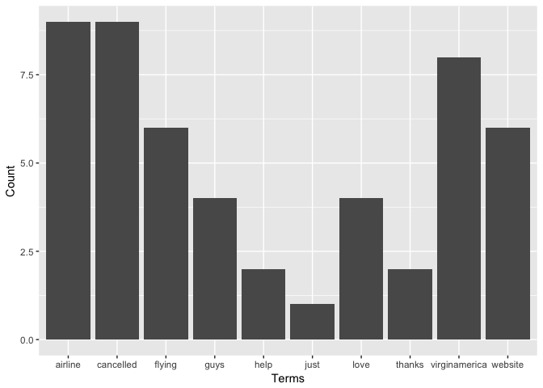
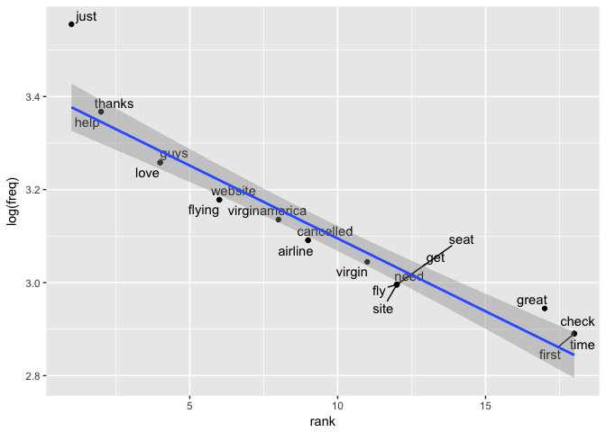
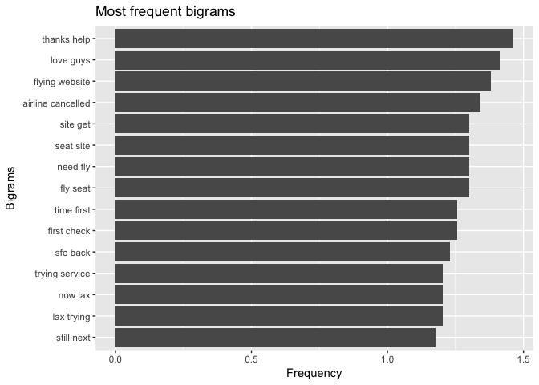
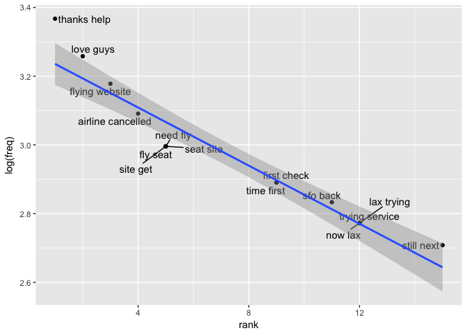
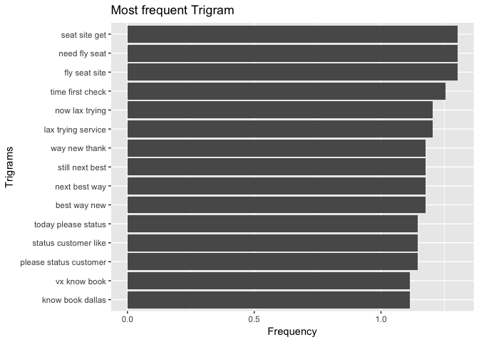
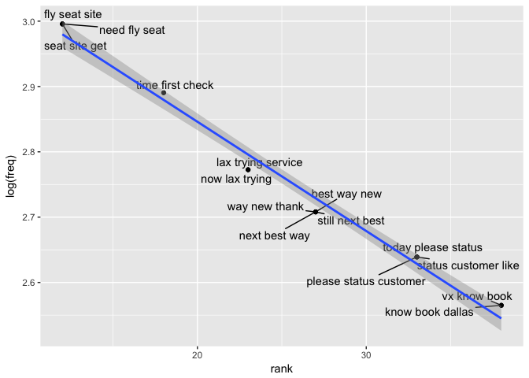
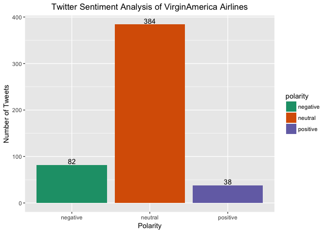

# Airline Sentiment
`r format(Sys.Date())`  
### Introduction
Analyzing the US based airlines performances by analyzing the the tweets of the 
airlines.Identifying the sentiments of tweets and classifying them as nuetral,
negative and positive sentiment for each airlines. Identify the issues  behind
negative sentiments and checking the significance of bigrams, trigrams and 
airlines on the sentiment.

### Description of Data Set
The dataset contains important fields like tweet_id,airline_sentiment, 
airline, name, text, tweet_created, tweet_location which will be widely used
in the sentiment analysis.


```r
data_dir <- "~/Desktop/Springboard/Capstone Project/Capstone" 
twitter_airline <- read.csv(file.path(data_dir,"tweets.csv"),header = TRUE)
dim(twitter_airline)
```

```
## [1] 14640    15
```

```r
colnames(twitter_airline)
```

```
##  [1] "tweet_id"                     "airline_sentiment"           
##  [3] "airline_sentiment_confidence" "negativereason"              
##  [5] "negativereason_confidence"    "airline"                     
##  [7] "airline_sentiment_gold"       "name"                        
##  [9] "negativereason_gold"          "retweet_count"               
## [11] "text"                         "tweet_coord"                 
## [13] "tweet_created"                "tweet_location"              
## [15] "user_timezone"
```

```r
knitr::opts_chunk$set(echo = TRUE)
```

### Load the libraries
Loading the libraries required for sentiment analysis.


```r
options(java.parameters = "-Xmx4g")
options(mc.cores=1)
library(tm)
library(dplyr)
library(plyr)
library(sentiment)
library(twitteR)
library(wordcloud)
library(ggplot2)
library(magrittr)
library(tidytext)
library(ggrepel)
library(stringr)
dyn.load('/Library/Java/JavaVirtualMachines/jdk1.8.0_66.jdk/Contents/Home/jre/lib/server/libjvm.dylib')
require(rJava)
#library(rJava)
library(RWeka)
library(slam)
```

### Structure of the dataset

```r
str(twitter_airline)
```

```
## 'data.frame':	14640 obs. of  15 variables:
##  $ tweet_id                    : num  5.7e+17 5.7e+17 5.7e+17 5.7e+17 5.7e+17 ...
##  $ airline_sentiment           : Factor w/ 3 levels "negative","neutral",..: 2 3 2 1 1 1 3 2 3 3 ...
##  $ airline_sentiment_confidence: num  1 0.349 0.684 1 1 ...
##  $ negativereason              : Factor w/ 11 levels "","Bad Flight",..: 1 1 1 2 3 3 1 1 1 1 ...
##  $ negativereason_confidence   : num  NA 0 NA 0.703 1 ...
##  $ airline                     : Factor w/ 6 levels "American","Delta",..: 6 6 6 6 6 6 6 6 6 6 ...
##  $ airline_sentiment_gold      : Factor w/ 4 levels "","negative",..: 1 1 1 1 1 1 1 1 1 1 ...
##  $ name                        : Factor w/ 7701 levels "___the___","__betrayal",..: 1073 3477 7666 3477 3477 3477 1392 5658 1874 7665 ...
##  $ negativereason_gold         : Factor w/ 14 levels "","Bad Flight",..: 1 1 1 1 1 1 1 1 1 1 ...
##  $ retweet_count               : int  0 0 0 0 0 0 0 0 0 0 ...
##  $ text                        : Factor w/ 14427 levels "_\xf4ִ RT @JetBlue: Our fleet's on fleek. http://t.co/4KH92mKoTZ",..: 14016 13923 13794 13857 13659 13937 14049 13928 14015 13855 ...
##  $ tweet_coord                 : Factor w/ 833 levels "","[-33.87144962, 151.20821275]",..: 1 1 1 1 1 1 1 1 1 1 ...
##  $ tweet_created               : Factor w/ 6804 levels "2/16/15 23:36",..: 6414 6397 6397 6397 6396 6396 6395 6394 6393 6376 ...
##  $ tweet_location              : Factor w/ 3082 levels "","  || san antonio, texas||",..: 1 1 1465 1 1 1 2407 1529 2389 1529 ...
##  $ user_timezone               : Factor w/ 86 levels "","Abu Dhabi",..: 32 64 29 64 64 64 64 64 64 32 ...
```
### Summary  of the dataset


```r
summary(twitter_airline)
```

```
##     tweet_id         airline_sentiment airline_sentiment_confidence
##  Min.   :5.676e+17   negative:9178     Min.   :0.3350              
##  1st Qu.:5.686e+17   neutral :3099     1st Qu.:0.6923              
##  Median :5.695e+17   positive:2363     Median :1.0000              
##  Mean   :5.692e+17                     Mean   :0.9002              
##  3rd Qu.:5.699e+17                     3rd Qu.:1.0000              
##  Max.   :5.703e+17                     Max.   :1.0000              
##                                                                    
##                 negativereason negativereason_confidence
##                        :5462   Min.   :0.000            
##  Customer Service Issue:2910   1st Qu.:0.361            
##  Late Flight           :1665   Median :0.671            
##  Can't Tell            :1190   Mean   :0.638            
##  Cancelled Flight      : 847   3rd Qu.:1.000            
##  Lost Luggage          : 724   Max.   :1.000            
##  (Other)               :1842   NA's   :4118             
##            airline     airline_sentiment_gold          name      
##  American      :2759           :14600         JetBlueNews:   63  
##  Delta         :2222   negative:   32         kbosspotter:   32  
##  Southwest     :2420   neutral :    3         _mhertz    :   29  
##  United        :3822   positive:    5         otisday    :   28  
##  US Airways    :2913                          throthra   :   27  
##  Virgin America: 504                          rossj987   :   23  
##                                               (Other)    :14438  
##                                negativereason_gold retweet_count     
##                                          :14608    Min.   : 0.00000  
##  Customer Service Issue                  :   12    1st Qu.: 0.00000  
##  Late Flight                             :    4    Median : 0.00000  
##  Can't Tell                              :    3    Mean   : 0.08265  
##  Cancelled Flight                        :    3    3rd Qu.: 0.00000  
##  Cancelled Flight\nCustomer Service Issue:    2    Max.   :44.00000  
##  (Other)                                 :    8                      
##                       text                            tweet_coord   
##  @united thanks         :    6                              :13621  
##  @AmericanAir thanks    :    5   [0.0, 0.0]                 :  164  
##  @JetBlue thanks!       :    5   [40.64656067, -73.78334045]:    6  
##  @SouthwestAir sent     :    5   [32.91792297, -97.00367737]:    3  
##  @AmericanAir thank you!:    4   [40.64646912, -73.79133606]:    3  
##  @united thank you!     :    4   [18.22245647, -63.00369733]:    2  
##  (Other)                :14611   (Other)                    :  841  
##        tweet_created          tweet_location
##  2/22/15 14:22:   11                 :4733  
##  2/22/15 17:15:   11   Boston, MA    : 157  
##  2/23/15 11:50:   11   New York, NY  : 156  
##  2/22/15 13:06:   10   Washington, DC: 150  
##  2/22/15 14:11:   10   New York      : 127  
##  2/22/15 17:14:   10   USA           : 126  
##  (Other)      :14577   (Other)       :9191  
##                     user_timezone 
##                            :4820  
##  Eastern Time (US & Canada):3744  
##  Central Time (US & Canada):1931  
##  Pacific Time (US & Canada):1208  
##  Quito                     : 738  
##  Atlantic Time (Canada)    : 497  
##  (Other)                   :1702
```
Dataset contains 14640 observations and 15 variables. There are some new 
variables that will be added to the dataset.


### Replace twitter handle with blank 
The tweets contained the airlines twitter handle. We must first remove the 
twitter handle as they should not be used in the text analysis. 


```r
twitter_airline$text <- gsub("@VirginAmerica","",gsub("@AmericanAir","",
 gsub("@JetBlue ","",gsub("@SouthwestAir","",gsub("@united","",
 gsub("@USAirways","", twitter_airline$text))))))
```


### Subsetting VirginAmerica tweets from the dataset


```r
twitter_VirginAmerica <- filter(twitter_airline, airline =="Virgin America")
```

### Build and cleaning the corpus 
Here we convert the text into a word corpus using the function VectorSource. 
A word corpus enables us to eliminate common words using the text mining 
package tm. Removing the corpus specific stopwords  lets us focus on the
important words. 

```r
tweets_corpus <- Corpus(VectorSource(twitter_VirginAmerica$text))


# Inspect Corpus
inspect(tweets_corpus[1:5])
```

```
## <<SimpleCorpus>>
## Metadata:  corpus specific: 1, document level (indexed): 0
## Content:  documents: 5
## 
## [1]  What @dhepburn said.                                                                                           
## [2]  plus you've added commercials to the experience... tacky.                                                      
## [3]  I didn't today... Must mean I need to take another trip!                                                       
## [4]  it's really aggressive to blast obnoxious "entertainment" in your guests' faces &amp; they have little recourse
## [5]  and it's a really big bad thing about it
```

### Clean the corpus

```r
# Remove Punctuations
tweets_corpus <- tm_map(tweets_corpus,removePunctuation)


#Remove URLs
removeURL <- function(x) {
  gsub("http[^[:space:]]*", "", x)
}
tweets_corpus <- tm_map(tweets_corpus,content_transformer(removeURL))

# Remove anything expect English and Space
remove_others <- function(x) {
  gsub("[^[:alpha:][:space:]]*","",x)
}
tweets_corpus <- tm_map(tweets_corpus,content_transformer(remove_others))
inspect(tweets_corpus[1:5])
```

```
## <<SimpleCorpus>>
## Metadata:  corpus specific: 1, document level (indexed): 0
## Content:  documents: 5
## 
## [1]  What dhepburn said                                                                                       
## [2]  plus youve added commercials to the experience tacky                                                     
## [3]  I didnt today Must mean I need to take another trip                                                      
## [4]  its really aggressive to blast obnoxious entertainment in your guests faces amp they have little recourse
## [5]  and its a really big bad thing about it
```

### Convert the corpus to lowercase 

```r
tweets_corpus <- tm_map(tweets_corpus,content_transformer(tolower))

# Remove Stopwords. 
tweets_stopwords <- c(setdiff(stopwords('english'), c("r", "big","VirginAmerica","VirginAmerica","VirginAmerica","airways","airlines","flight","pilot",
 "virgin","US airways","southwest","a","the","is","and")),"use", "see", 
 "used", "via", "amp","the","a","aa","aaaand","i","a","the",
 "flight","airlines","flights","airway","will", "cant","and","is","can","im")
tweets_corpus <- tm_map(tweets_corpus,removeWords,tweets_stopwords)
inspect(tweets_corpus[1:5])
```

```
## <<SimpleCorpus>>
## Metadata:  corpus specific: 1, document level (indexed): 0
## Content:  documents: 5
## 
## [1]   dhepburn said                                                                     
## [2]  plus youve added commercials   experience tacky                                    
## [3]   didnt today must mean  need  take another trip                                    
## [4]   really aggressive  blast obnoxious entertainment   guests faces    little recourse
## [5]     really big bad thing
```

### Remove extra whitespace

```r
tweets_corpus <- tm_map(tweets_corpus,stripWhitespace)
inspect(tweets_corpus[1:5])
```

```
## <<SimpleCorpus>>
## Metadata:  corpus specific: 1, document level (indexed): 0
## Content:  documents: 5
## 
## [1]  dhepburn said                                                               
## [2]  plus youve added commercials experience tacky                               
## [3]  didnt today must mean need take another trip                                
## [4]  really aggressive blast obnoxious entertainment guests faces little recourse
## [5]  really big bad thing
```

### Make a copy of the corpus


```r
tweets_corpus_copy <- tweets_corpus
tweets_corpus_jp <- tweets_corpus
```
### converting corpus to dataframe 

```r
attributes(tweets_corpus_jp)
```

```
## $names
## [1] "content" "meta"    "dmeta"  
## 
## $class
## [1] "SimpleCorpus" "Corpus"
```

```r
VirginAmerica_df <-data.frame(text=unlist(sapply(tweets_corpus, `[`)), stringsAsFactors=F)


VirginAmerica_df$tweet_id <- twitter_VirginAmerica$tweet_id
head(VirginAmerica_df)
```

```
##                                                                            text
## 1                                                                 dhepburn said
## 2                                 plus youve added commercials experience tacky
## 3                                  didnt today must mean need take another trip
## 4  really aggressive blast obnoxious entertainment guests faces little recourse
## 5                                                         really big bad thing 
## 6                  seriously pay seats didnt playing really bad thing flying va
##      tweet_id
## 1 5.70306e+17
## 2 5.70301e+17
## 3 5.70301e+17
## 4 5.70301e+17
## 5 5.70301e+17
## 6 5.70301e+17
```


### Create Term Document Martix

We convert the word corpus into a document matrix. The Document matrix can be 
analyzed to examine most frequently occurring words. 

```r
tweet_tdm <- TermDocumentMatrix(tweets_corpus,
                                control = list(wordLengths = c(1,Inf)))
tweet_tdm
```

```
## <<TermDocumentMatrix (terms: 1611, documents: 504)>>
## Non-/sparse entries: 3794/808150
## Sparsity           : 100%
## Maximal term length: 37
## Weighting          : term frequency (tf)
```


### Word Frequencies

We find the most frequent words and we create a Word Cloud of tweets using
We are limiting the maximum words to 100 and plotting the top 10 frequent words
using the ggplot package.

```r
# Frequent Terms
freq_terms <- findFreqTerms(tweet_tdm)
term_freq <- sort(rowSums(as.matrix(tweet_tdm)),decreasing = TRUE)
freqterms_df <- data.frame(term = names(term_freq), freq = term_freq)


# Creating a word cloud of frequent term
wordcloud(words = freqterms_df$term, freq = freqterms_df$freq, min.freq = 1,
          max.words=100, random.order=FALSE, rot.per=0.35, 
          colors=brewer.pal(8, "Dark2"))
```

<!-- -->

```r
# Plotting the top 10 frequent words


freqterms_df$rank <- rank(-freqterms_df$freq,ties.method="min")
freqterms_df <- freqterms_df[order(freqterms_df$rank,decreasing = F),]
head(freqterms_df,10)
```

```
##                        term freq rank
## just                   just   35    1
## thanks               thanks   29    2
## help                   help   29    2
## love                   love   26    4
## guys                   guys   26    4
## flying               flying   24    6
## website             website   24    6
## virginamerica virginamerica   23    8
## airline             airline   22    9
## cancelled         cancelled   22    9
```

```r
ggplot(head(freqterms_df,10), aes(x=term, y=rank)) + geom_bar(stat="identity") +
xlab("Terms") + ylab("Count") 
```

<!-- -->


#### Plot the frequency of the words on log scale .

Plotting the frequency of top 50 words in the logarithmic scale. 

```r
# Word frequency on log scale

freq_terms20 <- head(freqterms_df,20)
ggplot(freq_terms20, aes(rank, log(freq))) + geom_point() +
geom_text_repel(label = rownames(freq_terms20)) +  geom_smooth(method="lm") 
```

<!-- -->

```r
  #theme(axis.text.x=element_text(angle=45,hjust=1)) 
```

#### Plotting Bigrams for word frequency

The initial exploration of the word analysis was helpful and we will construct 
bigrams and trigrams and plot the top 15 bigram and trigram on a logarithmic 
scale.Bigrams are two word phrases and  trigrams are three word phrases. 
Recall that stop words had been removed so the phrases may look choppy. 

```r
#Bigram 
bigram_df <- freqterms_df %>%
  unnest_tokens(bigram, term , token = "ngrams", n = 2)

bigram_df$rank <- rank(-bigram_df$freq,ties.method="min")
bigram_df <- bigram_df[order(bigram_df$rank,decreasing = F),]

bigram_df15 <- head(bigram_df,15)
head(bigram_df15,15)
```

```
## # A tibble: 15 x 3
##     freq  rank            bigram
##    <dbl> <int>             <chr>
##  1    29     1       thanks help
##  2    26     2         love guys
##  3    24     3    flying website
##  4    22     4 airline cancelled
##  5    20     5          need fly
##  6    20     5          fly seat
##  7    20     5         seat site
##  8    20     5          site get
##  9    18     9        time first
## 10    18     9       first check
## 11    17    11          sfo back
## 12    16    12           now lax
## 13    16    12        lax trying
## 14    16    12    trying service
## 15    15    15        still next
```

```r
bigram_df15 <- bigram_df15[c("bigram","freq","rank")]
#Bigram Plot
ggplot(bigram_df15,  aes(reorder(bigram,freq), log10(freq))) +
 geom_bar(stat = "identity") + coord_flip() +
 xlab("Bigrams") + ylab("Frequency") + ggtitle("Most frequent bigrams")
```

<!-- -->

```r
#Bigram Plot ranking vs frequency on log scale

ggplot(bigram_df15, aes(rank, log(freq))) + geom_point() +
geom_text_repel(label = (bigram_df15$bigram)) + geom_smooth(method="lm")
```

<!-- -->

####Plotting Bigrams / Trigrams for word frequency


```r
#Trigram
trigram_df <- freqterms_df %>%  unnest_tokens(trigram, term , token = "ngrams", n = 3)
trigram_df <- trigram_df %>% arrange(desc(freq))

trigram_df15 <- head(trigram_df,15)
head(trigram_df15,15)
```

```
## # A tibble: 15 x 3
##     freq  rank                trigram
##    <dbl> <int>                  <chr>
##  1    20    12          need fly seat
##  2    20    12          fly seat site
##  3    20    12          seat site get
##  4    18    18       time first check
##  5    16    23         now lax trying
##  6    16    23     lax trying service
##  7    15    27        still next best
##  8    15    27          next best way
##  9    15    27           best way new
## 10    15    27          way new thank
## 11    14    33    today please status
## 12    14    33 please status customer
## 13    14    33   status customer like
## 14    13    38           vx know book
## 15    13    38       know book dallas
```

```r
# Trigram Plot 
ggplot(trigram_df15, aes(reorder(trigram,freq), log10(freq))) +
  geom_bar(stat = "identity") + coord_flip() +
  xlab("Trigrams") + ylab("Frequency") +
  ggtitle("Most frequent Trigram")
```

<!-- -->

```r
#Trigram Plot ranking vs frequency on log scale


ggplot(trigram_df15, aes(rank, log(freq))) + geom_point() +
geom_text_repel(label = (trigram_df15$trigram)) + geom_smooth(method="lm") 
```

<!-- -->


### Sentiments
Let us know look at the sentiments of the tweets for VirginAmerica airlines. It helps in 
identifying the positive, negative and nuetral sentiment of the tweets.  

### Retrieve Data for VirginAmerica airline

```r
VirginAmerica <- VirginAmerica_df
VirginAmerica <- droplevels(VirginAmerica)


VirginAmerica_txt  <- VirginAmerica$text

VirginAmerica_sentiment <- sentiment(VirginAmerica_txt)

# map values 
VirginAmerica_sentiment$score <- NA
VirginAmerica_sentiment$score[VirginAmerica_sentiment$polarity == "positive"] <- 1
VirginAmerica_sentiment$score[VirginAmerica_sentiment$polarity == "negative"] <- -1
#VirginAmerica_table <- table(VirginAmerica_sentiment$polarity)
ggplot(VirginAmerica_sentiment, aes(x=polarity)) +
  geom_bar(aes(y=..count.., fill=polarity)) +geom_text(stat='count',
  aes(label=..count..),vjust=-0.2)+
  scale_fill_brewer(palette="Dark2") +
 labs(x="Polarity", y="Number of Tweets") +
  ggtitle("Twitter Sentiment Analysis of VirginAmerica Airlines")+
  theme(plot.title = element_text(hjust = 0.5))
```

<!-- -->

```r
VirginAmerica_sentiment$tweet_id <- VirginAmerica$tweet_id

VirginAmerica_sentiment$airline <- 'VirginAmerica'
VirginAmerica_sentiment$code <- 'VA'

VirginAmerica_sentiment$freq <- str_count(VirginAmerica_sentiment$text, '\\s+')+1
colnames(VirginAmerica_sentiment) <- paste("sentiment", colnames(VirginAmerica_sentiment), sep = "_")
VirginAmerica_sentiment$tweet_id <- VirginAmerica$tweet_id
VirginAmerica_sentiment$text <- VirginAmerica$text
dim(VirginAmerica_sentiment)
```

```
## [1] 504  10
```
 
VirginAmerica has most of the tweets that are nuetral. The negative tweets are
more than the positive tweets

### Create  Vcorpus

Creating and cleaning VCorpus to use unigrams, bigrams and trigrams for 
Document Term Matrix.


```r
dtm_corpus <- VCorpus(VectorSource(twitter_VirginAmerica$text))

# Remove Punctuations
dtm_corpus<- tm_map(dtm_corpus,removePunctuation)

#Remove URLs
removeURL <- function(x) {
  gsub("http[^[:space:]]*", "", x)
}
dtm_corpus<- tm_map(dtm_corpus,content_transformer(removeURL))

# Remove anything expect English and Space
remove_others <- function(x) {
  gsub("[^[:alpha:][:space:]]*","",x)
}
dtm_corpus<- tm_map(dtm_corpus,content_transformer(remove_others))

# Transform to lower case

dtm_corpus<- tm_map(dtm_corpus,content_transformer(tolower))

# Remove Stopwords. 
tweets_stopwords <- c(setdiff(stopwords('english'), c("r", "big","VirginAmerica","VirginAmerica","SW","airways","airlines","flight","pilot",
 "virgin","US airways","VirginAmerica","a","the","is","and")),"use", "see", 
 "used", "via", "amp","the","a","aa","aaaand","i","a","the",
 "flight","airlines","flights","airway","will", "cant","and","is","can","im")
dtm_corpus<- tm_map(dtm_corpus,removeWords,tweets_stopwords)

# Remove WhiteSpace
dtm_corpus<- tm_map(dtm_corpus,stripWhitespace)
```

### Create Document Term Matrix
The  unigrams, bigrams and trigram of  document matrix can be 
analyzed to examine most frequently occurring words. 

#### Unigram of DTM 

The unigram are single word phase from the document term matrix is created 
and the sparse terms are removed. The tweet ID and the tweets are added to the 
dataframe created . The term are placed across the columns and 
their occurence across each tweet are indicated either 0 or 1. 


```r
# Creating DTM
unigram_dtm <- DocumentTermMatrix(dtm_corpus)

# Inspecting the unigram DTM
inspect(unigram_dtm[1:5,5:10])
```

```
## <<DocumentTermMatrix (documents: 5, terms: 6)>>
## Non-/sparse entries: 0/30
## Sparsity           : 100%
## Maximal term length: 11
## Weighting          : term frequency (tf)
## Sample             :
##     Terms
## Docs absolute absolutely accelerate accept access accommodate
##    1        0          0          0      0      0           0
##    2        0          0          0      0      0           0
##    3        0          0          0      0      0           0
##    4        0          0          0      0      0           0
##    5        0          0          0      0      0           0
```

```r
# Removing Sparseterms from the DTM 
unigram_sparse <- removeSparseTerms(unigram_dtm,0.995)
unigram_sparse
```

```
## <<DocumentTermMatrix (documents: 504, terms: 336)>>
## Non-/sparse entries: 2176/167168
## Sparsity           : 99%
## Maximal term length: 15
## Weighting          : term frequency (tf)
```

```r
unigram_df <- as.data.frame(as.matrix(unigram_sparse))
colnames(unigram_df) <- paste("unigram_df.", colnames(unigram_df), sep = "_")
colnames(unigram_df) <- make.names(colnames(unigram_df))

unigram_df$tweet_id <- VirginAmerica_df$tweet_id
unigram_df$text <- VirginAmerica_df$text
dim(unigram_df)
```

```
## [1] 504 338
```

```r
#head(unigram_df,5)
#write.csv(unigram_df, file.path(data_dir,"VirginAmerica_Unigram.csv"))
```
#### Bigram of DTM 

The bigrams are two word phase from the document term matrix is created 
and the sparse terms are removed.


```r
#Tokenizing
BigramTokenizer <- function(x) {RWeka::NGramTokenizer(x, RWeka::Weka_control(min = 2, max = 2))}
#BigramTokenizer <- function(x) NGramTokenizer(x, Weka_control(min=2, max=2))

bigram_dtm <- DocumentTermMatrix(dtm_corpus, 
                                 control=list(tokenize=BigramTokenizer))

# Inspecting the bigram DTM
inspect(bigram_dtm[1:5,5:10])
```

```
## <<DocumentTermMatrix (documents: 5, terms: 6)>>
## Non-/sparse entries: 0/30
## Sparsity           : 100%
## Maximal term length: 16
## Weighting          : term frequency (tf)
## Sample             :
##     Terms
## Docs able potentially absolute best accept credit access website
##    1                0             0             0              0
##    2                0             0             0              0
##    3                0             0             0              0
##    4                0             0             0              0
##    5                0             0             0              0
##     Terms
## Docs account help account recent
##    1            0              0
##    2            0              0
##    3            0              0
##    4            0              0
##    5            0              0
```

```r
# Removing Sparseterms from the DTM 
bigram_sparse <- removeSparseTerms(bigram_dtm,0.995)
bigram_sparse
```

```
## <<DocumentTermMatrix (documents: 504, terms: 45)>>
## Non-/sparse entries: 182/22498
## Sparsity           : 99%
## Maximal term length: 25
## Weighting          : term frequency (tf)
```

```r
bigram_df <- as.data.frame(as.matrix(bigram_sparse))
colnames(bigram_df) <- paste("bigram_df.", colnames(bigram_df), sep = "_")
colnames(bigram_df) <- make.names(colnames(bigram_df))
bigram_df$tweet_id <- VirginAmerica_df$tweet_id
bigram_df$text <- VirginAmerica_df$text
dim(bigram_df)
```

```
## [1] 504  47
```

```r
#head(bigram_df,5)
#write.csv(bigram_df, file.path(data_dir,"VirginAmerica_Bigram.csv"))
```


#### Trigram of DTM 

The trigrams are three word phase from the document term matrix is created 
and the sparse terms are removed.


```r
#Tokenizing
#TrigramTokenizer <- function(x) NGramTokenizer(x, Weka_control(min=3, max=3))
TrigramTokenizer <- function(x)  {RWeka::NGramTokenizer(x, RWeka::Weka_control(min = 3, max = 3))}

trigram_dtm <- DocumentTermMatrix(dtm_corpus, 
                                  control=list(tokenize=TrigramTokenizer))
trigram_dtm
```

```
## <<DocumentTermMatrix (documents: 504, terms: 2826)>>
## Non-/sparse entries: 2886/1421418
## Sparsity           : 100%
## Maximal term length: 51
## Weighting          : term frequency (tf)
```

```r
# Inspecting the trigram DTM
inspect(trigram_dtm[1:5,5:10])
```

```
## <<DocumentTermMatrix (documents: 5, terms: 6)>>
## Non-/sparse entries: 0/30
## Sparsity           : 100%
## Maximal term length: 24
## Weighting          : term frequency (tf)
## Sample             :
##     Terms
## Docs able potentially respond absolute best team accept credit cards
##    1                        0                  0                   0
##    2                        0                  0                   0
##    3                        0                  0                   0
##    4                        0                  0                   0
##    5                        0                  0                   0
##     Terms
## Docs access website safari account recent add achieves second year
##    1                     0                  0                    0
##    2                     0                  0                    0
##    3                     0                  0                    0
##    4                     0                  0                    0
##    5                     0                  0                    0
```

```r
# Removing Sparseterms from the DTM 
trigram_sparse <- removeSparseTerms(trigram_dtm,0.999)
trigram_sparse
```

```
## <<DocumentTermMatrix (documents: 504, terms: 2826)>>
## Non-/sparse entries: 2886/1421418
## Sparsity           : 100%
## Maximal term length: 51
## Weighting          : term frequency (tf)
```

```r
trigram_df <- as.data.frame(as.matrix(trigram_sparse))
colnames(trigram_df) <- paste("trigram_df.", colnames(trigram_df), sep = "_")
colnames(trigram_df) <- make.names(colnames(trigram_df))
trigram_df$tweet_id <- VirginAmerica_df$tweet_id
trigram_df$text <- VirginAmerica_df$text
dim(trigram_df)
```

```
## [1]  504 2828
```

```r
#head(trigram_df,5)
#write.csv(trigram_df, file.path(data_dir,"VirginAmerica_Trigram.csv"))
```
### Preparing for the model

Combining the unigram, bigrams, trigrams and sentiment into one dataframe 
for modelling

```r
tweets_unibigram <- full_join(unigram_df, bigram_df, by = c("tweet_id", "text"))
 
tweets_unibitrigram <- full_join(tweets_unibigram,trigram_df, by = c("tweet_id","text"))

tweets_model <- full_join(tweets_unibitrigram,VirginAmerica_sentiment, by = c("tweet_id","text")) 
dim(tweets_model)
```

```
## [1]  756 3217
```

```r
#write.csv(tweets_model, file.path(data_dir,"Delete.csv"))
```
