Airline Sentiment
================
2017-10-21

### Load the dataset

``` r
data_dir <- "~/Desktop/Springboard/Capstone Project/Capstone" 
twitter_airline <- read.csv(file.path(data_dir,"tweets.csv"),header = TRUE)
knitr::opts_chunk$set(echo = TRUE)
```

### Load the libraries

``` r
library(tm)
```

    ## Loading required package: NLP

``` r
library(dplyr)
```

    ## Warning: package 'dplyr' was built under R version 3.4.2

    ## 
    ## Attaching package: 'dplyr'

    ## The following objects are masked from 'package:stats':
    ## 
    ##     filter, lag

    ## The following objects are masked from 'package:base':
    ## 
    ##     intersect, setdiff, setequal, union

``` r
library(plyr)
```

    ## -------------------------------------------------------------------------

    ## You have loaded plyr after dplyr - this is likely to cause problems.
    ## If you need functions from both plyr and dplyr, please load plyr first, then dplyr:
    ## library(plyr); library(dplyr)

    ## -------------------------------------------------------------------------

    ## 
    ## Attaching package: 'plyr'

    ## The following objects are masked from 'package:dplyr':
    ## 
    ##     arrange, count, desc, failwith, id, mutate, rename, summarise,
    ##     summarize

``` r
library(sentiment)
```

    ## Loading required package: RCurl

    ## Loading required package: bitops

    ## Loading required package: rjson

``` r
library(twitteR)
```

    ## 
    ## Attaching package: 'twitteR'

    ## The following object is masked from 'package:plyr':
    ## 
    ##     id

    ## The following objects are masked from 'package:dplyr':
    ## 
    ##     id, location

``` r
library(wordcloud)
```

    ## Loading required package: RColorBrewer

``` r
library(ggplot2)
```

    ## 
    ## Attaching package: 'ggplot2'

    ## The following object is masked from 'package:NLP':
    ## 
    ##     annotate

``` r
library(magrittr)
library(tidytext)
```

    ## Warning: package 'tidytext' was built under R version 3.4.2

### Replace twitter handle with blank

The tweets contained the airlines twitter handle. We must first remove the twitter handle as they should not be used in the text analysis .

``` r
twitter_airline$text <- gsub("@VirginAmerica","",gsub("@AmericanAir","",gsub("@JetBlue ","",gsub("@SouthwestAir","",gsub("@united","",gsub("@USAirways","",twitter_airline$text))))))
```

### Build a corpus, and specify the source to be character vectors

``` r
tweets_corpus <- Corpus(VectorSource(twitter_airline$text))
```

### Inspect Corpus

``` r
inspect(tweets_corpus[1:2])
```

    ## <<SimpleCorpus>>
    ## Metadata:  corpus specific: 1, document level (indexed): 0
    ## Content:  documents: 2
    ## 
    ## [1]  What @dhepburn said.                                     
    ## [2]  plus you've added commercials to the experience... tacky.

### Remove punctuations from corpus

``` r
tweets_corpus <- tm_map(tweets_corpus,removePunctuation)
inspect(tweets_corpus[1:2])
```

    ## <<SimpleCorpus>>
    ## Metadata:  corpus specific: 1, document level (indexed): 0
    ## Content:  documents: 2
    ## 
    ## [1]  What dhepburn said                                  
    ## [2]  plus youve added commercials to the experience tacky

### Remove URLs

``` r
removeURL <- function(x) {
  gsub("http[^[:space:]]*", "", x)
}
tweets_corpus <- tm_map(tweets_corpus,content_transformer(removeURL))
```

### Remove anything expect English and Space

``` r
remove_others <- function(x) {
  gsub("[^[:alpha:][:space:]]*","",x)
}
tweets_corpus <- tm_map(tweets_corpus,content_transformer(remove_others))
inspect(tweets_corpus[1:15])
```

    ## <<SimpleCorpus>>
    ## Metadata:  corpus specific: 1, document level (indexed): 0
    ## Content:  documents: 15
    ## 
    ##  [1]  What dhepburn said                                                                                                 
    ##  [2]  plus youve added commercials to the experience tacky                                                               
    ##  [3]  I didnt today Must mean I need to take another trip                                                                
    ##  [4]  its really aggressive to blast obnoxious entertainment in your guests faces amp they have little recourse          
    ##  [5]  and its a really big bad thing about it                                                                            
    ##  [6]  seriously would pay  a flight for seats that didnt have this playing\nits really the only bad thing about flying VA
    ##  [7]  yes nearly every time I fly VX this ear worm wont go away                                                          
    ##  [8]  Really missed a prime opportunity for Men Without Hats parody there                                                
    ##  [9] virginamerica Well I didntbut NOW I DO D                                                                            
    ## [10]  it was amazing and arrived an hour early Youre too good to me                                                      
    ## [11]  did you know that suicide is the second leading cause of death among teens                                         
    ## [12]  I lt pretty graphics so much better than minimal iconography D                                                     
    ## [13]  This is such a great deal Already thinking about my nd trip to Australia amp I havent even gone on my st trip yet p
    ## [14]  virginmedia Im flying your fabulous Seductive skies again U take all the stress away from travel                   
    ## [15]  Thanks

### Convert the corpus to lowercase

``` r
tweets_corpus <- tm_map(tweets_corpus,content_transformer(tolower))
```

### Remove Stopwords

It is important remove the stopwords with regards to the airlines industry apart from the normal words that does contain any importance significance.

``` r
tweets_stopwords <- c(setdiff(stopwords('english'), c("r", "big","delta","united","american","airways","airlines","flight","pilot","virgin","US airways","southwest","a","the","is","and")),"use", "see", "used", "via", "amp","the","a","thanks","thank","aa","aaaand","i","a","the","flight","airlines","flights","airway","will")
tweets_corpus <- tm_map(tweets_corpus,removeWords,tweets_stopwords)
inspect(tweets_corpus[1:15])
```

    ## <<SimpleCorpus>>
    ## Metadata:  corpus specific: 1, document level (indexed): 0
    ## Content:  documents: 15
    ## 
    ##  [1]   dhepburn said                                                                           
    ##  [2]  plus youve added commercials   experience tacky                                          
    ##  [3]   didnt today must mean  need  take another trip                                          
    ##  [4]   really aggressive  blast obnoxious entertainment   guests faces    little recourse      
    ##  [5]  and   really big bad thing                                                               
    ##  [6]  seriously  pay     seats  didnt   playing\n really   bad thing  flying va                
    ##  [7]  yes nearly every time  fly vx  ear worm wont go away                                     
    ##  [8]  really missed  prime opportunity  men without hats parody                                
    ##  [9] virginamerica well  didntbut now   d                                                      
    ## [10]    amazing and arrived  hour early youre  good                                            
    ## [11]    know  suicide is  second leading cause  death among teens                              
    ## [12]   lt pretty graphics  much better  minimal iconography d                                  
    ## [13]   is   great deal already thinking   nd trip  australia   havent even gone   st trip yet p
    ## [14]  virginmedia im flying  fabulous seductive skies  u take   stress away  travel            
    ## [15]

### Remove extra whitespace

``` r
tweets_corpus <- tm_map(tweets_corpus,stripWhitespace)
inspect(tweets_corpus[1:15])
```

    ## <<SimpleCorpus>>
    ## Metadata:  corpus specific: 1, document level (indexed): 0
    ## Content:  documents: 15
    ## 
    ##  [1]  dhepburn said                                                                  
    ##  [2]  plus youve added commercials experience tacky                                  
    ##  [3]  didnt today must mean need take another trip                                   
    ##  [4]  really aggressive blast obnoxious entertainment guests faces little recourse   
    ##  [5]  and really big bad thing                                                       
    ##  [6]  seriously pay seats didnt playing really bad thing flying va                   
    ##  [7]  yes nearly every time fly vx ear worm wont go away                             
    ##  [8]  really missed prime opportunity men without hats parody                        
    ##  [9] virginamerica well didntbut now d                                               
    ## [10]  amazing and arrived hour early youre good                                      
    ## [11]  know suicide is second leading cause death among teens                         
    ## [12]  lt pretty graphics much better minimal iconography d                           
    ## [13]  is great deal already thinking nd trip australia havent even gone st trip yet p
    ## [14]  virginmedia im flying fabulous seductive skies u take stress away travel       
    ## [15]

### Make a copy of the corpus

``` r
tweets_corpus_copy <- tweets_corpus
```

### Stemming

``` r
tweets_corpus <- tm_map(tweets_corpus,stemDocument)
```

### Stem Completion

``` r
tweets_corpus <- tm_map(tweets_corpus,content_transformer(stemCompletion), dictionary = tweets_corpus_copy)
```

### Create Term Document Martix

``` r
tweet_tdm <- TermDocumentMatrix(tweets_corpus, control = list(wordLengths = c(1,Inf)))
tweet_tdm
```

    ## <<TermDocumentMatrix (terms: 209, documents: 14640)>>
    ## Non-/sparse entries: 489/3059271
    ## Sparsity           : 100%
    ## Maximal term length: 28
    ## Weighting          : term frequency (tf)

### Word Frequencies

``` r
# Frequent Terms
freq.terms <- findFreqTerms(tweet_tdm, lowfreq = 4)
term.freq <- sort(rowSums(as.matrix(tweet_tdm)),decreasing = TRUE)
df <- data.frame(term = names(term.freq), freq = term.freq)

# Creating a word cloud of frequent term

wordcloud(words = df$term, freq = df$freq, min.freq = 1,
          max.words=200, random.order=FALSE, rot.per=0.35, 
          colors=brewer.pal(8, "Dark2"))
```

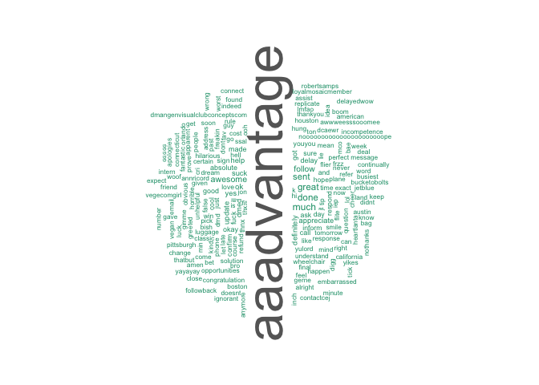

``` r
# Plotting the top 10 frequent words
library(ggplot2)
ggplot(df[1:10,], aes(x=term, y=freq)) + geom_bar(stat="identity") +
xlab("Terms") + ylab("Count") + coord_flip() 
```

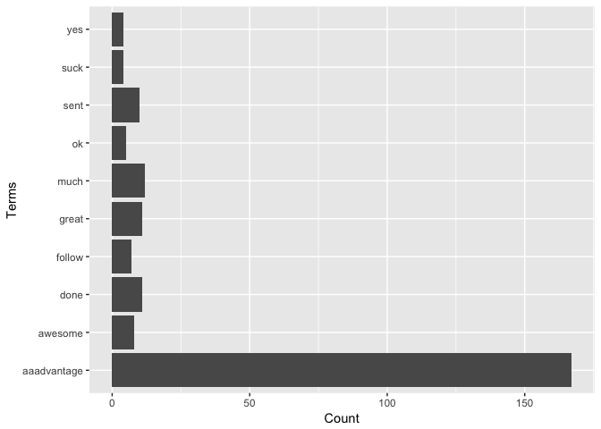

``` r
# Plot the frequency of the words on linear / log scale . 
#df$term <- as.numeric(df$term)
#df$freq <- as.numeric(df$freq)
#ggplot(df, aes(x= log(term), y= log(freq)))+ geom_line()
 # qplot(log(df$term), log(df$freq))
```

#### Plot the frequency of the words on linear / log scale .

``` r
Freq_df <- df

#Freq_df$term <- as.numeric(Freq_df$term)

#Freq_df$log_freq <- log(Freq_df$freq)
#Freq_df$freq <- as.numeric(Freq_df$freq)


ggplot(head(Freq_df,50), aes(term, log10(freq))) + geom_point() +theme(axis.text.x=element_text(angle=45,hjust=1))
```

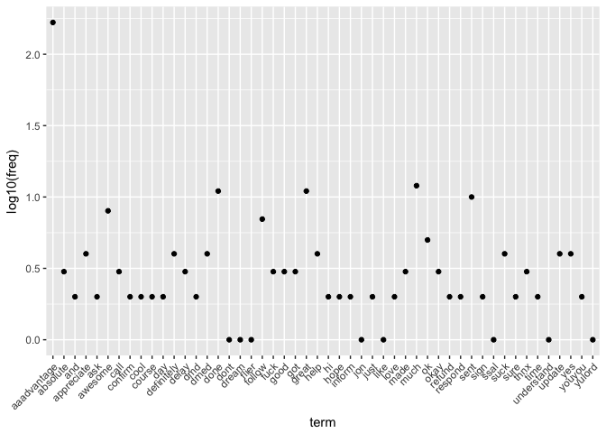

``` r
  #ggplot(data=Freq_df, aes(x=term, y=freq)) +geom_line()  +  scale_y_log10() +  scale_x_log10() 
```

#### Plotting Bigrams / Trigrams for word frequency

``` r
  library(dplyr)
#Bigram 
bigram_df <- df %>%
  unnest_tokens(bigram, term , token = "ngrams", n = 2)

bigram_df <- bigram_df %>% arrange(desc(freq))
head(bigram_df,10)
```

    ## # A tibble: 10 x 2
    ##     freq            bigram
    ##    <dbl>             <chr>
    ##  1    11        done great
    ##  2     4          suck yes
    ##  3     4          yes dmed
    ##  4     4   dmed definitely
    ##  5     4 definitely update
    ##  6     4 update appreciate
    ##  7     4   appreciate help
    ##  8     3    absolute delay
    ##  9     3        delay okay
    ## 10     3          okay got

``` r
#Bigram Plot
ggplot(head(bigram_df,15), aes(reorder(bigram,freq), log10(freq))) + geom_bar(stat = "identity") + coord_flip() +
 xlab("Bigrams") + ylab("Frequency") + ggtitle("Most frequent bigrams")
```

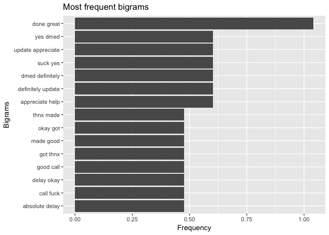

``` r
#Trigram
trigram_df <- df %>%  unnest_tokens(trigram, term , token = "ngrams", n = 3)

trigram_df <- trigram_df %>% arrange(desc(freq))
head(trigram_df,10)
```

    ## # A tibble: 10 x 2
    ##     freq                      trigram
    ##    <dbl>                        <chr>
    ##  1     4                suck yes dmed
    ##  2     4          yes dmed definitely
    ##  3     4       dmed definitely update
    ##  4     4 definitely update appreciate
    ##  5     4       update appreciate help
    ##  6     3          absolute delay okay
    ##  7     3               delay okay got
    ##  8     3                okay got thnx
    ##  9     3                got thnx made
    ## 10     3               thnx made good

``` r
# Trigram Plot 
ggplot(head(trigram_df,15), aes(reorder(trigram,freq), log10(freq))) +
  geom_bar(stat = "identity") + coord_flip() +
  xlab("Trigrams") + ylab("Frequency") +
  ggtitle("Most frequent Trigram")
```

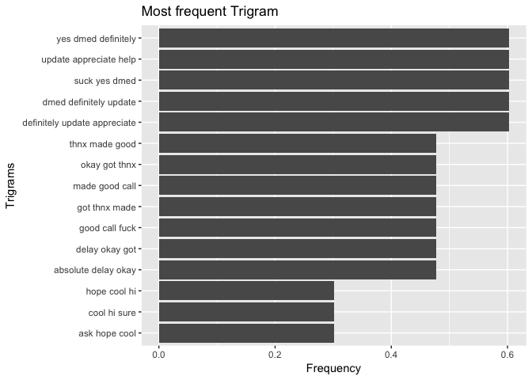 \#\#\# Tweets by Airlines

We will analyze the total number of tweets for each airlines

``` r
ggplot(twitter_airline, aes(x= airline)) + geom_bar(aes(y=..count.., fill = airline))+geom_text(stat='count',aes(label=..count..),vjust=-0.2)+
  scale_fill_brewer(palette="Dark2") + xlab("Airlines") + ylab("Tweets Count")
```

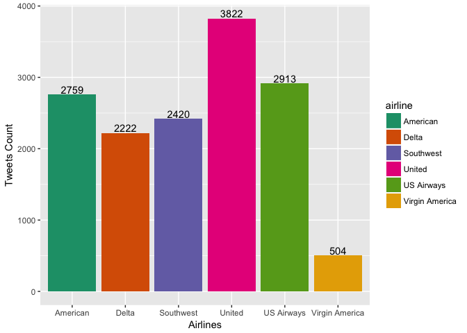

United Airlines has the most tweets and Virgin America has the least tweets. Having higher number of tweets can either be because of their popularty or they might have lot of issues which needs to be investigated further.

### Sentiments

Let us know look at the sentiments of the tweets for each airlines.

### Retrieve Data for Delta airline

``` r
delta <- subset(twitter_airline,airline == "Delta")
delta.txt  <- delta$text
delta_sentiment <- sentiment(delta.txt)
delta_sentiment$score <- 0
delta_sentiment$score[delta_sentiment$polarity == "positive"] <- 1
delta_sentiment$score[delta_sentiment$polarity == "negative"] <- -1
delta_table <- table(delta_sentiment$polarity)
ggplot(delta_sentiment, aes(x=polarity)) +
  geom_bar(aes(y=..count.., fill=polarity)) +geom_text(stat='count',aes(label=..count..),vjust=-0.2)+
  scale_fill_brewer(palette="Dark2") +
  labs(x="Polarity", y="Number of Tweets") +
  ggtitle("Twitter Sentiment Analysis of Delta Airlines")+
  theme(plot.title = element_text(hjust = 0.5))
```

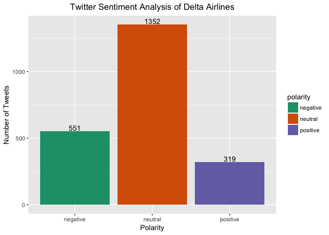

``` r
delta_sentiment$airline = 'Delta'
delta_sentiment$code = 'DL'
colnames(delta_sentiment)
```

    ## [1] "text"     "polarity" "language" "score"    "airline"  "code"

Delta has most of the tweets that are nuetral. But the negative tweets are more than the positive tweets and requires inspection. \#\#\# Retrieve Data for American airline

``` r
american <- subset(twitter_airline,airline == "American")
american.txt  <- american$text
american_sentiment <- sentiment(american.txt)
american_sentiment$score <- 0
american_sentiment$score[american_sentiment$polarity == "positive"] <- 1
american_sentiment$score[american_sentiment$polarity == "negative"] <- -1
american_table <- table(american_sentiment$polarity)
ggplot(american_sentiment, aes(x=polarity)) +
  geom_bar(aes(y=..count.., fill=polarity)) +geom_text(stat='count',aes(label=..count..),vjust=-0.2)+
  scale_fill_brewer(palette="Dark2") +
  labs(x="Polarity", y="Number of Tweets") +
  ggtitle("Twitter Sentiment Analysis of American Airlines")+
  theme(plot.title = element_text(hjust = 0.5))
```

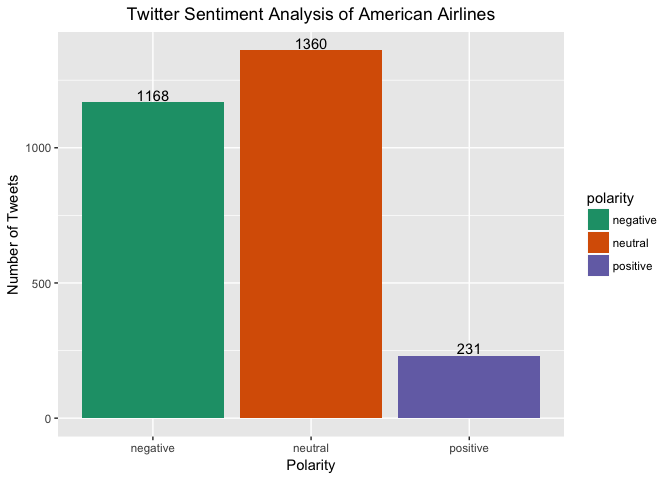

``` r
american_sentiment$airline = 'American'
american_sentiment$code = 'AA'
colnames(american_sentiment)
```

    ## [1] "text"     "polarity" "language" "score"    "airline"  "code"

AA tweets indicate that their negative tweets are almost equal to the neutral tweets. The reason behind the negative tweets must be explored.

### Retrieve Data for United airline

``` r
united <- subset(twitter_airline,airline == "United")
united.txt  <- united$text
united_sentiment <- sentiment(united.txt)
united_sentiment$score <- 0
united_sentiment$score[united_sentiment$polarity == "positive"] <- 1
united_sentiment$score[united_sentiment$polarity == "negative"] <- -1
united_table <- table(united_sentiment$polarity)
ggplot(united_sentiment, aes(x=polarity)) +
  geom_bar(aes(y=..count.., fill=polarity)) +geom_text(stat='count',aes(label=..count..),vjust=-0.2)+
  scale_fill_brewer(palette="Dark2") +
  labs(x="Polarity", y="Number of Tweets") +
  ggtitle("Twitter Sentiment Analysis of United Airlines")+
  theme(plot.title = element_text(hjust = 0.5))
```

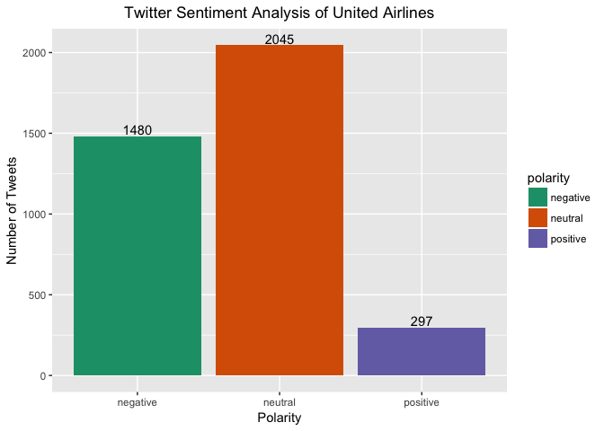

``` r
united_sentiment$airline = 'United'
united_sentiment$code = 'UA'
colnames(united_sentiment)
```

    ## [1] "text"     "polarity" "language" "score"    "airline"  "code"

United airlines tweets indicate that their negative tweets are almost equal to the neutral tweets. The reason behind the negative tweets must be explored.

### Retrieve Data for Southwest airline

``` r
southwest <- subset(twitter_airline,airline == "Southwest")
southwest.txt  <- southwest$text
southwest_sentiment <- sentiment(southwest.txt)
southwest_sentiment$score <- 0
southwest_sentiment$score[southwest_sentiment$polarity == "positive"] <- 1
southwest_sentiment$score[southwest_sentiment$polarity == "negative"] <- -1
southwest_table <- table(southwest_sentiment$polarity)
ggplot(southwest_sentiment, aes(x=polarity)) +
  geom_bar(aes(y=..count.., fill=polarity)) +geom_text(stat='count',aes(label=..count..),vjust=-0.2)+
  scale_fill_brewer(palette="Dark2") +
  labs(x="Polarity", y="Number of Tweets") +
  ggtitle("Twitter Sentiment Analysis of Southwest Airlines")+
  theme(plot.title = element_text(hjust = 0.5))
```

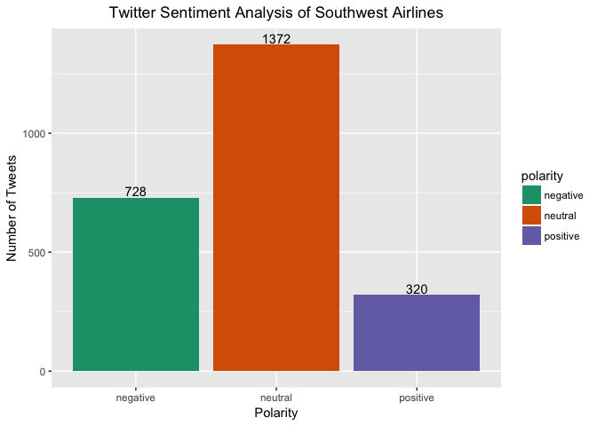

``` r
southwest_sentiment$airline = 'Southwest'
southwest_sentiment$code = 'SW'
colnames(southwest_sentiment)
```

    ## [1] "text"     "polarity" "language" "score"    "airline"  "code"

United airlines tweets indicate that they have almost double the amount of neutral tweets as compared to the negative tweets.

### Retrieve Data for US Airways

``` r
us_airways <- subset(twitter_airline,airline == "US Airways")
us_airways.txt  <- us_airways$text
us_airways_sentiment <- sentiment(us_airways.txt)
us_airways_sentiment$score <- 0
us_airways_sentiment$score[us_airways_sentiment$polarity == "positive"] <- 1
us_airways_sentiment$score[us_airways_sentiment$polarity == "negative"] <- -1
us_airways_table <- table(us_airways_sentiment$polarity)
ggplot(us_airways_sentiment, aes(x=polarity)) +
  geom_bar(aes(y=..count.., fill=polarity)) +geom_text(stat='count',aes(label=..count..),vjust=-0.2)+
  scale_fill_brewer(palette="Dark2") +
  labs(x="Polarity", y="Number of Tweets") +
  ggtitle("Twitter Sentiment Analysis of Us_airways Airlines")+
  theme(plot.title = element_text(hjust = 0.5))
```

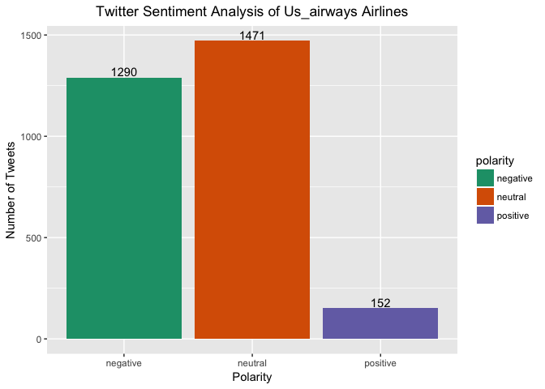

``` r
us_airways_sentiment$airline = 'US Airways'
us_airways_sentiment$code = 'UW'
colnames(us_airways_sentiment)
```

    ## [1] "text"     "polarity" "language" "score"    "airline"  "code"

US Airways tweets indicate that they have almost equal amount of neutral and negative tweets. The reason behind the negative tweets must be investigated further.

### Retrieve Data for Virgin America

``` r
virgin_america <- subset(twitter_airline,airline == "Virgin America")
virgin_america.txt  <- virgin_america$text
virgin_america_sentiment <- sentiment(virgin_america.txt)
virgin_america_sentiment$score <- 0
virgin_america_sentiment$score[virgin_america_sentiment$polarity == "positive"] <- 1
virgin_america_sentiment$score[virgin_america_sentiment$polarity == "negative"] <- -1
virgin_america_table <- table(virgin_america_sentiment$polarity)
ggplot(virgin_america_sentiment, aes(x=polarity)) +
  geom_bar(aes(y=..count.., fill=polarity)) +geom_text(stat='count',aes(label=..count..),vjust=-0.2)+
  scale_fill_brewer(palette="Dark2") +
  labs(x="Polarity", y="Number of Tweets") +
  ggtitle("Twitter Sentiment Analysis of Virgin America ")+
  theme(plot.title = element_text(hjust = 0.5))
```

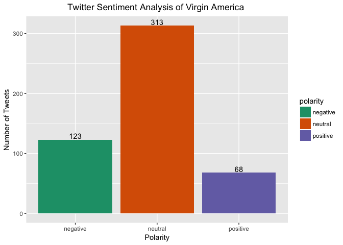

``` r
virgin_america_sentiment$airline = 'Virgin America'
virgin_america_sentiment$code = 'VA'
colnames(virgin_america_sentiment)
```

    ## [1] "text"     "polarity" "language" "score"    "airline"  "code"

Virgin America tweets indicate that they have more neutral tweets

### Combining data from all airlines

``` r
all.sentiment <- rbind(delta_sentiment,american_sentiment,united_sentiment,southwest_sentiment,virgin_america_sentiment,us_airways_sentiment)
all.sentiment$score <- 0
 all.sentiment$score[all.sentiment$polarity == "Positive"] <- 1
 all.sentiment$score[all.sentiment$polarity == "Negative"] <- -1

 #Plot by sentiment for all airlines
 
ggplot(all.sentiment, aes(x=airline,position = 'fill')) + geom_bar(aes(y=..count.., fill=polarity), position = "fill")  + scale_fill_brewer(palette="Dark2") +
 labs(x="Polarity", y="Number of Tweets") +
 ggtitle("Twitter Sentiment Analysis of US based airlines ")+
  theme(plot.title = element_text(hjust = 0.5)) 
```

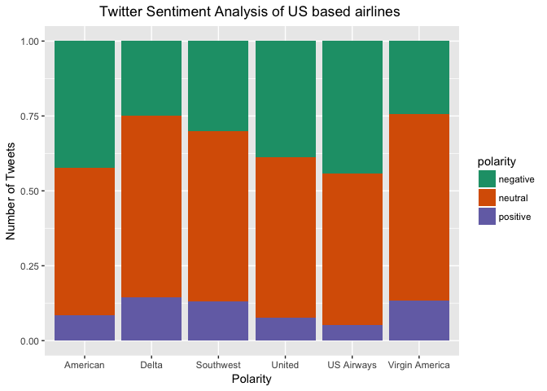

``` r
 all.airlines <- rbind(delta,american,united,us_airways,virgin_america,southwest)
all.airlines$updatedsentiment <- all.sentiment$polarity
library(reshape2)
airlines= all.airlines %>% group_by(airline) %>% dplyr::summarise(count=n())
posNegByAirline <- dcast(all.airlines, airline ~ updatedsentiment)
```

    ## Using updatedsentiment as value column: use value.var to override.

    ## Aggregation function missing: defaulting to length

``` r
posNegByAirline$total <- posNegByAirline$negative + posNegByAirline$positive + posNegByAirline$positive
posNegByAirline$Negative_proportion <- (posNegByAirline$negative/posNegByAirline$total)*100
posNegByAirline
```

    ##          airline negative neutral positive total Negative_proportion
    ## 1       American     1168    1360      231  1630            71.65644
    ## 2          Delta      551    1352      319  1189            46.34146
    ## 3      Southwest     1079    1219      122  1323            81.55707
    ## 4         United     1480    2045      297  2074            71.35969
    ## 5     US Airways      848    1677      388  1624            52.21675
    ## 6 Virgin America      214     260       30   274            78.10219

The 100% stacked bar indicate that American, United and US Airways have the most negative tweets as compared to other airlines. It is important now to understand the reason behind the negative tweets

Negative tweets by Airlines
---------------------------

The total number of negative tweets by airlines

``` r
negativeTweets <- all.airlines %>% filter(updatedsentiment =="negative")


ggplot(negativeTweets, aes(x= airline)) + geom_bar(aes(y=..count.., fill = airline))+geom_text(stat='count',aes(label=..count..),vjust=-0.2)+
  scale_fill_brewer(palette="Dark2") + xlab("Airlines") + ylab("Tweets Count")
```

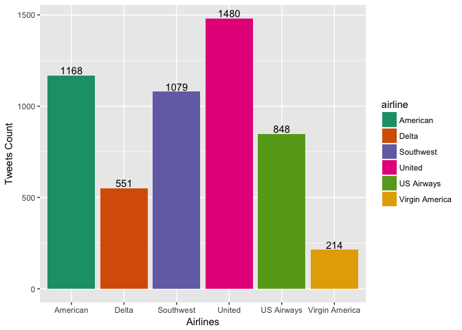 United Airlines has the most negative tweets among all the other airlines followed by American and Southwest. It would be interesting to find out the reson behind these negative tweets.

Reason behind the negative sentiment
------------------------------------

``` r
Negative_Reason <- negativeTweets
Negative_Reason$negativereason <- gsub("^$", "Can't Tell", Negative_Reason$negativereason)

# Plot the negative reason 

ggplot(Negative_Reason, aes(x= airline, position = 'fill')) + geom_bar(aes(y=..count.., fill = negativereason),position = "fill")+
  scale_fill_brewer(palette="Paired") + xlab("Airlines") + ylab("Tweets Count")
```

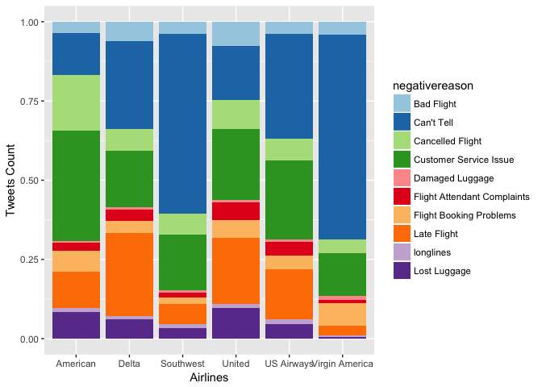 \# Bigrams and Trigrams of Sentiments

``` r
#bigram_sentiment <- all.sentiment %>% unnest_tokens(bigram, text , token = "ngrams", n = 2)
#bigram_sentiment$rank <- order(bigram_sentiment$polarity)

all.sentiment$text2 <- all.sentiment$text
all.sentiment <- all.sentiment %>% unnest_tokens(bigram,text, token  = "ngrams", n=2)
all.sentiment$rank <- order(all.sentiment$polarity)

#all.sentiment <- all.sentiment %>% unnest_tokens(trigram,text, token  = "ngrams", n=3)

# Bigram Plot 
ggplot(head(all.sentiment,15), aes(reorder(bigram,rank), log10(rank))) +
  geom_bar(stat = "identity") + coord_flip() +
  xlab("Bigrams") + ylab("Rank") +
  ggtitle("Most frequent Bigrams")
```

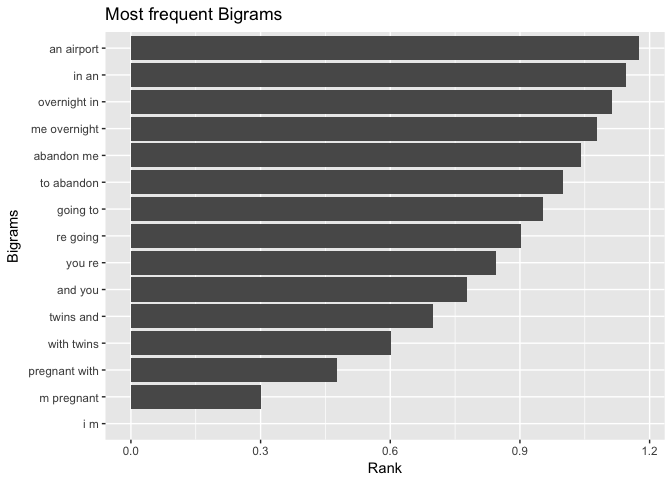

``` r
all.sentiment <- all.sentiment %>% unnest_tokens(trigram, text2 , token = "ngrams", n = 3)
all.sentiment$rank <- order(all.sentiment$polarity)

# Bigram Plot 
ggplot(head(all.sentiment,15), aes(reorder(trigram,rank), log10(rank))) +
  geom_bar(stat = "identity") + coord_flip() +
  xlab("Trigrams") + ylab("Rank") +
  ggtitle("Most frequent Trigrams")
```

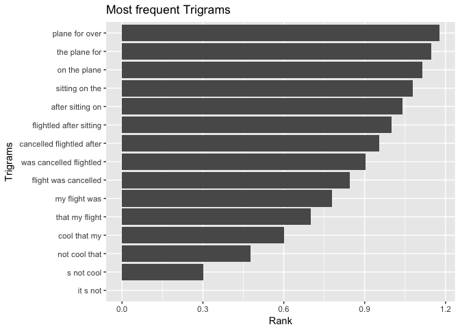 \#\#\#\# Analysis of Variance of the sentiments Creating a numeric variable for polarity. polarity\_score is -1 for negative sentiment, 0 for neutral and 1 for positive sentiment

``` r
sentiment_variance <- all.sentiment

# Creating polarity_score as numeric
sentiment_variance <- all.sentiment %>%  mutate(polarity_score =  ifelse(polarity == "negative",-1,ifelse(polarity == "neutral",0,1)))


# Box plot of the polarity score for airlines.
ggplot(sentiment_variance, aes(x = airline, y = polarity_score)) +
  geom_boxplot(fill = "grey80", colour = "blue") +
  scale_x_discrete() + xlab("Airline") +
  ylab("Polarity Score")
```

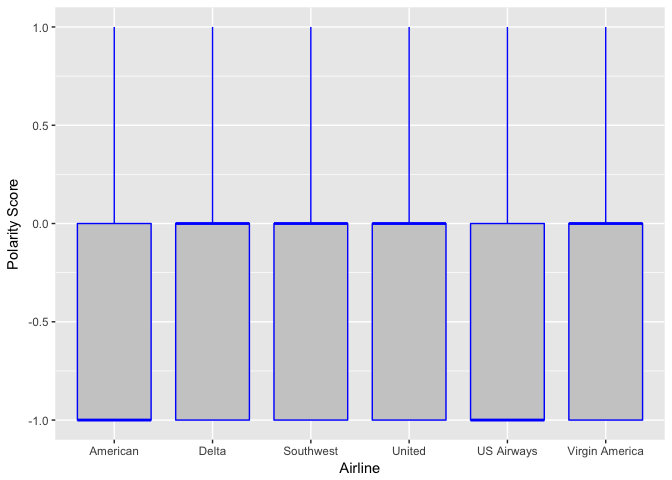

``` r
# Calculating Analysis of Variance with airlines as predictor variable 

Linearmodel1 = lm(polarity_score ~ airline , data = sentiment_variance)
summary(Linearmodel1)
```

    ## 
    ## Call:
    ## lm(formula = polarity_score ~ airline, data = sentiment_variance)
    ## 
    ## Residuals:
    ##     Min      1Q  Median      3Q     Max 
    ## -0.7727 -0.5799  0.2273  0.4695  1.4939 
    ## 
    ## Coefficients:
    ##                         Estimate Std. Error t value Pr(>|t|)    
    ## (Intercept)           -0.4694561  0.0006660 -704.93   <2e-16 ***
    ## airlineDelta           0.2421240  0.0010569  229.09   <2e-16 ***
    ## airlineSouthwest       0.1700004  0.0010180  167.00   <2e-16 ***
    ## airlineUnited          0.0493160  0.0008767   56.25   <2e-16 ***
    ## airlineUS Airways     -0.0244606  0.0009242  -26.47   <2e-16 ***
    ## airlineVirgin America  0.2371706  0.0018991  124.89   <2e-16 ***
    ## ---
    ## Signif. codes:  0 '***' 0.001 '**' 0.01 '*' 0.05 '.' 0.1 ' ' 1
    ## 
    ## Residual standard error: 0.6311 on 4482293 degrees of freedom
    ## Multiple R-squared:  0.02262,    Adjusted R-squared:  0.02262 
    ## F-statistic: 2.074e+04 on 5 and 4482293 DF,  p-value: < 2.2e-16

``` r
#anova1 <- aov(sentiment_variance$polarity_score ~ sentiment_variance$airline)
#summary(anova1)
#anova2 <- data.frame(Fitted = fitted(anova1),
 # Residuals = resid(anova1), Airline = sentiment_variance$airline)

#Plotting the analysis of variance with fitted & residuals 
#ggplot(anova2, aes(Fitted, Residuals, colour = Airline)) + geom_point()
```
