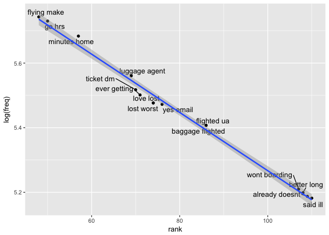
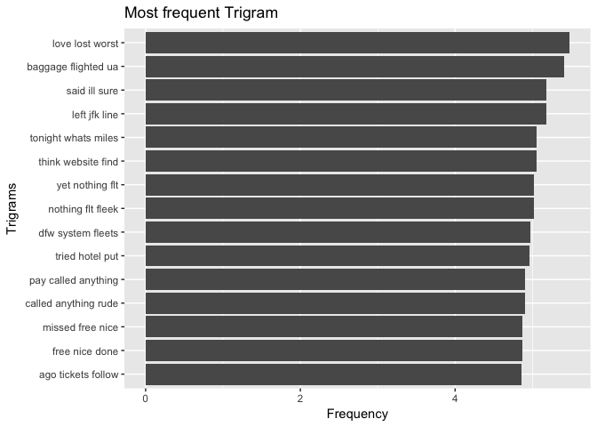
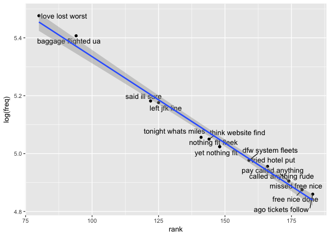

All Airlines Sentiment
================
2018-08-01

### Introduction

Analyzing the US based airlines tweets and identifying the sentiments of tweets and classifying them as nuetral,negative and positive sentiment for each airlines.Tokenizing the tweets as unigrams/ bigrams / trigrams and finding their significance on the sentiments.

### Goal

Provide insights to airlines who want to predict how tokenized phrases may influence sentiment of the customer tweets

### Description of Data Set

The dataset contains important fields like tweet\_id,airline\_sentiment, airline, name, text, tweet\_created, tweet\_location which will be widely used in the sentiment analysis.

    ## [1] 14640    15

    ##  [1] "tweet_id"                     "airline_sentiment"           
    ##  [3] "airline_sentiment_confidence" "negativereason"              
    ##  [5] "negativereason_confidence"    "airline"                     
    ##  [7] "airline_sentiment_gold"       "name"                        
    ##  [9] "negativereason_gold"          "retweet_count"               
    ## [11] "text"                         "tweet_coord"                 
    ## [13] "tweet_created"                "tweet_location"              
    ## [15] "user_timezone"

Dataset contains 14640 observations and 15 variables. There are some new variables that will be added to the dataset.

### Replace twitter handle with blank

The tweets contained the airlines twitter handle. We must first remove the twitter handle as they should not be used in the text analysis.

``` r
twitter_airline$text <- gsub("@VirginAmerica","",gsub("@AmericanAir","",
 gsub("@JetBlue ","",gsub("@SouthwestAir","",gsub("@united","",
 gsub("@USAirways","", twitter_airline$text))))))
```

### Build and cleaning the corpus

Here we convert the text into a word corpus using the function VectorSource. A word corpus enables us to eliminate common words using the text mining package tm. Removing the corpus specific stopwords lets us focus on the important words. The puncutations, URLs, anything except english/space and extra white space is removed. The corpus is converted to lower case

#### Initial Corpus

    ## <<SimpleCorpus>>
    ## Metadata:  corpus specific: 1, document level (indexed): 0
    ## Content:  documents: 5
    ## 
    ## [1]  What @dhepburn said.                                                                                           
    ## [2]  plus you've added commercials to the experience... tacky.                                                      
    ## [3]  I didn't today... Must mean I need to take another trip!                                                       
    ## [4]  it's really aggressive to blast obnoxious "entertainment" in your guests' faces &amp; they have little recourse
    ## [5]  and it's a really big bad thing about it

#### Final Corpus

    ## <<SimpleCorpus>>
    ## Metadata:  corpus specific: 1, document level (indexed): 0
    ## Content:  documents: 5
    ## 
    ## [1]  dhepburn said                                                               
    ## [2]  plus youve added commercials experience tacky                               
    ## [3]  didnt today must mean need take another trip                                
    ## [4]  really aggressive blast obnoxious entertainment guests faces little recourse
    ## [5]  really big bad thing

### Create Term Document Martix

We convert the word corpus into a document matrix. The Document matrix can be analyzed to examine most frequently occurring words.

``` r
tweet_tdm <- TermDocumentMatrix(tweets_corpus,
                                control = list(wordLengths = c(1,Inf)))
tweet_tdm
```

    ## <<TermDocumentMatrix (terms: 13245, documents: 14640)>>
    ## Non-/sparse entries: 122648/193784152
    ## Sparsity           : 100%
    ## Maximal term length: 46
    ## Weighting          : term frequency (tf)

### Exploratory Data Analysis

We find the most frequent words and we create a Word Cloud of tweets. We are limiting the maximum words to 100 and plotting the top 10 frequent words using the ggplot package. 

#### Plot the frequency of the words on log scale .

Plotting the frequency of top 15 words in the logarithmic scale. 

#### Plotting Bigrams for word frequency

The initial exploration of the word analysis was helpful and we will construct bigrams and plot the top 15 bigrams on a logarithmic scale.Bigrams are two word phrases.Recall that stop words had been removed so the phrases may look choppy. 

#### Plotting Trigrams for word frequency

We will construct trigrams and plot the top 15 trigrams on a logarithmic scale. Trigrams are three word phrases



### Sentiments

Let us know look at the sentiments of the tweets for all airlines. It helps in identifying the positive, negative and nuetral sentiment of the tweets.

### Retrieve Data for all\_airlines


All the airlines anf their respective sentiments has been analyzed and plotted. Most of the tweets are nuetral. The negative tweets are more than the positive tweets and we will go ahead and look at the significance of unigrams,bigrams and trigrams on sentiments.

### Create Vcorpus and Document Term Matrix

Creating and cleaning VCorpus to use unigrams, bigrams and trigrams for Document Term Matrix.The unigrams, bigrams and trigram of document term matrix can be analyzed to examine most frequently occurring words.

#### Unigram/Bigram/Trigram of DTM

The unigram/bigram/trigram are single,double and triple word phase respectively are created from the document term matrix and the sparse terms are removed. The tweet ID , airlines and the tweets are added to the dataframe. The term are placed across the columns and their occurence across each tweet are indicated either 0 or 1.

### Feature Engineering.

Combining the unigram, bigrams, trigrams and sentiment into one dataframe for modeling.Creating new feature tweetreason and location to categorize the negative reason and tweet location into more meaningful variables


### Unigram /Bigram/Trigram Modeling

Creating a dataframe test\_unigram,test\_bigram, test\_trigram which includes tweetreason, timezone,sentiment\_freq,Is\_Positive,Is\_Negative,Is\_Neutral and all unigram varialbles.Logistic regression is applied for all positive/neutral/negative sentimentsmbased on the tweetreason.

### Data Split and Mapping Values for training / test datset

Dataset is split using createDataPartition from the caret package. The dataset is split into 70:30 ratio.Mapping the values for training and testing dataset and creating dataframe for all the unigrams/bigrams/trigrams for positive/neutral/negative sentiment. SMOTE function is used to balance the training dataset.

``` r
## split training data into train batch and test batch
set.seed(23)


training_rows <- createDataPartition(test_df2$sentiment_polarity, 
                                     p = 0.7, list = FALSE)

train_batch <- test_df2[training_rows, ]
test_batch <- test_df2[-training_rows, ]
train_control <- trainControl(method = "repeatedcv", repeats = 5,
                        summaryFunction = twoClassSummary,
                        classProbs = TRUE)
```

### Cross Validation and ROC curves for Naive Bayes for entire training dataset

cross validation is performed using Naive Bayes with entire training dataset on all the sentiment for unigram/bigram/trigram. timezone is excluded as it had zero variances. ROC curves are plotted for executed cross validated models to check the significance of entire variables on sentiments for unigram/bigram/trigram. P & N values describe the number of positives and negative in the model. ROC curves with AUC more than 0.5 is displayed

    ## [1] "AUC of Bigram Positive"

    ## [1] 0.8098093


    ## [1] "AUC PR of Bigram Positive"

    ## [1] 0.8052781


    ## [1] "AUC of Trigam Positive"

    ## [1] 0.7846529


    ## [1] "AUC PR of Trigram Positive"

    ## [1] 0.7296475


The model with the best performance was a bigram positive and trigram positive model for the entire training dataset

### Cross Validation and ROC curves for Naive Bayes for entire testing dataset

Cross validation is performed using Naive Bayes with entire test dataset on all the sentiment for unigram/bigram/trigram. timezone is excluded as it had zero variances.ROC curves are plotted for executed cross validated models to check the significance of entire variables on sentiments for unigram/bigram/trigram.P & N values describe the number of positives and negative in the model.ROC curves with AUC more than 0.5 is displayed

    ## [1] "AUC of Bigram Positive"

    ## [1] 0.7501999


    ## [1] "AUC PR of Bigram Positive"

    ## [1] 0.12962


The bigram positive model was the best performing model on the entire testing dataset.

### Recommendations

1.  It is possible to train a model to determine the sentiment of airline tweets and determine if the customers are having negative or positive experience based on their tweets

2.  Bigram positive terms have more significance in determining the sentiment and enables airlines look for most frequenly bigram words.

### Limitations

1.  Eventhough NaiveBayes and Logistics Regression has been applied for looking at the significance of unigram/bigram/trigram on the sentiments, multinomial regression could have provided better insights on the signficance of the variables.

2.Sentiment analysis can be further expalined to classify the sentiment of the tweers into more categories to provide deeper understanding of customer sentiments.

3.Stemming could have provided better insights by reducing the repetition of terms

Note : The sentiment analysis for individual airlines and code can be found at <https://github.com/prashijp/Capstone-Project>
